# Other MiniNDP Variants
There are a few other versions of the card just to allow for different parts availability and different soldering difficulty.  
They all work the same from a software point of view, and all are tested.

### SL1M - slim 1 meg
* Same as EZ1M, just with TSOP & TSSOP components.  
* Allows to make a thin card.

Use the thinner CR2016 version of the cover with this.  
The battery holder is technically for CR2012, but you can stuff a CR2016 in it.

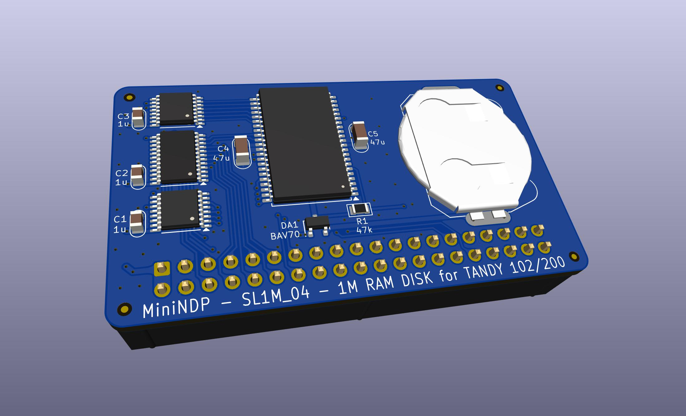  
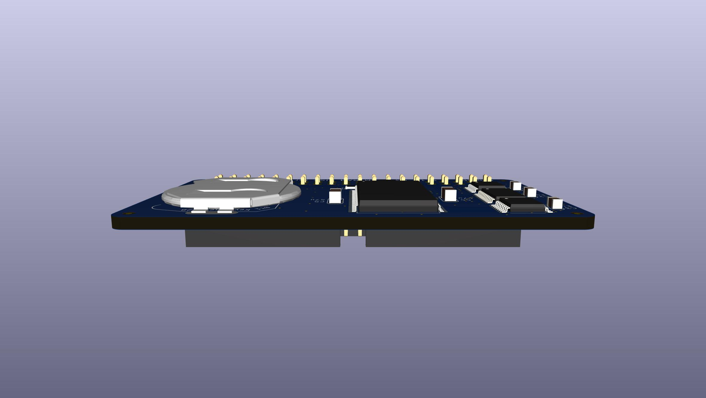  
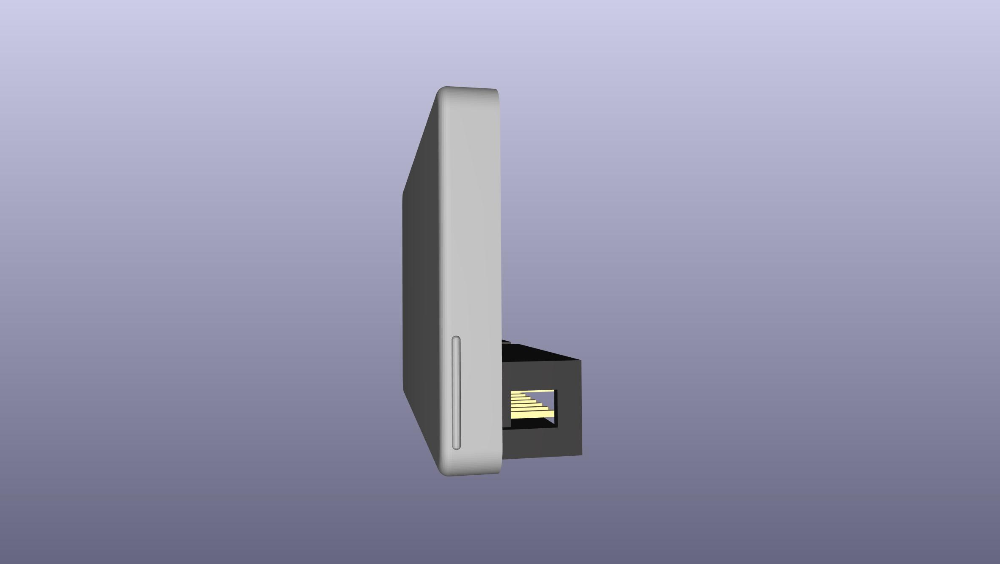  
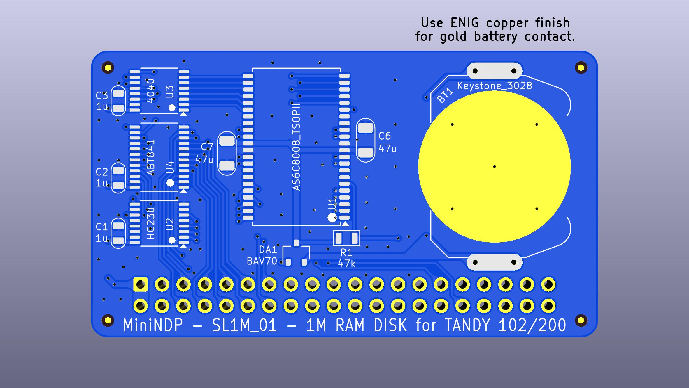  
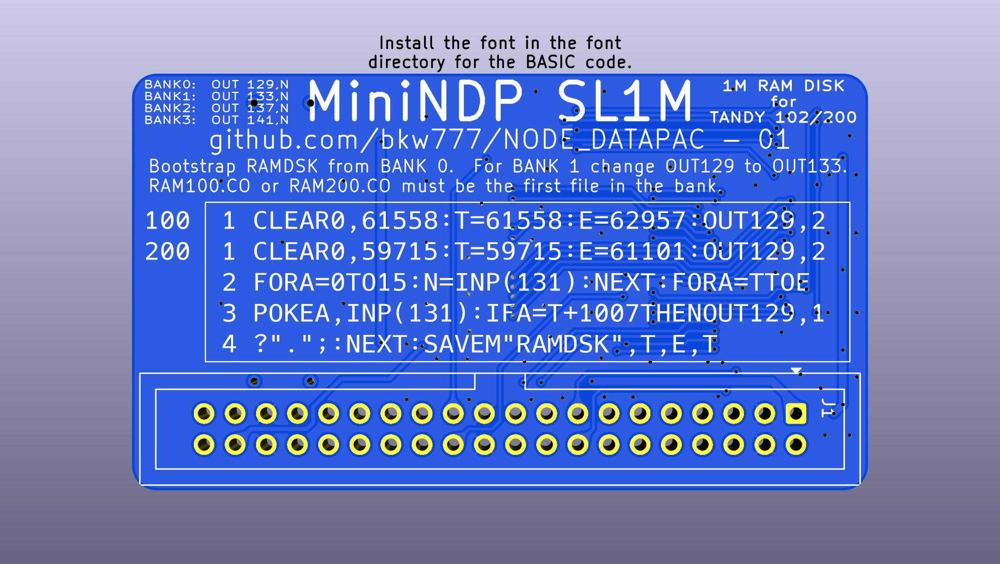  
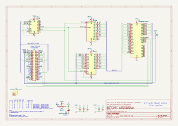  
[MiniNDP_SL1M.bom.csv](PCB/out/MiniNDP_SL1M.bom.csv)

### EZ512 - easy-build 512K
* All larger parts for easier hand-soldering.  
* 1M SOIC/SOJ sram is getting uncommon and expensive.  

It requires an additional chip vs the 1M because the 512K sram doesn't have a CE2 pin.

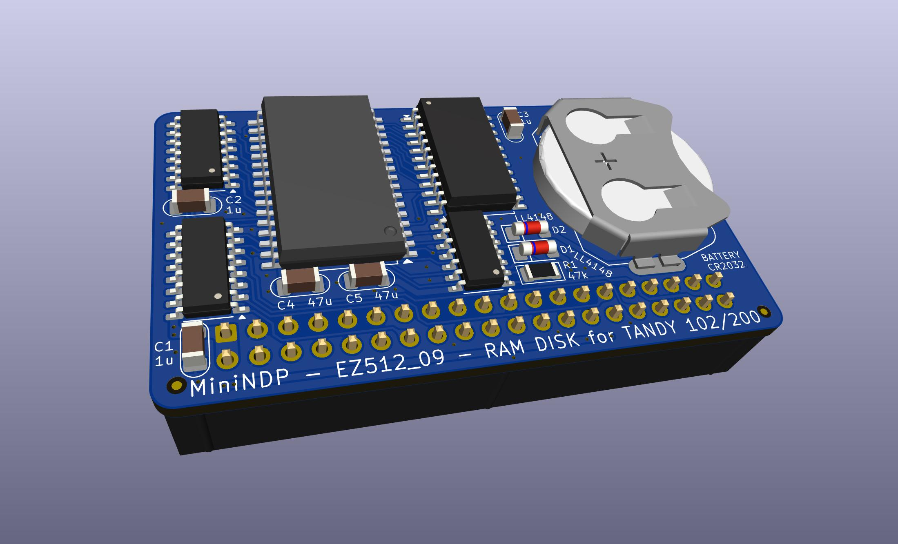  
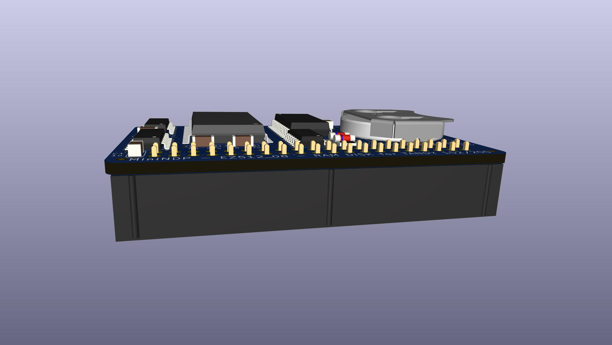  
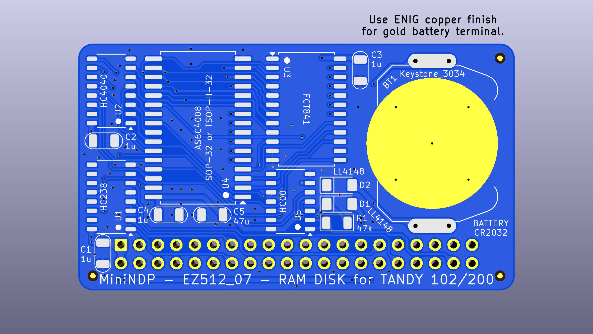  
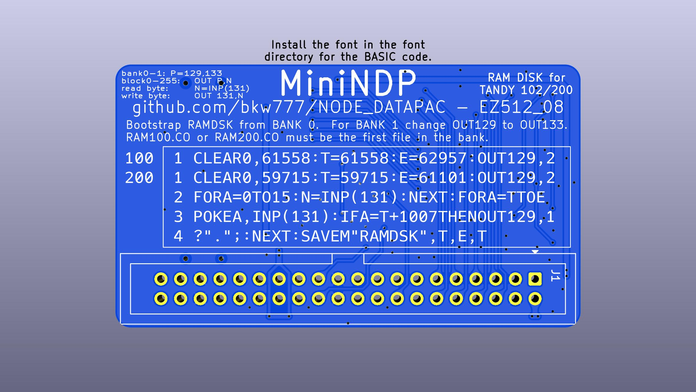  
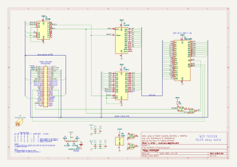  
[MiniNDP_EZ512.bom.csv](PCB/out/MiniNDP_EZ512.bom.csv)

### MiniNDP "OG"
* Circuit is more like the original NODE version.  
* Components are more common & available.  
* Supports 512K, 256K, or 128K.  
* Supports CR2032, CR2016, or CR2012, so you can choose if you want more battery life or a thinner card.  
* Supports a big tantalum cap for more battery-change grace period.

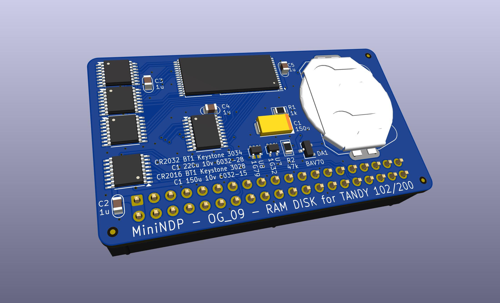  
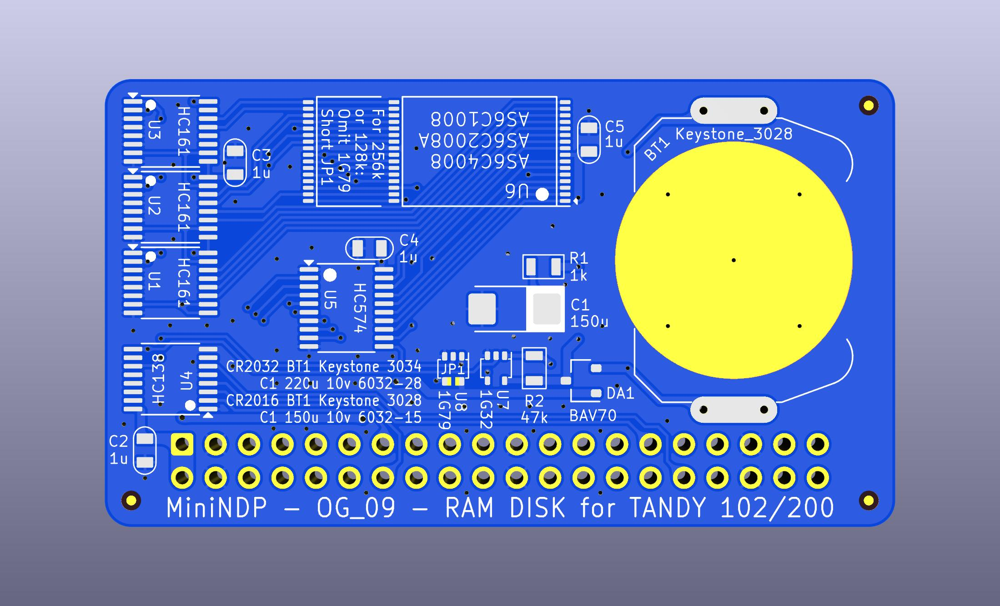  
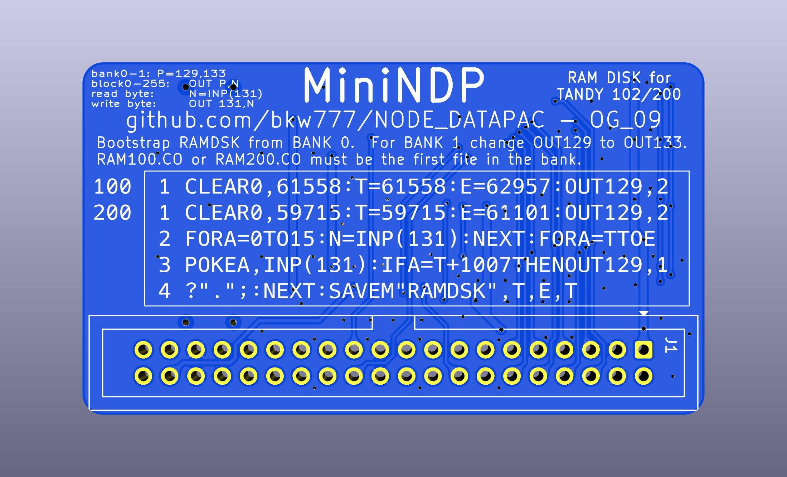  
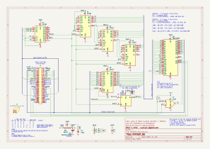  
[MiniNDP_OG.bom.csv](PCB/out/MiniNDP_OG.bom.csv)

## Battery Options
Max battery vs thinnest card  
|BATTERY|life|holder|height|tantalum|grace(1)|
|---|---|---|---|---|---|
|CR2032|7-13 years|[Keystone 3034](https://www.digikey.com/en/products/detail/keystone-electronics/3034/4499289) TE/Linx BAT-HLD-001-SMT Adam Tech BH-67 MPD BK-912|4.1mm|[TAJC227K010RNJ](https://www.digikey.com/en/products/detail/kyocera-avx/TAJC227K010RNJ/1833766?s=N4IgTCBcDaICoEEBSBhMYDsBpADARhwCUA5JEAXQF8g) - 6032-28 220u 10v|1 minute|
|CR2016|3-6 years|[TE BAT-HLD-002-SMT](https://www.digikey.com/en/products/detail/te-connectivity-linx/BAT-HLD-002-SMT/3044011)(2)|2.8mm|[TLJW157M010R0200](https://www.digikey.com/en/products/detail/kyocera-avx/TLJW157M010R0200/929982?s=N4IgTCBcDaICoBkBSB1AjAVgOwFkAMaeASnmHniALoC%2BQA) - 6032-15 150u 10v|40 seconds|
|CR2012|1.5-3 years|[Keystone 3028](https://www.digikey.com/en/products/detail/keystone-electronics/3028/4499284) (picture is wrong, part is correct)|1.7mm|[TLJW157M010R0200](https://www.digikey.com/en/products/detail/kyocera-avx/TLJW157M010R0200/929982?s=N4IgTCBcDaICoBkBSB1AjAVgOwFkAMaeASnmHniALoC%2BQA) - 6032-15 150u 10v|40 seconds|

(1) Grace is the battery-change grace period provided by C1.  
With no battery installed, how long it takes for C1 to discharge from 2.0v (coin cell about to die) down to 1.5v (sram data retention).

(2) This CR2016 holder is taller than needed for a CR2016, so much so that you may as well just use a full CR2032 holder and get double the years.  
But you can actually stuff a CR2016 into the CR2012 holder. It's just a stiff fit.  
You can adjust the CR2012 holder to fit perfect so there will be less strain on the solder joints by either bending the tabs down slightly before soldering,  
or by soldering with the holder clamped over a piece of PCB in the holder as a filler block in place of a battery. PCB is 1.6mm just like CR2016.

CR2032 height
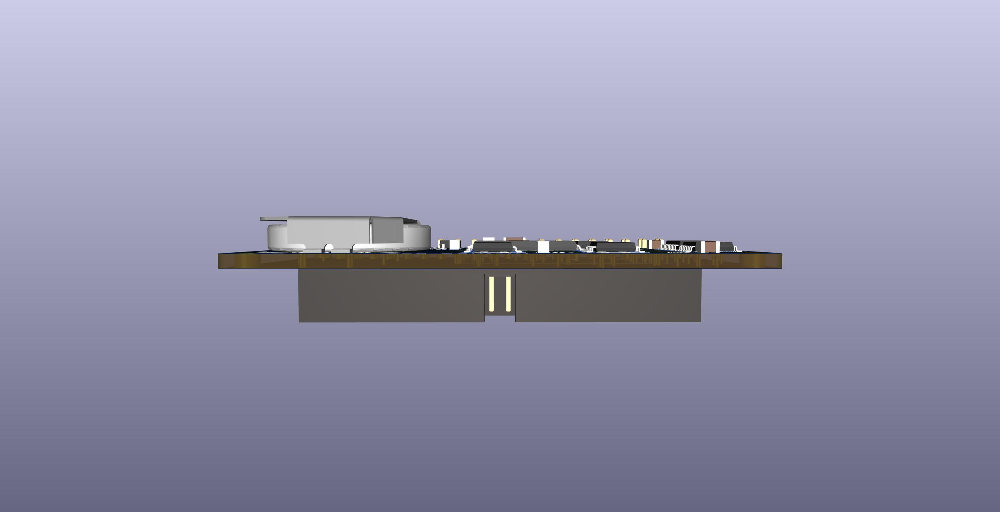

CR2016 height (nominally a CR2012 holder, but can take a CR2016)  
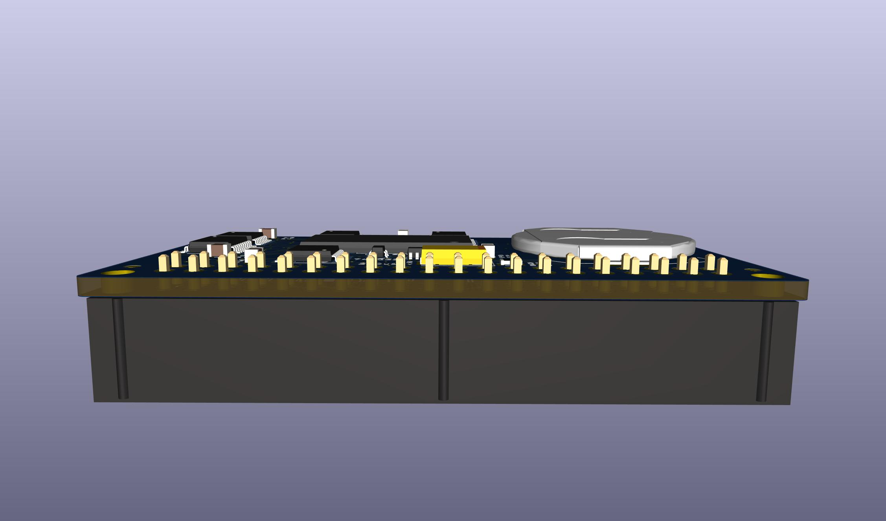

