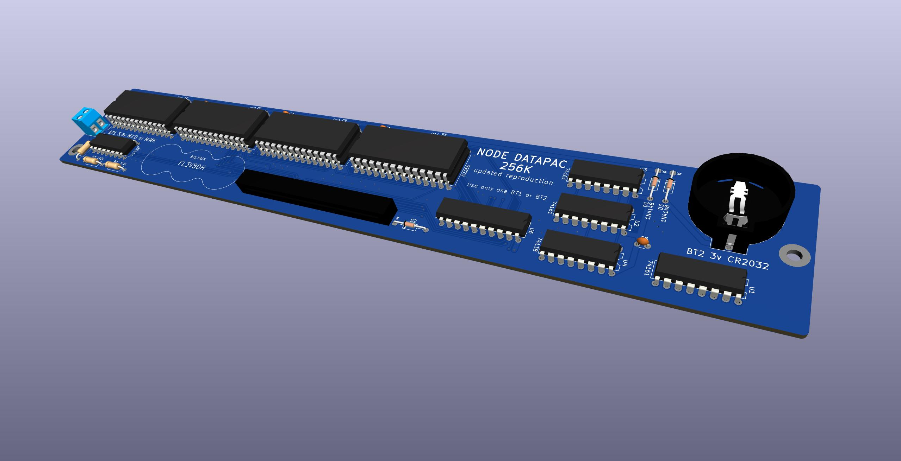
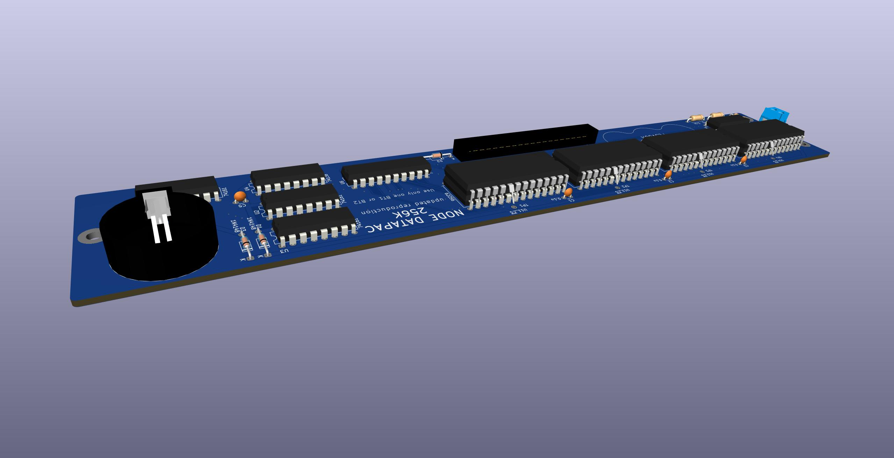

# Reproduction of Node Systems DATAPAC

The NODE Systems DATAPAC and RAMPAC were a popular ram disk peripheral for TRS-80 / TANDY Models 100, 102, & 200 computers.

RAMPAC was a later device that apparently functioned exactly the same as DATAPAC, just in a different, smaller form factor.

This schematic and PCB documents the DATAPAC. If I ever aquire a RAMPAC, I'll add that.

Here is some disorganized [INFO](http://tandy.wiki/NODE_DATAPAC) mostly gathered from the [M100SIG archive](https://github.com/LivingM100SIG/Living_M100SIG).  
Copies of most of the stuff above are in [REF/software](REF/software)  

TLDR: To use the hardware, install RAMDSK.CO for Model 200, or RAM100.CO for Model 100/102, and what you get is a 128K or 256K ram disk.

The enclosure printing says 256K, and the circuit is all there to support 256K, but my 2 units only had 128K installed.  
There are footprints on the PCB for 4 x 32K sram chips, for a total of 128K.  
To get 256K, a 2nd set of 4 chips are piggybacked on top of the first 4, except with pin 20 bent out and connected to a via on the pcb instead of the chip below.  
No other parts or changes are needed.

### Original Schematic & PCB
This is a new drawing but aims to reflect the original actual device as exactly as possible.  
Both the schematic and the pcb are exactly like the real original, warts and all.  
It's meant to be a form of documentation or reference describing the original hardware as it was.  

PCB TOP

PCB BOTTOM

The real PCB has no silkscreen. This image has silkscreen added to show where the components from the schematic go.

### New Schematic & PCB
This aims to be a functional replacement and will change over time to use newer parts.  
Currently still uses the same main chips as the original, re-routes many of the traces, changes the battery connections to support current options, adds decoupling caps,
and silkscreen.  
Pending TODO items: Change the BUS connection to use a removable cable, and flip the pinout so that the computer end of the cable can use a connector that actually fits in a 200.

## Battery
The original battery is no longer made. The modern replacement is almost 2mm taller and does not fit inside the enclosure.

NODE Systems themselves used to perform an update to older units to replace the original rechargeable NiCD cell with a non-rechargeable lithium cell which was supposed to last about 5 years.

The change is simple and easy, and the parts are common. You just remove the old battery and the 200 ohm resistor, and replace them with a CR2032 holder and a diode. That's it. Both parts fit and solder right in the same locations where the old parts came out. Point the diode stripe away from the battery, just like the other diode that is right there next to it. Any kind of diode will do. Another 1N4148 like the other one that's already there is perfect.
This should give about 4 years of memory.

BEFORE

AFTER

STEPS

If you wish to keep using a rechargeable battery, then a suitable option is FL3/V80H. That is 3 16x5.8mm NiMH button cells in a flat in-line pack with wire leads. It fits perfectly in the space next to the ribbon cable. It needs to be secured with hot glue or foam mounting tape, and connected with wires run to the original battery location.

## Software
Originally these were shipped with an option rom from NODE, which I do not have.  
RAMDSK is purported to provide all or almost all of the same functionality, and even NODE themselves eventually licensed RAMDSK from Paul Globman and included a copy with each unit. It's unclear if this was in addition to their own original rom, or fully replacing it.

The only other significant software using this device seems to be [XOS](http://www.club100.org/library/libpg.html), also from Paul Globman, which is sort of an OS for the Model 200. XOS does not require a RAMPAC or DATAPAC, but apparently makes good use of one if present.
I have not tried XOS yet.

## Model compatibility
The case says for Model 102/200, however...

### Model 200
The connector on the DATAPAC does NOT actually fit in a 200 without cutting the opening around the bus connector on the 200 wider.

The only connector that fits in a 200 is a solder-type box header like used in this [cable for the Disk/Video Interface](http://tandy.wiki/Disk/Video_Interface:_Cable#Good_Cable).

### Model 100
This device actually works on Model 100 too. It needs an adapter cable but the cable is simple.
From the top of that page with the Disk/Video Interface cables above, the Model 100 part of the [3-part cable](http://tandy.wiki/Disk/Video_Interface:_Cable#Good_Cable) works for this too. Just the Model 100 part, not the full cable with all 3 parts connected.
