# Reproduction of Node Systems DATAPAC

The NODE Systems DATAPAC and RAMPAC were a popular ram disk peripheral for TRS-80 / TANDY Models 100, 102, & 200 computers.

RAMPAC was a later device that functioned the same as DATAPAC, even using the same software to run it, just in a new smaller form factor.

This schematic and PCB documents the DATAPAC. If I ever aquire a RAMPAC, I'll add that.

Here is some disorganized [INFO](software/) mostly gathered from the [M100SIG archive](https://github.com/LivingM100SIG/Living_M100SIG) and [club100](http://www.club100.org).

TLDR: To use the hardware, install [RAMDSK.CO](software/RAMDSK/), and what you get is a 128K or 256K ram disk.

The enclosure printing says 256K, and the circuit is all there to support 256K, but my 2 units only had 128K installed.  
There are footprints on the PCB for 4 x 32K sram chips, for a total of 128K.  
To get 256K, a 2nd set of 4 chips are piggybacked on top of the first 4, with only pin 20 bent out and connected to the pcb instead of to the chip below.  
No other parts or changes are needed.

### Original Schematic & PCB
This is a new drawing but aims to reflect the original actual device as exactly as possible.  
Both the schematic and the pcb are exactly like the real original, warts and all.  
It's meant to be a form of documentation or reference describing the original hardware as it was.  

PCB TOP
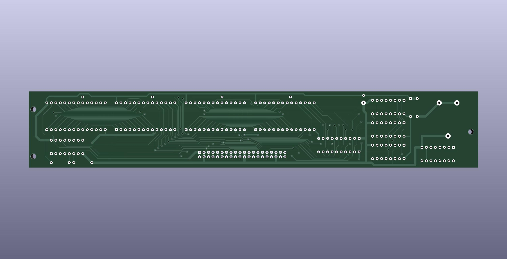

PCB BOTTOM

The real PCB has no silkscreen. This image has silkscreen added to show where the components from the schematic go.
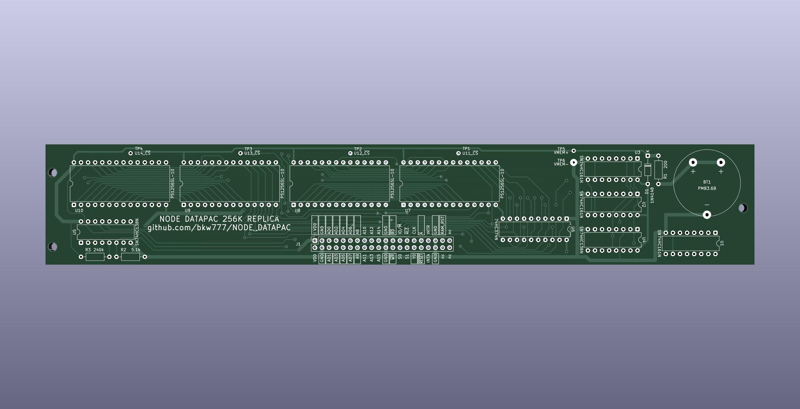

### New Schematic & PCB
This aims to be a functional replacement and will change over time to use newer parts.  
Currently still uses all the same main chips as the original. Changes so far are that many of the traces are rerouted, battery connections to support current battery options, decoupling caps, ground pours, silkscreen.  
Pending TODO items: Change the BUS connection to use a removable cable, and flip the pinout so that the computer end of the cable can use a connector that actually fits in a 200.

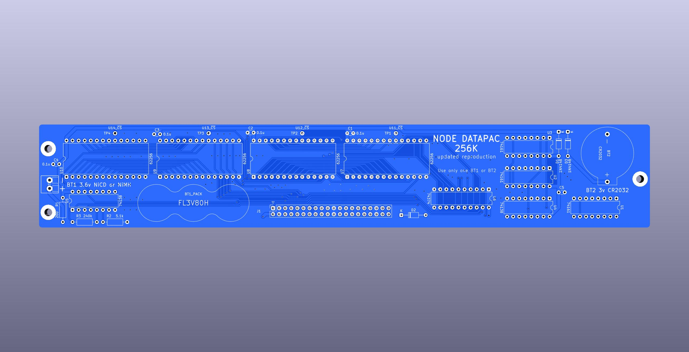

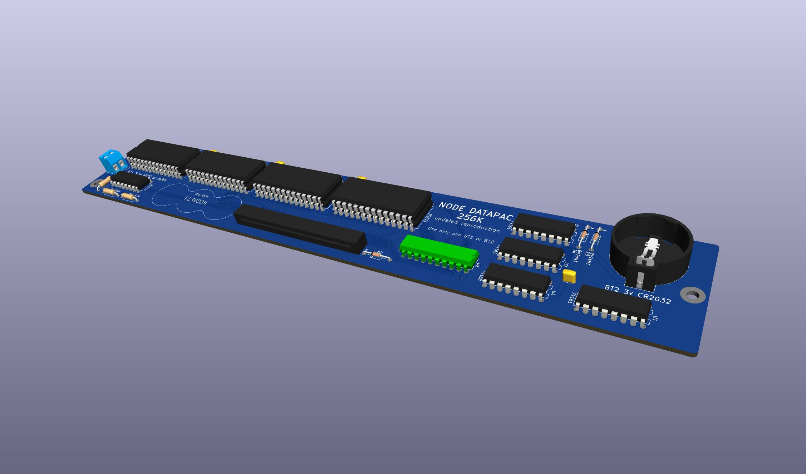
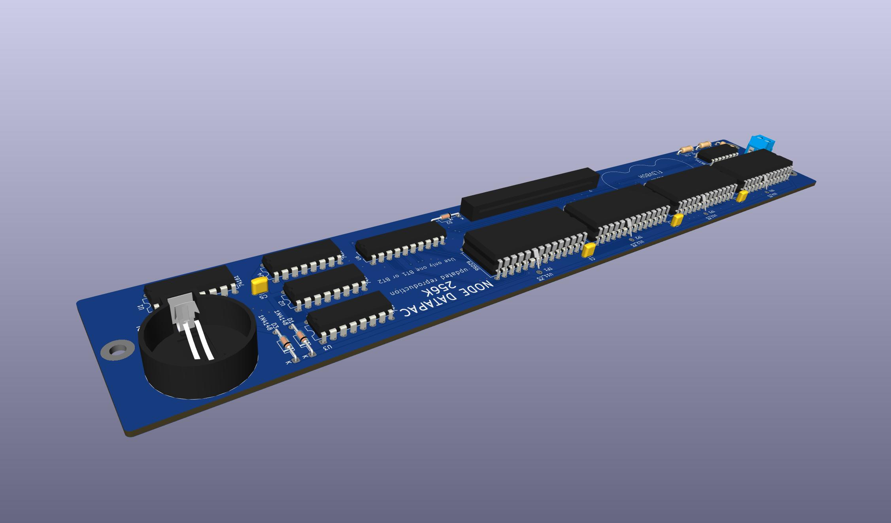

## Battery
The original battery is no longer made. The modern replacement is almost 2mm taller and does not fit inside the enclosure.

NODE Systems themselves used to perform an update to older units to replace the original rechargeable NiCD cell with a non-rechargeable lithium cell which was supposed to last about 5 years.

The change is simple and easy, and the parts are common. You just remove the old battery and the 200 ohm resistor, and replace them with a CR2032 holder and a diode. That's it. Both parts fit and solder right in the same locations where the old parts came out. Point the diode stripe away from the battery, just like the other diode that is right there next to it. Any kind of diode will do. Another 1N4148 like the other one that's already there is perfect.
This should give about 4 years of memory.  
(The original battery may have only lasted a number of months according to a review in the archives. So the coin cell mod is definitely an improvement as well as being available.)

BEFORE
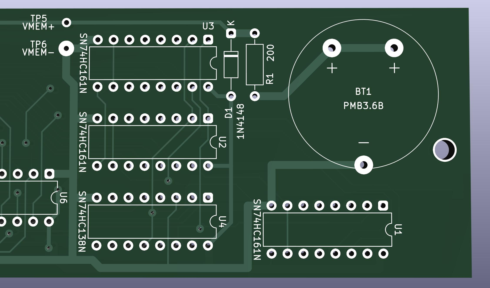

AFTER
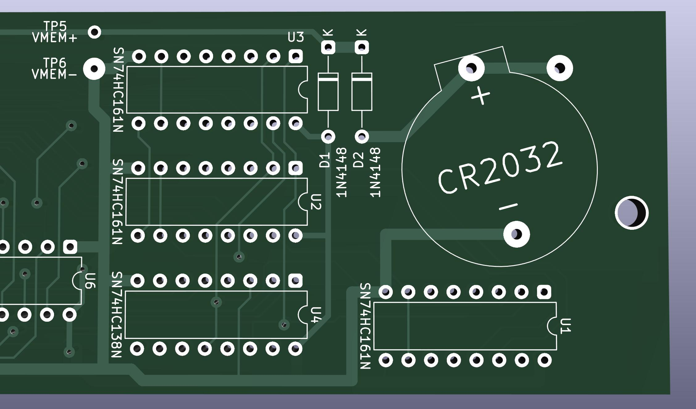

STEPS
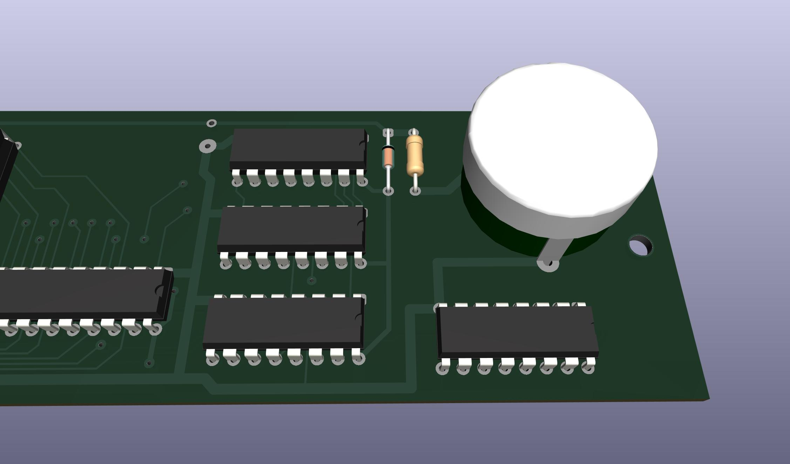
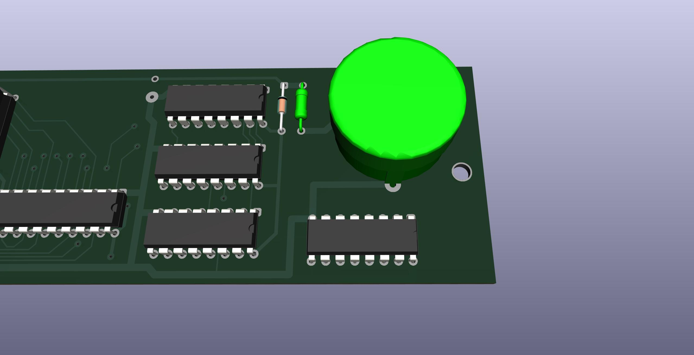
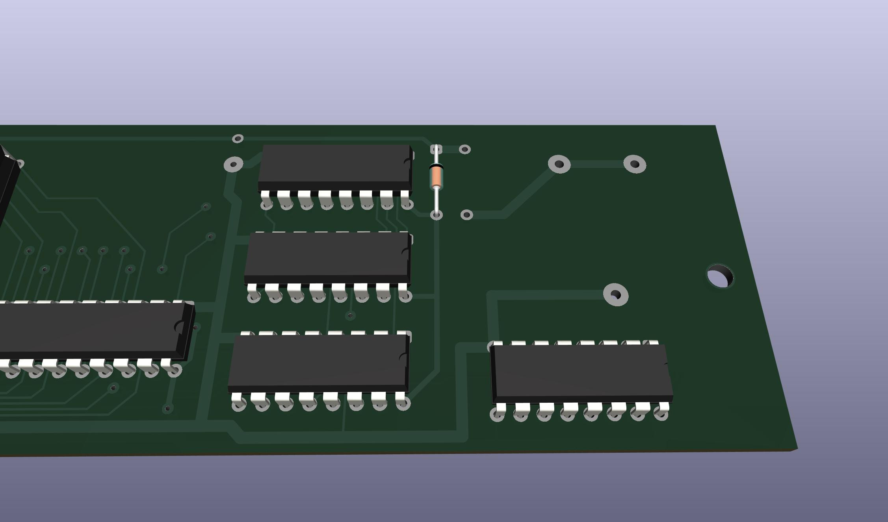
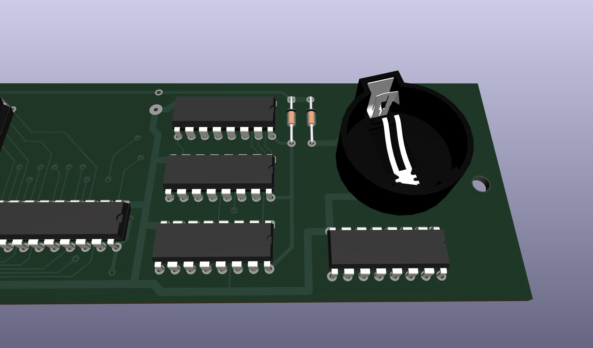

If you wish to keep using a rechargeable battery, then a suitable option is FL3/V80H. That is 3 16x5.8mm NiMH button cells in a flat in-line pack with wire leads. It fits perfectly in the space next to the ribbon cable. It needs to be secured with hot glue or foam mounting tape, and connected with wires run to the original battery location.  

## Documentation
The original manual does not seem to be scanned or archived anywhere.

All we have today is a few bits of info from discussions in the [M100SIG archive](https://github.com/LivingM100SIG/Living_M100SIG) and Paul Globmans software on [club100](http://www.club100.org/library/libpg.html).  
Some of these are collected [here](software).

A few of those documents indicate that the device shipped with the user manual pre-loaded onto the DATAPAC as an 11.7K text file, along with at least one BASIC program, and the Format function in the option rom would also re-create this file.

## Software
The "driver" software for the device is [RAMDSK](software/RAMDSK/)

Originally these shipped with an option rom from NODE, which does not seem to be archived anywhere.  

RAMDSK is purported to provide all or almost all of the same functionality as NODEs rom, and even NODE themselves later licensed RAMDSK and included a copy with each unit. It's unclear if this was in addition to their original rom, or fully replacing it.  
Even the rom calls from the option rom have equivalents in RAMDSK, though at different addresses.  
(One thing RAMDSK does not do which the original option rom did, is re-create the user manual text file as part of the Format function.)  

The only other significant software using this device seems to be [XOS-C](http://www.club100.org/library/libpg.html), also from Paul Globman, which is sort of an OS for the Model 200. XOS does not require a RAMPAC or DATAPAC, but apparently makes good use of one if present.  
I have not tried XOS-C yet.

Some things culled from the M100SIG archive and Club100.org are collected in [software](software)  

## Model compatibility
Apparently these were only ever supported on models 100, 102, 200. (No NEC or Olivetti, etc)

The cases on my units both say "Model 102/200", however...

### Model 200
The connector on the DATAPAC does NOT actually fit in a Model 200 without cutting the opening wider around the bus connector.  

The only connector that fits in a 200 without hacking on the 200s case is a solder-type IDC box header like [this](https://www.digikey.com/en/products/detail/sullins-connector-solutions/SBH11-PBPC-D20-ST-BK/1990068),
 which could be soldered back to back with the female version like [this](https://www.digikey.com/en/products/detail/sullins-connector-solutions/SFH11-PBPC-D20-ST-BK/1990093),
 to make an adapter to allow connecting to a 200 without having to damage the 200's case.

Crimp-on versions of that connector are too wide to fit in the 200's opening.

### Model 100
This "102/200" version actually works on Model 100 too. It needs an adapter cable, but the cable is simple. It's just a "wire-to-board" IDC-DIP-40 crimp-on DIP connector and a standard 2x20 female IDC connector, both crimped on to a 40-pin ribbon cable about 8 inches long.  
The Model 100 part of this [3-part cable for the Disk/Video Interface](http://tandy.wiki/Disk/Video_Interface:_Cable) is exactly the same thing.
