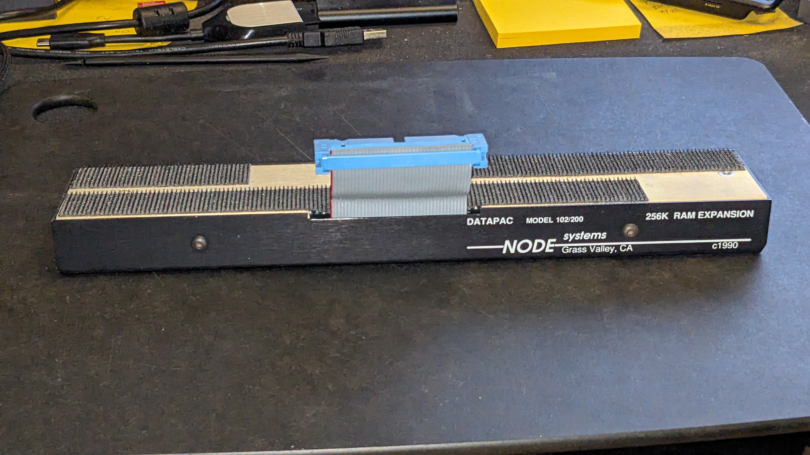
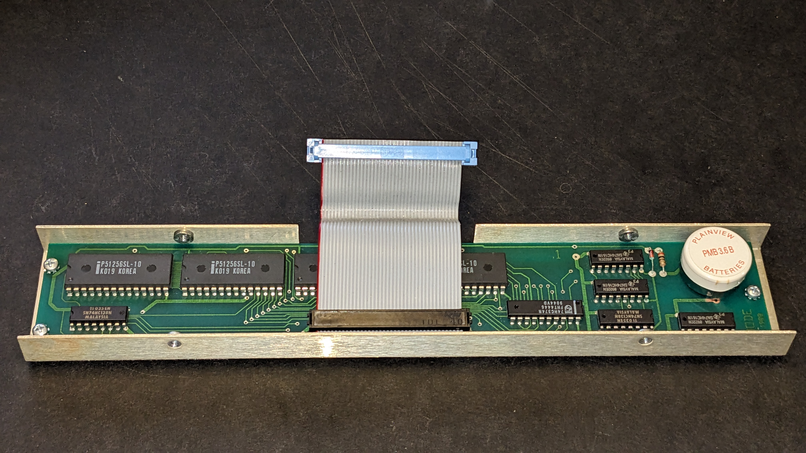
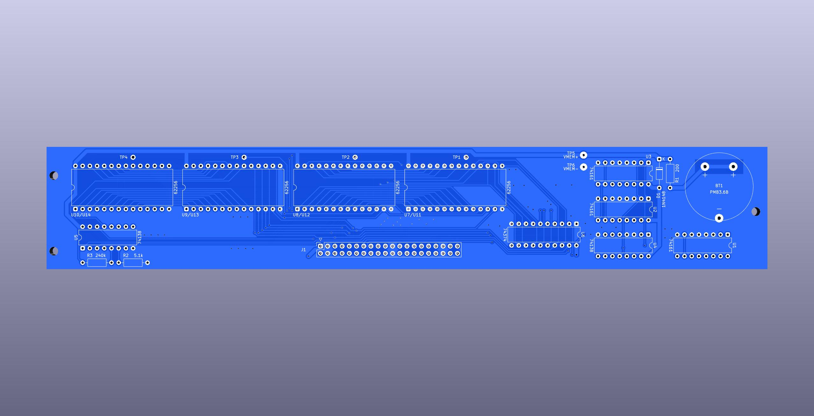
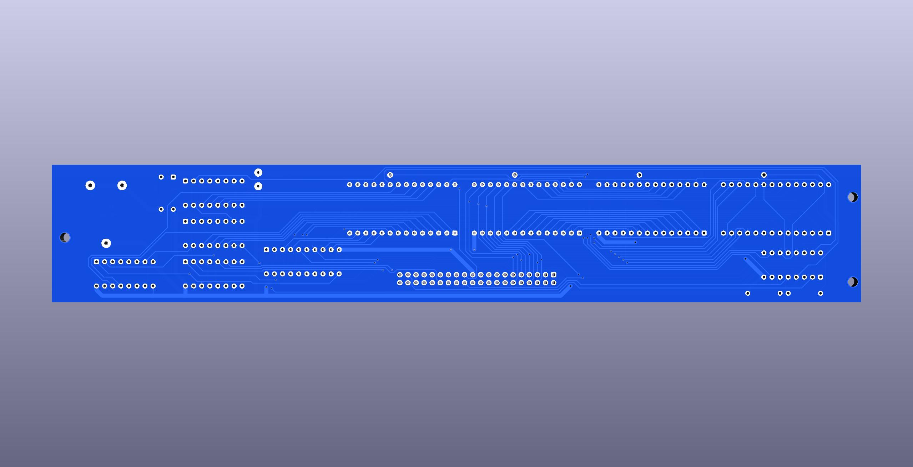
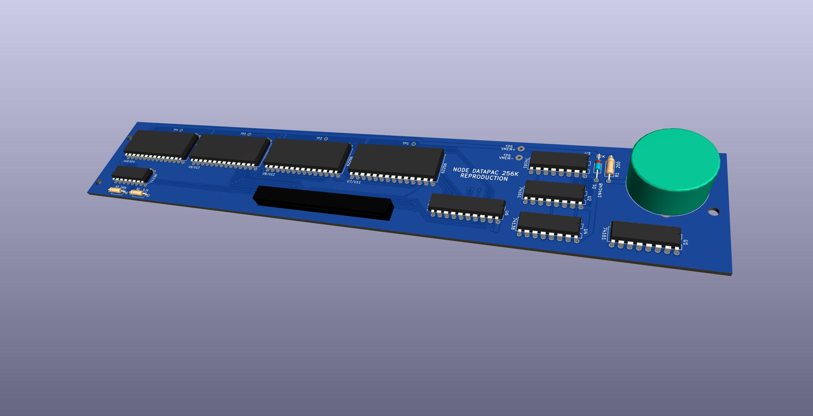

# Reproduction of Node Systems DATAPAC

The NODE Systems DATAPAC and RAMPAC were a popular ram expansion peripheral for TRS-80 / TANDY Models 100, 102, & 200 computers.

Some disorganized [INFO](http://tandy.wiki/NODE_DATAPAC) mostly gathered from the [M100SIG archive](https://github.com/LivingM100SIG/Living_M100SIG).  
Copies of most of the stuff above are in [REF/software](REF/software)  

TLDR: Install RAMDSK.CO (for 200) or RAM100.CO (for 100/102) to use the hardware.

The PCB is not an *exact* copy of the original. I could not stop myself from a few minor cleanups, even though this is really meant to be more documentation of the original than recipe to build a new one. Also some traces are hidden under chips and would have had to be guessed anyway unless I was willing to violate the original artifact to desolder all the chips just to get a full view of the pcb. It is electrically all the same connections, and the layout is almost the same (one chip is moved about 1 or 2 mm to make some traces neater), and still includes the original battery footprint even though you can not buy a battery like that any more and have to solder wires to to some other kind of battery.

I guess one possible actual use for this pcb might be if you had a DATAPAC that has a damaged pcb from battery corrosion or something, you could have any pcb manufacturer make one of these and transfer all the parts from the original to this. It uses all the same parts in the same locations, just transplant them 1 to 1. Except remember, this is not actually tested yet.

I will make a seperate PCB to make actual changes like a different battery solution, not to mention maybe entirely different chips eventually.

Maybe I will also make an exact copy pcb too just for historical reference. Or as exact as I can know from the parts that are visible. It would only need a few minor adjustments and would not need any ongoing updates to be kept in sync with the main version.
