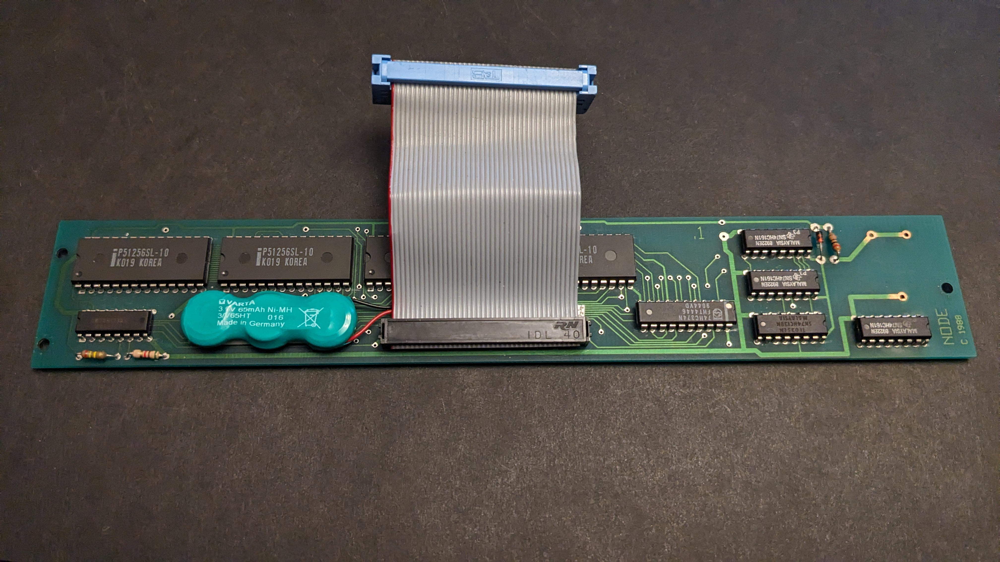

# Reproduction of Node Systems DATAPAC

The NODE Systems DATAPAC and RAMPAC were a popular ram disk peripheral for TRS-80 / TANDY Models 100, 102, & 200 computers.

RAMPAC was a later device that apparently functioned exactly the same as DATAPAC, just in a different, smaller form factor and probably using different parts inside.

This schematic and PCB documents the DATAPAC. If I ever aquire a RAMPAC, I'll add that.

Some disorganized [INFO](http://tandy.wiki/NODE_DATAPAC) mostly gathered from the [M100SIG archive](https://github.com/LivingM100SIG/Living_M100SIG).  
Copies of most of the stuff above are in [REF/software](REF/software)  

TLDR: Install RAMDSK.CO (for 200) or RAM100.CO (for 100/102) to use the hardware, and what you get is one or two 128K ram disks.

The PCB is not an *exact* copy of the original. I could not stop myself from a few minor cleanups, even though this is really meant to be more documentation of the original than recipe to build a new one. Also some traces are hidden under chips and would have had to be guessed anyway unless I was willing to violate the original artifact to desolder all the chips just to get a full view of the pcb. It is electrically all the same connections, and the layout is almost the same (one chip is moved about 1 or 2 mm to make some traces neater), and still includes the original battery footprint even though you can not buy a battery like that any more and have to solder wires to to some other kind of battery.

I guess one possible actual use for this pcb might be if you had a DATAPAC that has a damaged pcb from battery corrosion or something, you could have any pcb manufacturer make one of these and transfer all the parts from the original to this. It uses all the same parts in the same locations, just transplant them 1 to 1. Except remember, this is not actually tested yet.

I will make a seperate PCB to make actual changes like a different battery solution, not to mention maybe entirely different chips eventually.

Maybe I will also make an exact copy pcb too just for historical reference. Or as exact as I can know from the parts that are visible. It would only need a few minor adjustments and would not need any ongoing updates to be kept in sync with the main version.

## Battery
No one makes a battery like the original any more. There is a standard battery that would be a drop-in replacement in mose cases, but does not fit in this device.

The best option I have found so far is a FL3/V80H, ie: 3 V80H cells in a flat in-line pack. It fits perfectly in the space next to the ribbon cable. It needs to be secured with hot glue or foam mounting tape.

Pic shows 3/V65H but that is just the high-temperature version of the same cell because it's what I already had.  
Not shown wired up, but the two pins connected together to the diode & resistor are the positive, and the single pin next to the chip is the negative.  
Also the connector these packs sometimes come with is JST-ZH aka 1.5mm, so the ideal solution would be to install a male 2-pin JST-ZH extension lead, and then you can replace the battery in the future without even having to solder again.

I would also add some kind of support underneath the pcb in the center, like a blob of hot glue or a self-adhesive rubber or vynil foot, etc. Even a piece of folded paper or cardboard. Anything insulating. Something to prevent the pcb from bowing downwards.  
The pcb is only supported on the very ends, with the long narrow pcb unsupported in between. The original batter is located right next to one of the screw posts, and so is supported well enough.  
But with the weight of a battery added to the existing weight of the chips in the middle of this long norrow unsupported pcb, even normal small bumps like just setting the unit down on a table will flex the pcb.

## Software
Originally these were shipped with an option rom from NODE, which I do not have.  
RAMDSK is claimed to provide all or almost all the same functionality, and even NODE themselves eventually licensed RAMDSK from Paul Globman and included a copy with each unit. It's unclear if this was in addition to their own original rom, or fully replacing it.

The only other significant software using this device seems to be [XOS](http://www.club100.org/library/libpg.html), also from Paul Globman, which is sort of an OS for the Model 200. XOS does not require a RAMPAC or DATAPAC, but apparently makes good use of one if present.
I have not tried XOS yet.

## Model compatibility
The case says for Model 102/200, however...

### Model 200
The connector on the DATAPAC does NOT actually fit in a 200 without cutting the opening around the bus connector on the 200 wider

The only connector that fits in a 200 is a solder-type box header like used in this [cable for the Disk/Video Interface](http://tandy.wiki/Disk/Video_Interface:_Cable#Good_Cable).

### Model 100
This unit actually works on Modle 100 too. It needs an adapter cable but the cable is simple.
From the top of that page with the Disk/Video Interface cables above, the Model 100 part of the [3-part cable](http://tandy.wiki/Disk/Video_Interface:_Cable#Good_Cable) works for this too. Just the Model 100 part, not the full cable with all 3 parts connected.
