# NODE Systems DATAPAC
* [Documentation](#documentation)
* [DATAPAC Hardware](#datapac-hardware)
  * [Reproduction Schematic & PCB](#reproduction-schematic--pcb)
  * [Theory of Operation](#theory-of-operation)
  * [Battery](#battery)
  * [Upgrading 128K to 256K](#upgrading-to-256k)
  * [Model Compatibility](#model-compatibility)
* [Software](#software)
  * [BASIC](#basic)
  * [RAMDSK](#ramdsk)
    * [Installation](#installing-ramdsk)
    * [Usage](#using-ramdsk)
  * [NBOOT](#nboot)
  * [RAMPAC Inspector](#rampac-inspector)
  * [XOS-C](#xos-c)
  * [N-DKTR](#n-dktr)
  * [NODE-PDD-Link](#node-pdd-link)
  * [NDEXE](#ndexe)
  * [RAMPAC Diagnostic](#rampac-diagnostic)
* [MiniNDP](#minindp)
<!--
  * [PCB & BOM](#minindp-pcb--bom)
  * [Cover](#minindp-cover)
-->

This repo documents the NODE Systems DATAPAC, RAMPAC, and a new clone, the [MiniNDP](#minindp).

The NODE Systems DATAPAC was a popular ram disk peripheral for TRS-80 / TANDY Models 100, 102, & 200 computers.

Later versions of the same device were called RAMPAC. They functioned the same as DATAPAC and used the same software, just in a much smaller form factor.

The schematic and PCB below documents the DATAPAC from examining 2 units. If I ever aquire a RAMPAC, I'll add that.

Here is some disorganized [INFO](software/) mostly gathered from the [M100SIG archive](https://github.com/LivingM100SIG/Living_M100SIG) and [club100](http://www.club100.org).

TLDR: To use the hardware, install [RAMDSK](#ramdsk), and what you get is a ram disk of 128k to 1M depending on model and installed ram.

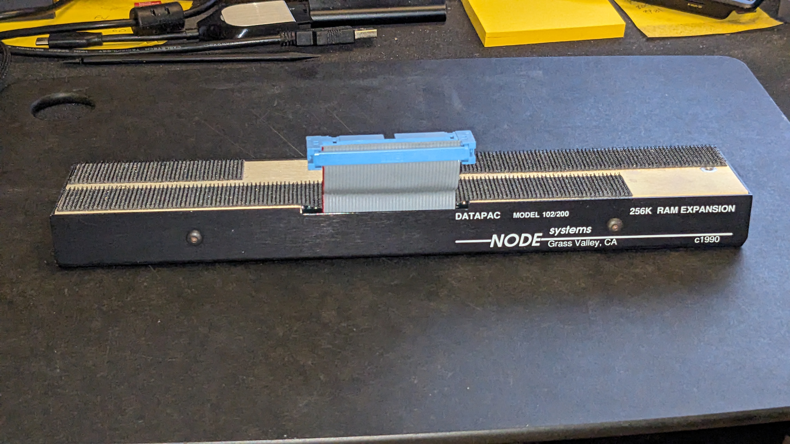
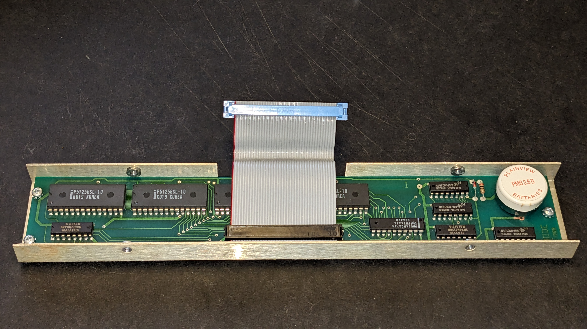
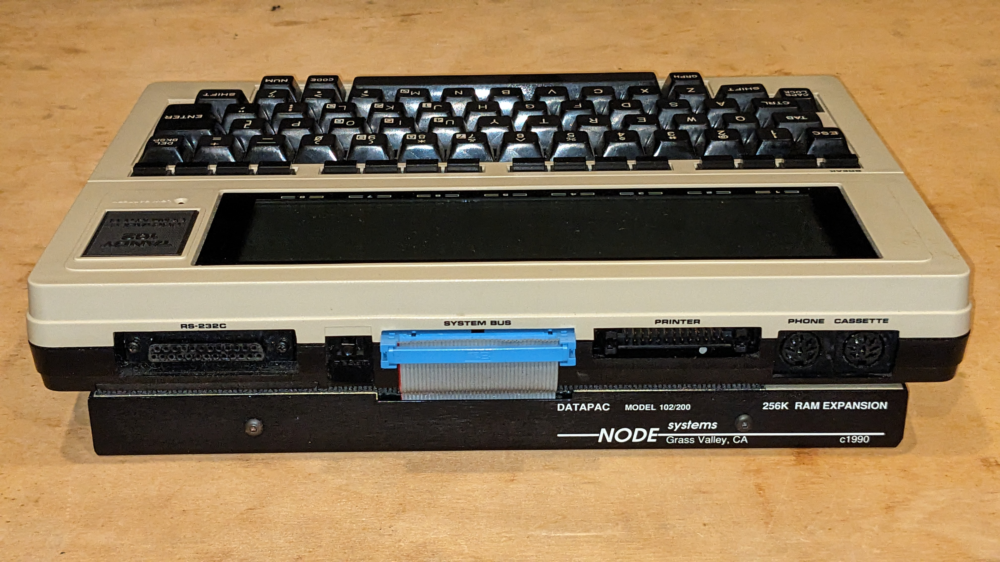
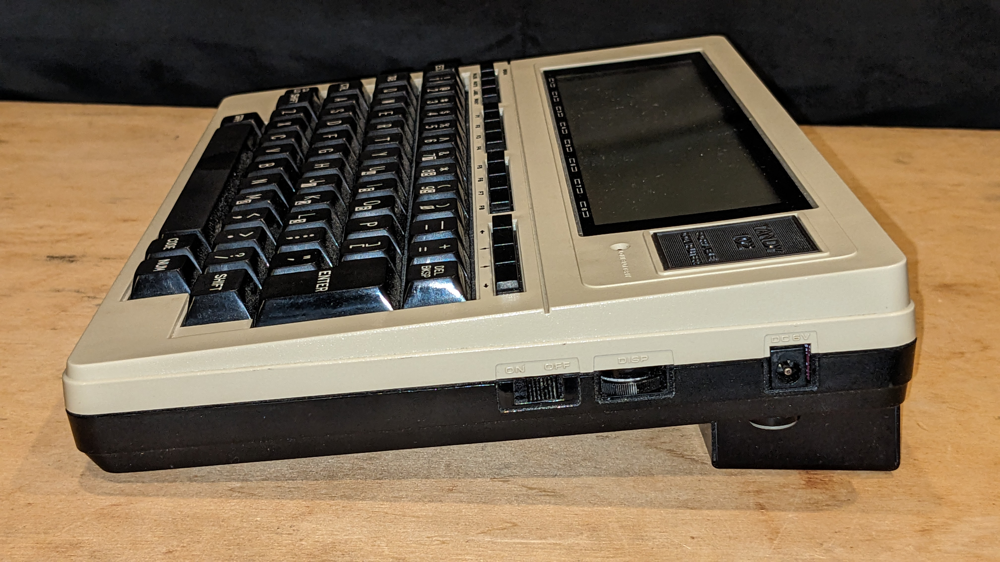

# Documentation
The original text file manual [RAMDSK.DO](ROM/100/RAMDSK.DO).  
The [NODE ROM](ROM) that came with the unit generates this file when formatting a device.

There are also some discussions in the [M100SIG archive](https://github.com/LivingM100SIG/Living_M100SIG) and Paul Globmans software on [club100](http://www.club100.org/library/libpg.html).  
Most of these are collected in [docs](docs).  
See also the docs for the various bits of [software](software).

Other References  
* "Database management with both the Node RAMPAC & DATAPAC."  
  Alspaugh, Ron - [Portable 100, Nov 90:8-11](https://archive.org/details/P100-Magazine/1990-11/page/8/)  
* "Node utility mini-extravaganza! Here are two special programs for Node Datapac/RAMPAC users."  
  Globman, Paul - [Portable 100, Dec 90:19-20](https://archive.org/details/P100-Magazine/1990-12/page/18/)  

# DATAPAC Hardware
## Reproduction Schematic & PCB
This is a new drawing but aims to reflect the original actual device as exactly as possible.  
It's meant to be a form of documentation or reference describing the original hardware as it was.  
For instance, the ungrounded inputs on the 161's, the inconsistent thickness of power traces, the fact that only 1 of the 2 bus VDD pins is connected, the VCC trace that almost touches one of the mounting screw heads, etc, are all exactly as in the original.  
(I added a fiber washer to that screw in my units after noticing that. The case is not connected to ground, but still...)  

For a historical reproduction version of the original PCB (minus the NODE copyright mark), see: NODE_DATAPAC_256K_historical_reproduction.kicad_pro

For a cleaned up version of the original PCB that still uses the same components and fits in the same case, see: NODE_DATAPAC_256K_bkw.kicad_pro


PCB TOP
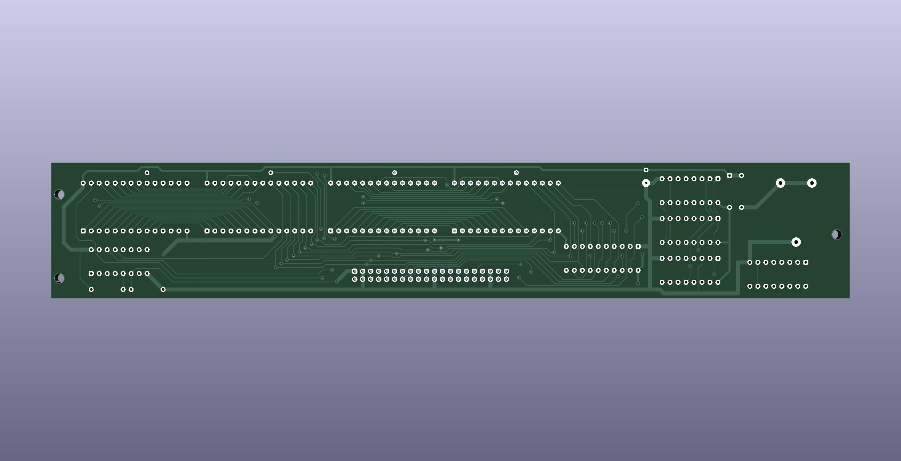

PCB BOTTOM
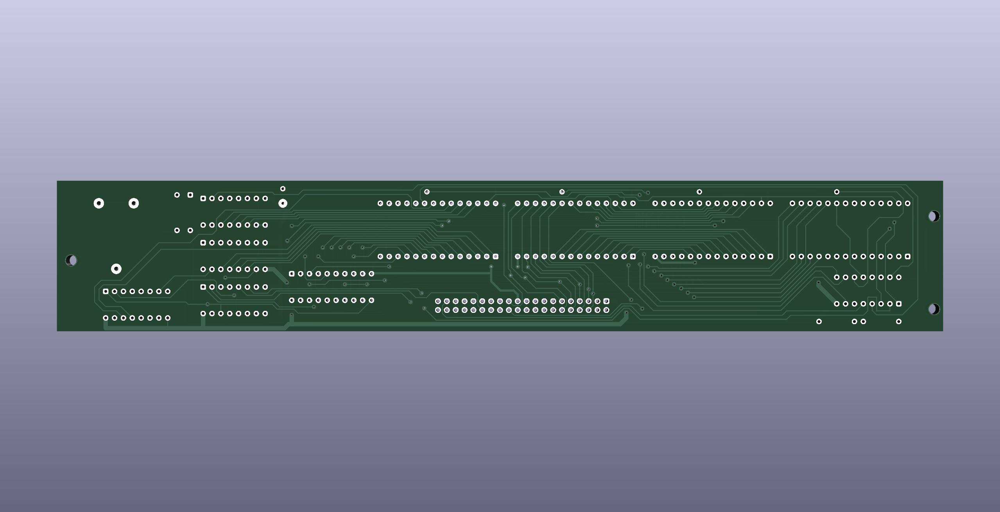

The original PCB has no silkscreen. This image has silkscreen added to show where the components from the schematic go.
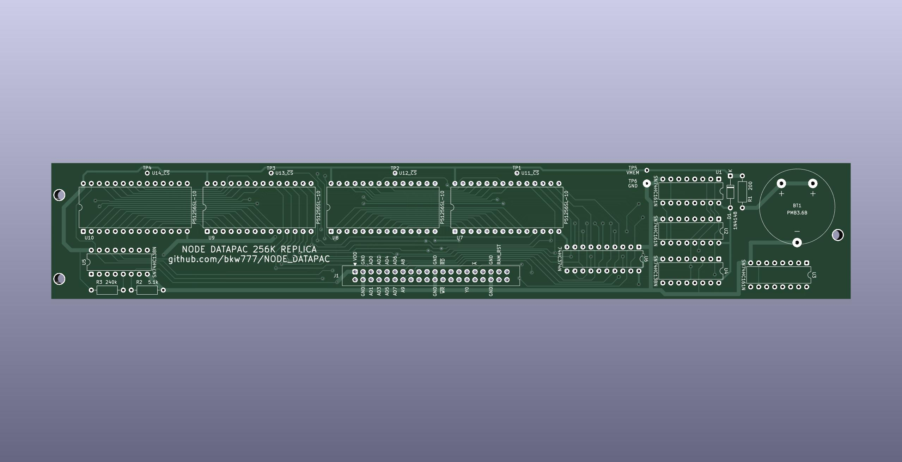

<!--
## Updated Replacement PCB that fits the original case

Uses all the same through-hole parts, fits in the original enclosure, improves the trace routing a little, for example moving that VCC line away from that screw head, GND traces replaced by zone fills, thicker and all the same size vcc lines, decoupling caps, silkscreen.  

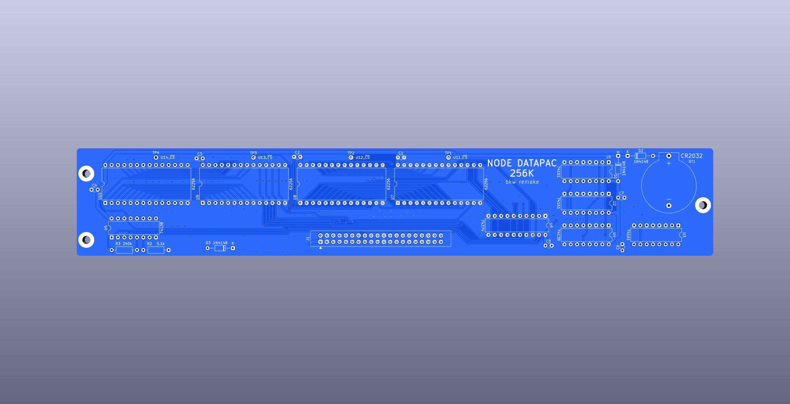
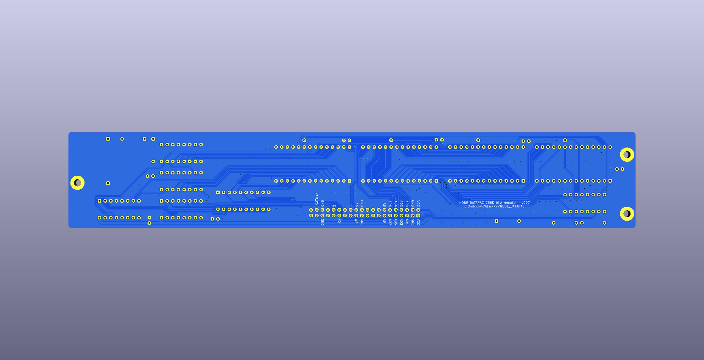
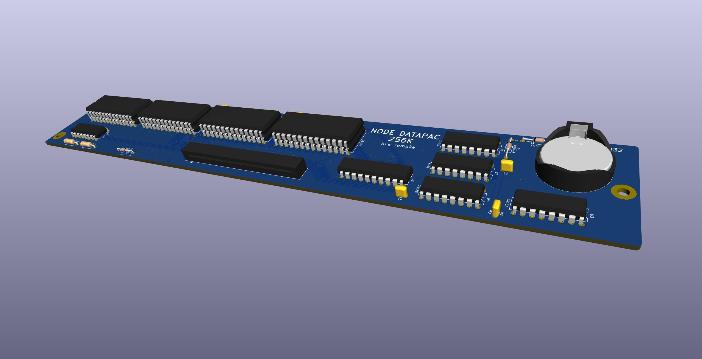
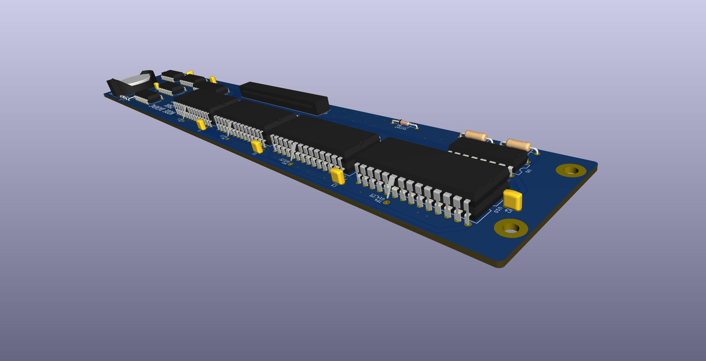
-->

## Theory of Operation
The circuit has 2 functions, SELECT-BLOCK and READ/WRITE-BYTE, controlled by the internal active-low signals /BLOCK and /BYTE.

The U4 HC138 monitors four lines from the bus, `/Y0` `(A)` `A8` `A9`, and based on that asserts either `/BLOCK` or `/BYTE` or neither.  
If neither /BLOCK nor /BYTE is asserted then the bus traffic has no effect on any of the other chips.

The 3 HC161 form a 0-1023 counter, setting SRAM address bits A0-A9.  
Call this the byte-number or byte-position counter or offset.

The HC374 sets SRAM address bits A10-A17 from the bus data bits AD0-AD7, and latches that value on its outputs until triggered to update to a new value.  
Call this the block-number or block selector.

The U5 HC138 converts 3 bits of the block-number into 1 of 8 chip-select to select 1 of 8 32K SRAM chips,  
and also monitors both /BYTE and RAMRST and disables all ram while either /BYTE or RAMRST is high.

----

### SELECT-BLOCK
When /BLOCK goes low:
* SRAM A0-A9 are reset to 0  (byte-position counter is reset to 0)
* BUS AD0-AD7 are copied to SRAM A10-A17  (bus data lines AD0-AD7 select a block-number)

When /BLOCK goes high:
* SRAM A10-A17 are held latched at whatever they were set to  (block-number is locked in until next /BLOCK)

----

### READ-BYTE / WRITE-BYTE
When /BYTE goes low:
* SRAM is enabled  (bus data lines AD0-AD7 read from or write to the current address in SRAM)

When /BYTE goes high:
* SRAM is disabled
* A0-A9 are incremented by 1 (byte-position, thus the current address in SRAM, is advanced to the next byte)

----

The byte-number and block-number combine to form the current address in SRAM at any given time.  

The device provides up to 256 blocks (8-bit block-number) of 1024 bytes each (10-bit byte-number).

The host computer first does a SELECT-BLOCK to select a block number from 0-255, then does READ-BYTE or WRITE-BYTE to read or write one byte of data at byte number 0 in that block, then repeats the BYTE operation up to 1023 more times to read or write up to all 1024 bytes in the block.  

If you read or write more than 1024 times without selecting a new block, the byte-number counter just rolls over to 0 again.

You can also mix reads and writes in the same block. Each read OR write advances the byte position the same way each time, regardless if the previous operation was a read or a write. For instance in order to skip over 64 bytes without modifying them and then start writing at the 65th byte, you would read-and-ignore 64 times and then start writing.

"ramdisk" is an appropriate term because the device actually does operate like a disk even though it has no brains or firmware. The block-select latch acts like a track or sector address, and the binary counter acts like a disk or tape head reading or writing a sequential stream of bytes.

Later versions of RAMPAC were offered with 384k or 512k by adding a second bank of up to 256k, and later versions of RAMDSK.CO know how to access the 2nd bank.

In 512K units, the extra 256K is accessed by the state of bus address line A10 during a SELECT-BLOCK operation.  
SELECT-BLOCK with BUS_A10 low accesses bank0, with BUS_A10 high accesses bank1.  
All other aspects are the same, so accessing bank0 on a a 512K device is the same as accessing the only bank on a 256K device.  Old software is still compatible with bank0 on new hardware, new software is still compatible with old hardware.

[What this all means from the host computer software side of things](https://github.com/bkw777/NODE_DATAPAC?tab=readme-ov-file#low-level-direct-access-using-only-basic)

## Battery
The original battery is no longer made, and the modern cross-reference is almost 2mm taller and does not fit inside the enclosure.

NODE Systems themselves used to perform an update to older units to replace the original rechargeable NiCD cell with a non-rechargeable lithium cell which was supposed to last about 5 years.

The change is simple and easy, and the parts are common. You just remove the old battery and the 200 ohm resistor, and replace them with a CR2032 holder and a diode. That's it. Both parts fit and solder right in the same locations where the old parts came out. Point the diode stripe away from the battery, just like the other diode that is right there next to it. Any standard diode will do. Schottky is not recommended because the reverse leakage is not good for a lithium cell. Another 1N4148 like the one that's already there is perfect.  
This should give at least 4 years of memory.  
(The original NiCD battery may have only lasted as little as a few months per charge according to a review in the archives. So the coin cell mod is not merely more conveniently available with current parts, it's an improvement.)

BEFORE
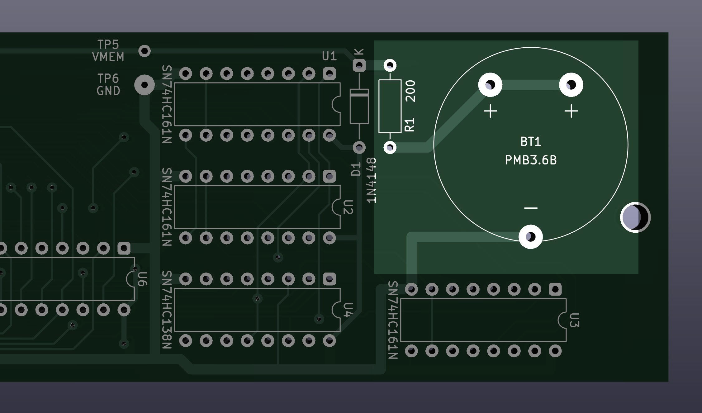

AFTER
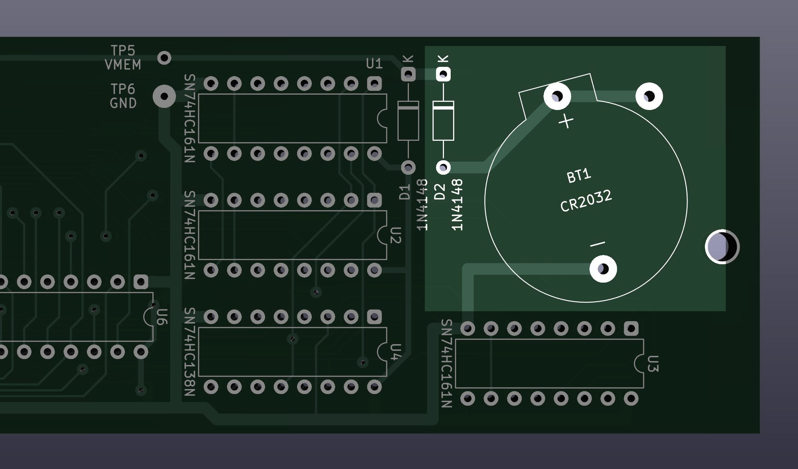

STEPS
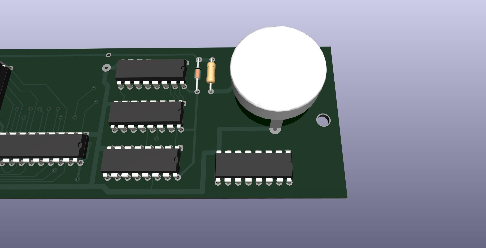
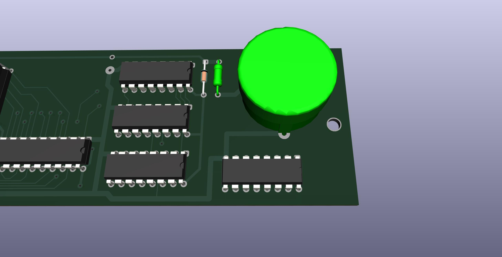
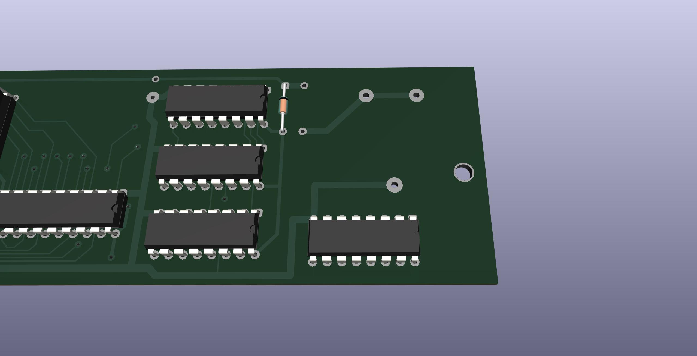
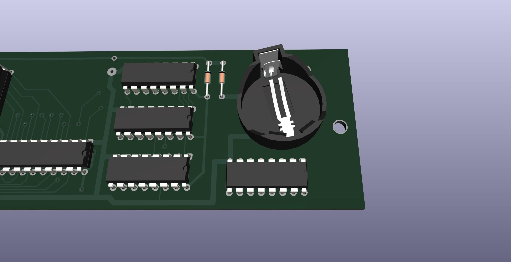


If you wish to keep using a rechargeable battery, then one suitable option is FL3/V80H. That is 3 16x5.8mm NiMH button cells in a flat in-line pack with wire leads. It fits perfectly in the space next to the ribbon cable. It needs to be secured with hot glue or foam mounting tape, and connected with wires run to the original battery location.  
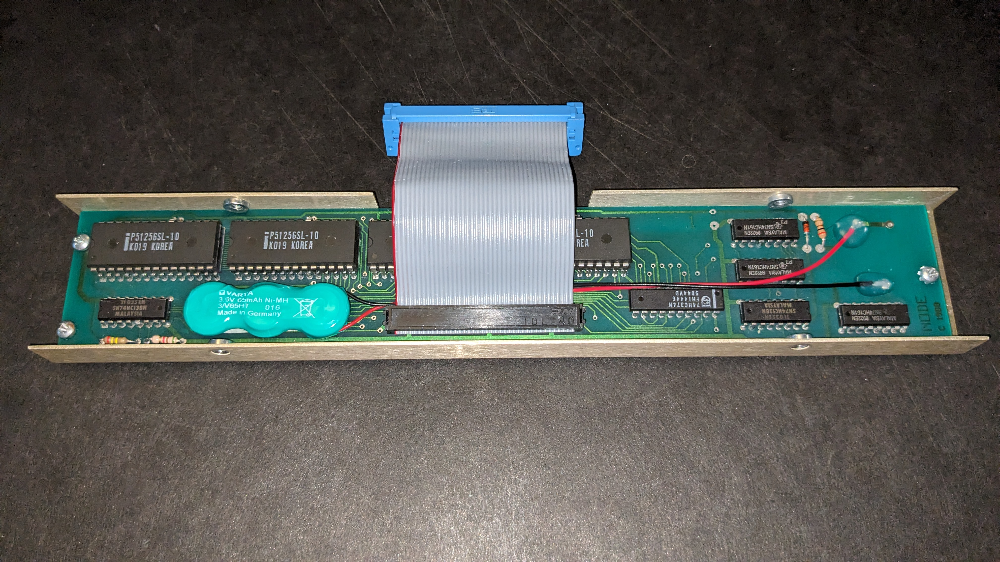

The charging circuit is utterly basic, so do not connect any other type of battery except NiCD or NiMH.  
You can use any cell form factor and any larger or smaller mAh capacity, but must be 3.6v and only NiCD or NiMH chemistry.

## Upgrading to 256K
A 128k unit may be upgraded to 256k by just adding 4 more SRAM chips piggy-backed onto the existing chips.

The PCB has 4 DIP-28 footprints for the SRAM chips.  
Each DIP-28 footprint also has an extra via close to pin 20.

A 128k unit has a low-power 62256 installed in each footprint, and nothing connected to the via near pin 20.

To get 256k, a second set of chips are soldered piggyback on top of the first four.  
All pins except pin 20 are simply soldered to the chip below.  
Pin 20 is bent out and connected to the extra via on the pcb (with a short bit of wire to reach) and not connected to the chip below.  

No other parts or changes are needed to upgrade an existing 128k unit to 256k.

Any 62256 will work, but for old parts you want the low-power version for standby battery life.  
New parts already naturally have as low or lower standby current than the low-power versions of old parts even if they don't say "low power".  
Old standard: HM62256    70uA  
Old lowpower: HM62256LP  4uA  
Old lowpower: P51256SL   2uA  
New standard: AS6C62256  1uA

## Model compatibility
Only Models 100, 102, & 200 were ever supported.

The device is probably hardware compatible with the Olivetti M-10 and Kyotronic KC-85, though RAMDSK was (probably) never ported to them.

The device is not compatible with the NEC PC-8201/PC-8300 at all.

### Model 200
The connector on the DATAPAC [does not actually fit in a Model 200](ref/does_not_fit_model_200.jpg) without cutting the opening wider around the bus connector on the 200.

The only connector that fits in a 200 without hacking on the 200s case is a [solder-type 2x20 male box header](https://www.digikey.com/en/products/detail/sullins-connector-solutions/SBH11-PBPC-D20-ST-BK/1990068),
 which could be soldered back to back with the [female version](https://www.digikey.com/en/products/detail/sullins-connector-solutions/SFH11-PBPC-D20-ST-BK/1990093),
 to make an [adapter](ref/T200_adapter.jpg) to allow [connecting to a 200](ref/T200_adapter_installed.jpg) without having to damage the 200's case.

### Model 100
The case says "102/200", but it actually works on Model 100 also. It needs an adapter cable, but the cable is simple. It's just a "wire-to-board" IDC-DIP-40 crimp-on DIP connector and a standard 2x20 female IDC connector, both crimped on to a 40-pin ribbon cable about 8 inches long.  
[The Model 100 part](https://github.com/bkw777/TRS-80_Disk_Video_Interface_Cable/blob/main/README.md#part-3---model-100-adapter) of this [3-part cable for the Disk/Video Interface](http://tandy.wiki/Disk/Video_Interface:_Cable) is exactly the same thing.

# Software

 - [NODE ROM](ROM)  
 - [RAMDSK.CO](software/RAMDSK)  
 - [other](software)  

Originally these shipped with an [OPTION ROM](ROM) from NODE called RAMDSK, written by Travelling Software. <sub><sup>\[citation needed, I don't remember where I read that\]</sup></sub>  

The only copy of the original rom available today is an early version that only supports the original 256k hardware, and only for Model 100/102.

Then Paul Globman wrote [RAMDSK.CO](software/RAMDSK), and that was eventually licensed by NODE and shipped with new units.  

Later, RAMDSK was updated with 2 changes:  
 - automatic repair of the format stamp on start-up  
 - support for 512k (2 banks of 256)

Today we have several versions of RAMDSK, including:  
 - original versions for 100 & 200 which supported 512K (2 banks), in the `orig` directories
 - an earlier version for 200 that only supports 256K
 - new versions for 100, 200, and K85 which support 1M (4 banks)

Some software culled from the [M100SIG archive](https://github.com/LivingM100SIG/Living_M100SIG) and [Club100](https://www.club100.org) are collected here in the [software](software) directory.  

## BASIC
How to access the hardware from BASIC.

### High level file operations using CALLable machine language routines
See [RAMDSK.DO](ROM/100/RAMDSK.DO) for the NODE ROM routines.  
See [RAMDSK.TIP](software/RAMDSK/RAMDSK.TIP) for the RAM100.CO/RAM200.CO routines.  
(But ignore the actual addresses, they only apply to the original pre-banks version of RAMDSK. The .map or .calls files in the RAMDSK directory tree have correct addresses for the matching .CO)

### Low level direct access using only BASIC
There are two low level operations that you use to access the device,  
BLOCK and BYTE, and each of those has two variations, for four total ops.

Select a BLOCK from BANK 0  
`OUT 129,n`  
Selects block# **n** (0-255) in bank 0, and resets the byte position to 0.

Select a BLOCK from BANK 1  
`OUT 133,n`  
Selects block# **n** (0-255) in bank 1, and resets the byte position to 0.

Read a BYTE  
`INP(131)`  
Reads the byte at the current byte position, and advances the byte position by one.

Write a BYTE  
`OUT 131,n`  
Writes the value **n** (0-255) to the current byte position, and advances the byte position by one.

The first read or write after selecting a block# applies to byte #0 of that block.  
The byte position advances by one after each read or write, so the next read or write will be byte #1, then byte #2, etc up to 1024.  
If you read or write more than 1024 times without selecting some other block, the byte position just rolls over to 0 again.

The position counter advances the same whether reading or writing.

Since the device can only read or write a single unsigned byte at a time, it's most efficient to use integer variables.  
Use the % suffix or DEFINT: `B%=INP(131)` or `DEFINT B : B=INP(131)`

The general sequence is always:  
1 - select a bank+block  
2 - read/write byte 0-1024 times

To seek to an arbitrary offset before reading or writing, read-and-ignore that many bytes.

For instance, in RBOOT.DO, to skip over the first 16 bytes of the block, it does `FORA=0TO15:N=INP(131):NEXT`  
N is not actually used, it's just reading 16 times and ignoring the data. This just advances the byte position counter to get from byte #0 past the 10-byte RAMDSK header and 6-byte .CO header to the start of the .CO executable data.

Examples

Select bank 0 block 0  
`OUT129,0`

read a byte, which will be byte #0 of this block  
`INP(131)`

Read and print the ascii of all the bytes in bank 0 block 2.  
(this will mess up the display from control bytes if there is a binary .CO file in this block)
```
10 OUT 129,2
20 FOR I=0 TO 1023
30 PRINT CHR$(INP(131));
40 NEXT
```

Do the same but in bank 1  
change line 10 to:  
`10 OUT 133,2`

Manually repair the first two bytes of block 0 to mark the bank as being formatted without touching any of the data.  
This means:
1. Select bank0 block0  
2. write one byte, value 64  
3. write one byte, value 4

`OUT129,0:OUT131,64:OUT131,4`

(BTW you usually don't need to do this because RAMDSK.CO will do it for you if you answer "Y" at the "Fix?" prompt.)

## RAMDSK
The disk technically doesn't care what you write to it, but the normal software for the device is either the [NODE ROM](ROM) or [RAMDSK.CO](software/RAMDSK/)  

This provides a virtual disk interface where you can copy files to and from the device.

RAMDSK provides the same functionality as the NODE ROM, and is compatible with it.  
They both write the same filesystem structure to the device, either one can read/write a device that was formatted by the other.

Differences between the NODE ROM and RAMDSK:

The NODE ROM creates a text file when it formats a blank device, RAMDSK does not.

The NODE ROM docs claim it also supports PG Designs and PCSG ram expansions, which are NOT clones or work-alikes of the DATAPAC/RAMPAC. RAMDSK only supports the DATAPAC/RAMPAC or anything that works exactly the same way such as MiniNDP.

RAMDSK supports banks (devices with more than 256K of ram), the NODE ROM only supports up to 256K.

RAMDISK includes a feature to automatically repair the format stamp in the first 2 bytes of the device, the NODE ROM does not.

### Assembly Source Reconstructed from Disassembly

[RAMDSK Source](software/RAMDSK/src)  

This source currently generates several variants based on compile-time options you can set in Makefile or on the make command line:

- Exact replicas of the legacy (2-bank) RAM100.CO v2 & RAM200.CO v2 binaries just for reference.

- A K85 equivalent of the legacy (2-bank) RAM100.CO

- New versions for 100, 200, & K85 that support up to 32 banks in theory (MiniNDP has 4 banks),  
  with the exact same file size & TOP/END/EXE as the legacy versions so that the same RBOOT code (silkscreened on MiniNDP) works on both old and new binaries.

- New versions that don't bother artificially matching an arbitrary file size, are a few bytes smaller and also live a few bytes higher.

- Single-bank versions that are even smaller by omitting all code dealing with banks.  
  This is probably very close to the original RAMDSK v1 from before bank support was added,  
  except the code to repair the format stamp is still included. RAMDSKv1 did not have that.

`make clean all` builds a 4-bank version of RAMxxx.CO, RAMxxx.DO, RAMxxx.calls for all models. (100, 200, K85)  

`make clean legacy` builds legacy versions for 100 & 200 and compares them against preserved copies of the originals to verify they match exactly.

`make load_100` or 200, or K85: convenience target that builds and then runs `dl -v -b RAMxxx.DO` to install to the portable.

For each `RAMxxx.CO`:  
`RAMxxx.DO` is a BASIC loader containing the .CO  
`RAMxxx.calls` lists some functions that may be CALLed from BASIC or another machine language program.  
See [RAMDSK.TIP](software/RAMDSK/RAMDSK.TIP) and [RAMDSK.DO](ROM/100/RAMDSK.DO) but ignore those addresses.

### Installing RAMDSK

Archived docs mention an 8 line BASIC program called BOOT that could be manually typed in to BASIC to bootstrap a copy of RAMDSK from a RAMPAC after a cold start.  
Requires first saving a copy of RAMDSK.CO to the device, and must be the first file on the device.

That program does not seem to be archived anywhere, but I have written `RBOOT` and `NBOOT` new below.  

To get [RAMDSK](software/RAMDSK) installed for the first time, use the matching `RAMxxx.DO` BASIC loader.

To bootstrap the BASIC loader from a PC running Windows:  
Install [tsend](https://github.com/bkw777/tsend)  
Then: `C:> tsend.ps1 -file RAM100.DO`

To bootstrap the BASIC loader from a PC running Linux, MACOS, FreeBSD, any unix, Cygwin/MSYS2:  
Install [dl2](https://github.com/bkw777/dl2)  
Then: `$ dl -v -b RAM100.DO`

Then run RAMDSK to format the device and copy RAMDSK.CO to it as the first file.  
In order for RBOOT or NBOOT to work, `RAMxxx.CO` must be the first file on bank0.

Once you have RAMDSK installed, if you save a copy to the RAMPAC as the very first file after a fresh format, then in the future you can re-install RAMDSK from the RAMPAC itself after a cold reset without needing another computer or TPDD drive by manually typing in a short BASIC program.

These are optimized to tetris-pack into the fewest possible 40-column lines, not to be the most efficient code, so the entire program actually fits on the screen so you can easily verify it's all typed-in correctly before trying to run it.  
Please excuse the inexcusable IF and math inside the byte read loop. :)

These have specific byte size and offset values that are only valid for the exact RAM100.CO and RAM200.CO files shown.

RBOOT for Model 100, 102, & KC-85
[software/RAMDSK/RAM100/RBOOT.100](software/RAMDSK/RAM100/RBOOT.100)  
for [software/RAMDSK/RAM100/RAM100.CO](software/RAMDSK/RAM100/RAM100.CO)  
and [software/RAMDSK/RAM100/RAMK85.CO](software/RAMDSK/RAM100/RAMK85.CO)
```
1 CLEAR0,61558:T=61558:E=62957:OUT129,2
2 FORA=0TO15:N=INP(131):NEXT:FORA=TTOE
3 POKEA,INP(131):IFA=T+1007THENOUT129,1
4 ?".";:NEXT:SAVEM"RAM100",T,E,T
```
(for K85 just change the name but the T & E addresses are the same for 100 & k85)

RBOOT for Model 200  
[software/RAMDSK/RAM200/RBOOT.200](software/RAMDSK/RAM200/RBOOT.200)  
for [software/RAMDSK/RAM200/RAM200.CO](software/RAMDSK/RAM200/RAM200.CO)
```
1 CLEAR0,59715:T=59715:E=61101:OUT129,2
2 FORA=0TO15:N=INP(131):NEXT:FORA=TTOE
3 POKEA,INP(131):IFA=T+1007THENOUT129,1
4 ?".";:NEXT:SAVEM"RAM200",T,E,T
```

Either of above may be adjusted to boot from a different bank instead of bank0.  
For bank1, 2, or 3, chamge all (2) occurances of OUT129 to OUT133, 137, or 141.  
Example, Model 200 booting from Bank1 (requres RAM200.CO saved as the first file in bank1):  
```
1 CLEAR0,59715:T=59715:E=61101:OUT133,2
2 FORA=0TO15:N=INP(131):NEXT:FORA=TTOE
3 POKEA,INP(131):IFA=T+1007THENOUT133,1
4 ?".";:NEXT:SAVEM"RAM200",T,E,T
```

If you want to get fancy, you could support both model 100 and model 200 at the same time on the same RAMPAC by saving RAM100.CO to Bank0 and RAM200.CO to Bank1.


### Using RAMDSK
Usage is mostly pretty self-explanatory.  

A few things happen at start-up that aren't explained well on-screen, or at all.  

1: On legacy versions if you keep holding the Enter key down while RAMDSK starts up, then it switches from bank0 to bank1 before anything else.
   This code is omitted from the new 4-bank version for a few different reasons.  

2: On startup RAMDSK looks at the first 2 bytes of the disk to tell if the disk is formatted or not.  
  If it does not see a valid format stamp (0x40 0x04), it asks if you want to format the disk.  
  You can answer Y or N here.  
  Don't panic if you get this on a device that is supposed to already be formatted and have files.  
  Just be sure to answer N! Explained by the next item...

3: [The format stamp is easily corrupted](software/RAMDSK/RAMPAC.001),  
  When this happens, you will get the format prompt above. Don't Panic.  
  If you answer N to format, then next it asks "Fix?"  
  If you answer Y to fix, it just re-writes the format stamp without touching anything else.

  <!-- (As Paul Globman said above, it was not a great engineering decision to use byte0 for this critical purpose (or any purpose) for exactly this reason, but that's what NODE did so we just have to deal with it.)  -->
  <!-- What Paul mentions about the latch being volatile is probably a good thing.  
  Better to always corrupt the same byte 0 than random bytes all over.  
  The latch losing power is like parking the heads. -->
  <!--
  You know what? now that we have source and can hack on RAMDSK, who cares about strict compatibility with the NODE ROM any more?
  TODO: maybe one of these, or something else:  
   - Use only the 2nd byte and ignore the 1st byte (but keep resetting it just to maximise compatibility with old binaries and node rom because no reason not to)  
     Maybe to make it less likely for a random data byte to match the valid format value, make it a checksum over the fcb table? That will definitely break compatibility because the legacy software is looking for exactly 0x40 0x04
   - Ignore both bytes 0 & 1 and don't even perform a format check, just assume it's formatted and display the gibberish if it's not. Format by providing a format button.  
     All of the actual load/save/kill/etc functions must still perform a test-else-abort on the spot every time just before their actual work, because the device is externally attached and can be disconnected at any time. 
     It's harmless to let the file listing display giberish. It's not harmless to let any other function read and operate on gibberish.
   - The 2nd 512 bytes of block0 are un-used, use some of them?
  -->

Finally it displays a screen full of disk filenames.  
The files are not listen in the order they exist on the device, nor alphabetically. First all of the .BA files are listed, then the .CO files, then the .DO files.

If there are more than one page of files on the disk, press Enter to see the next page of filenames.

All other actions done by the labelled F-keys.

F1 Bank - Switch between banks of 256k each.  
  Only functional on a RAMPAC that has more than 256k.  
  The current bank number is displayed at the top of the screen.

F2 Load - Copy a file from disk to ram.

F3 Save - Copy a file from ram to disk.

F4 Name - Rename a file on disk.

F5 Kill - Delete a file on disk.

F8 Menu - Exit RAMDSK.


### [NBOOT](software/NBOOT/)
The only reason the 4-line RBOOT above can be so short is because the filename and top & end addresses are all pre-known and hard-coded.

Just for reference, to boot some other CO instead of RAMDSK,  
here is a more flexible and generic bootstrapper for any .CO file up to 2038 bytes.  
* Reads the filename and start/length/exec values from the file itself  
* Works on any .CO file that fits in 2 blocks (2048 minus 10 bytes that RAMDSK uses = 2038 bytes)  
* Works without changes on all machines, 100, 200, K85
```
1 CLEAR32,59000:CLS:P=131:OUT129,2
2 FORA=0TO9:F$=F$+CHR$(INP(P)):NEXT
3 GOSUB8:T=N:GOSUB8:E=T+N-1:GOSUB8:X=N
4 F$=LEFT$(F$,6):N=T+1007:FORA=TTOE
5 ?@0,A:POKEA,INP(P):IFA=NTHENOUT129,1
6 NEXT:?@0,"Installed "F$:?"Type:"
7 ?"CLEAR 0,"T":NEW":SAVEMF$,T,E,X:END
8 N=INP(P)+INP(P)*256:RETURN
```

### RAMDSK data format

This is not publicly documented that I have found, at least not explicitly.  
Some things might be be figured out by reading the BASIC source to [N-DKTR](software/N-DKTR/) and [RD](software/Rampac_Diagnostic/), since they include functions to do things like inspect or repair files, except they use the callable machine language routines from the NODE rom or RAMDSK to do some of those functions, so maybe not that much can be gleaned from just the BASIC code.

In the past, Paul Globman reverse engineered the format written by the NODE option rom, but he used that to write the commercial product RAMDSK, not to publish the info.

I have figured out some things using [RAMPAC Inspector](software/CRI), and from [disassembling RAMDSK](software/RAMDSK/src)

The first 2 bytes of block 0 in each bank holds a special value `0x40 0x04` which indicates that the device is formatted.  

The design of the circuit means that the first byte is occasionally corrupted during power-on/power-off/plug/un-plug events,  
which is why there are several old docs & messages that say how to manually re-write those bytes,
and why eventually RAMDSK gained a function to repair it automatically.

(I'm hazy on this next part, I'm reading the RAMDSK disassembly not verifying the data on device yet)  
The next 510 bytes are 255 pairs of 2 bytes.
Each pair corresponds to a block.

The first byte in each pair is the file type attribute the same as used by
the system rom MKDIRENT routine.
0x00 = this block does not begin a file (doesn't mean it's not used)  
0x80 = fattrBA = this block begins a .BA file  
0xC0 = fattrDO = this block begins a .DO file  
0xA0 = fattrCO = this block begins a .CO file  

idk what the 2nd byte does yet, probably points to the next block number in the file.


Files appear to be stored in reverse block number order.  
On a blank device, a file that requires 2 blocks uses blocks 1 & 2, and starts at block 2 and ends at block 1.  
I don't know what happens when files get deleted and new files have to be fragmented.

(This part is certain)

Filename and length are stored in the first 10 bytes of the first block of a file.

6 bytes - file name  
2 bytes - file extension  
2 bytes - file length (lsb-first, aka platform native not like tpdd)

These 10 bytes are metadata created and used by RAMDSK, not part of the file.

The length field does not include these 10 bytes.

The file data starts immediately after this and continues for $length bytes.

A block is 1024 bytes, and the first block has 10 bytes used by the header, so files that are longer than 1014 bytes use more than one block.

The remaining blocks in the file have no metadata headers or any other formatting.  
The data simply resumes right at byte 0 in the remaining blocks, and simply  
ends wherever filesize ends.

## RAMPAC Inspector
[RAMPAC Inspector](software/CRI)

It's named CRI.BA because it's a very Crude RAMPAC Inspector.

You supply a bank number, block number, starting byte offset, and byte length, and it reads those bytes and displays them on screen.

bank: 0-1  (or 0-3 if you edit line 10 to enable 1-meg support)
block: 0-255
start: 0-1023
length: 1-1024

Press F2 while it's running to switch between ascii or hex display mode.

Press F8 while it's running or BREAK at the input prompt to quit.

The reason it exists when [RD](software/Rampac_Diagnostic/) and [N-DKTR](software/N-DKTR/) already exist is,  
* Smaller  
* No machine code - you can see everything it does or change anything it does all in BASIC  
* No machine code - stand-alone, does not require either the NODE rom or RAMDSK to work  
* Supports banks / devices with more than 256k

TODO - display/repair first 2 bytes formatted flag.  
TODO - display filenames and lengths from the headers.  

## XOS-C
[XOS-C](http://www.club100.org/library/libpg.html) is "sort of an OS" for the Model 200.  
XOS-C does not require a RAMPAC, but leverages one if available.  
[Several of the NODE utils from the M100SIG require XOS-C.](software/Requires_XOS-C/)

## N-DKTR

NODE Doctor

[N-DKTR](software/N-DKTR/)

## NODE-PDD-Link

This is likely the best way to move files between the RAMPAC and a PC, by using it in concert with a [TPDD emulator](http://tandy.wiki/TPDD_server) on the PC, though I haven't tried it myself yet.

[NODE-PDD-Link](software/NODE-PDD-Link/)

## NDEXE
[NDEXE](software/NDEXE/)

## RAMPAC Diagnostic
[Rampac Diagnostic](software/Rampac_Diagnostic/)

# MiniNDP

New design that functions the same as DATAPAC / RAMPAC.

[For Model 102 & Model 200](#minindp-ez1m---for-model-102-and-200)

[For Model 100 & Kyotronic KC-85](#minindp-u1m---for-model-100-or-kyotronic-kc-85)

1 megabyte in 4 banks of 256k.

How to access all 4 banks:  
Select bank 0, block N: `OUT 129,N`  
Select bank 1, block N: `OUT 133,N`  
Select bank 2, block N: `OUT 137,N`  
Select bank 3, block N: `OUT 141,N`

Everything else works the same as normal DATAPAC/RAMPAC.

## MiniNDP EZ1M - For Model 102 and 200

Unlike the original DATAPAC, this actually fits into the bus port on the Model 200 without having to hack it's case.

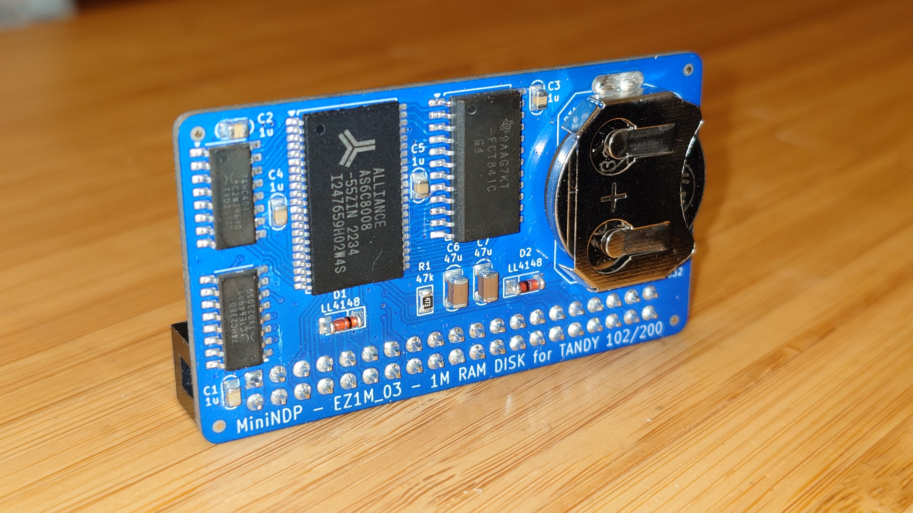
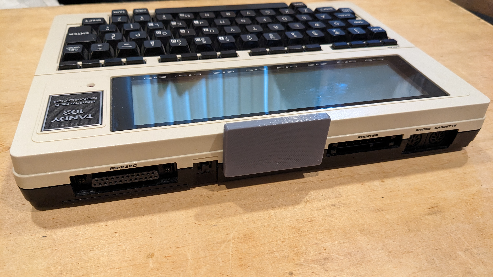
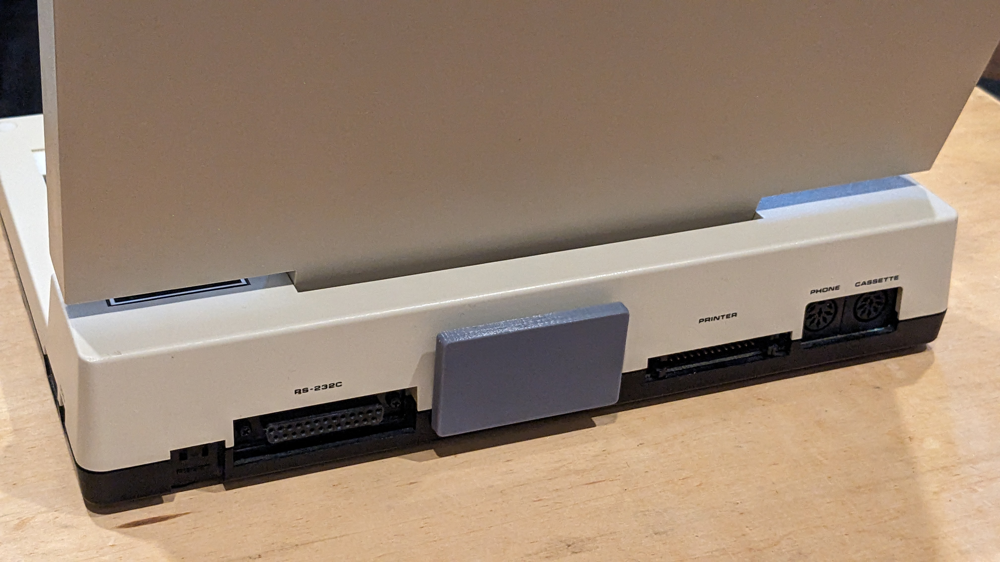
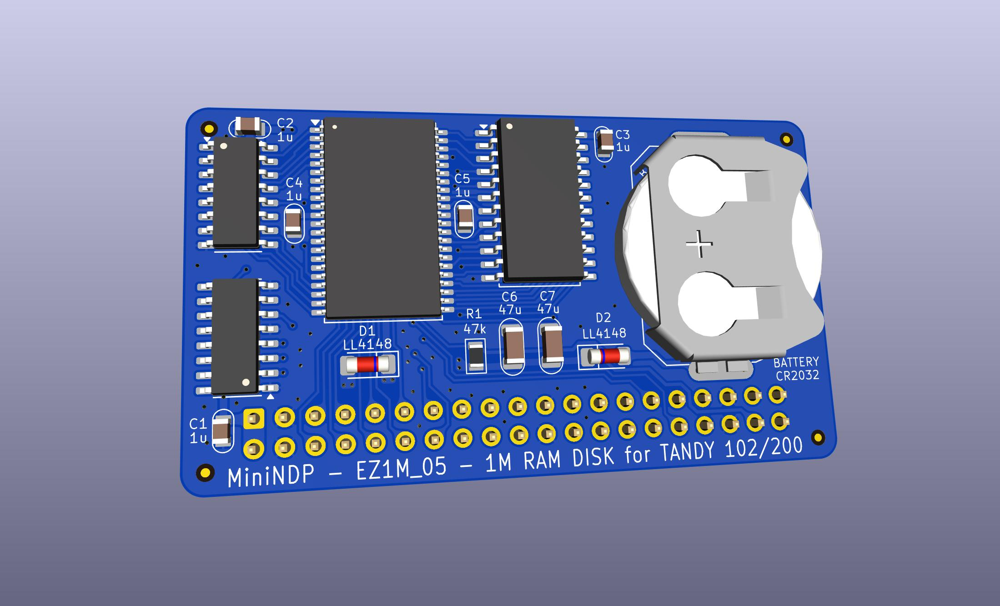
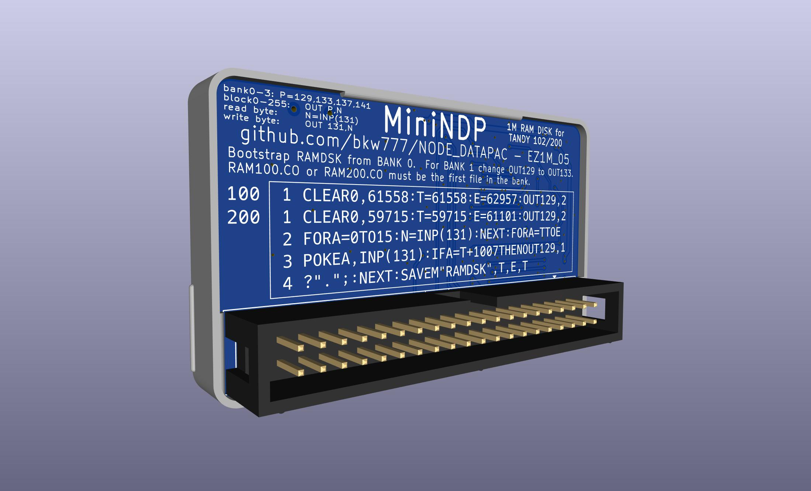
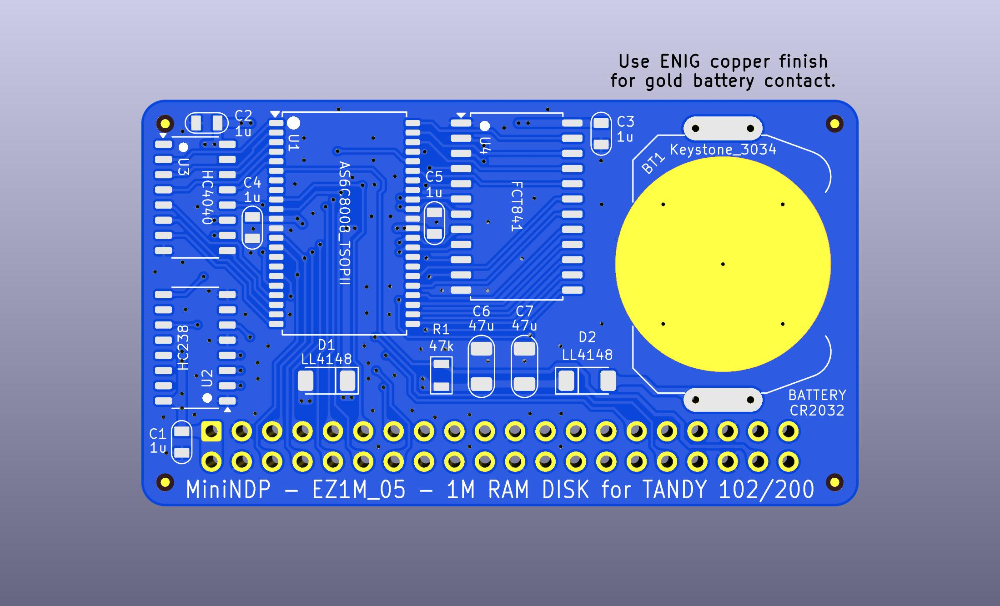
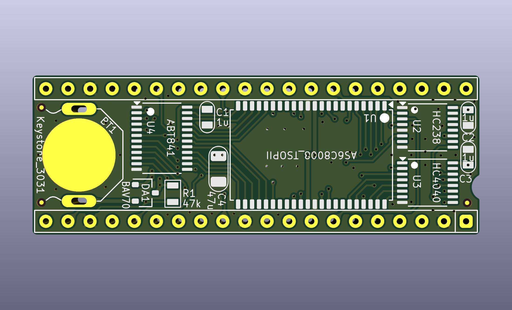
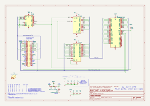
[MiniNDP.bom.csv](PCB/out/MiniNDP.bom.csv)

BOM [DigiKey](https://www.digikey.com/short/m4h7bmh0)  
PCB & Cover [PCBWAY](https://www.pcbway.com/project/shareproject/MiniNDP_mini_Node_DataPac_d08018c4.html)


## MiniNDP u1M - For Model 100 or Kyotronic KC-85

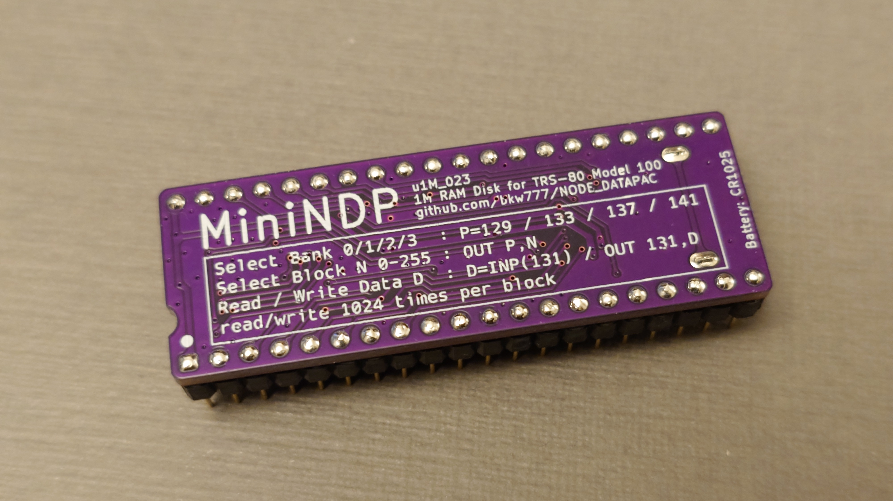  
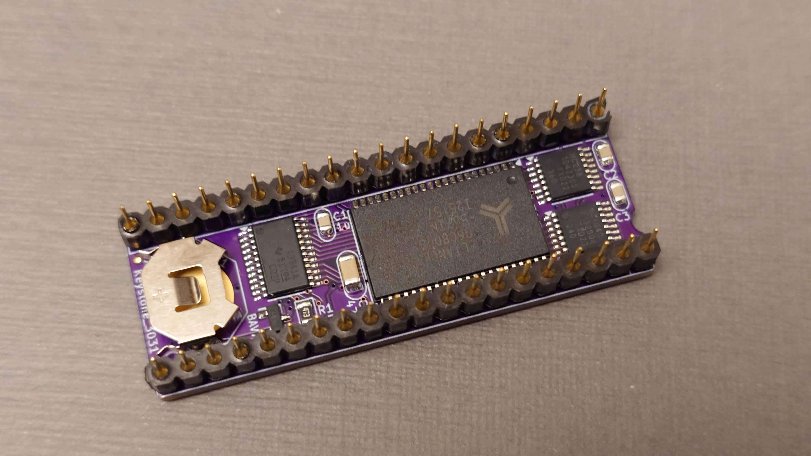  
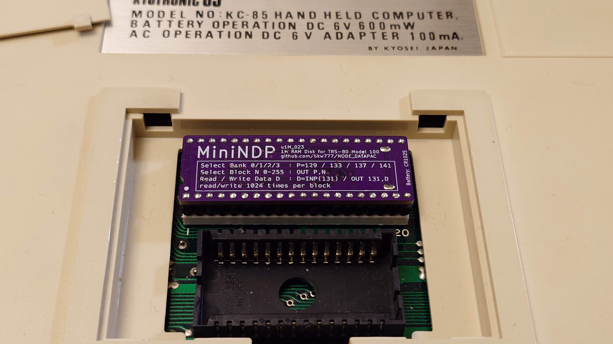  
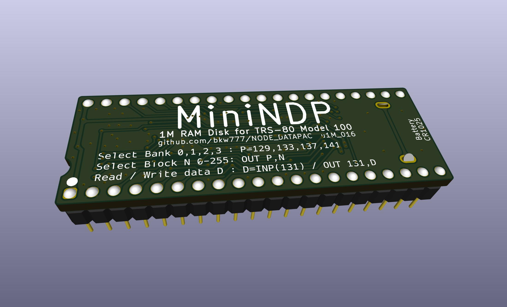  
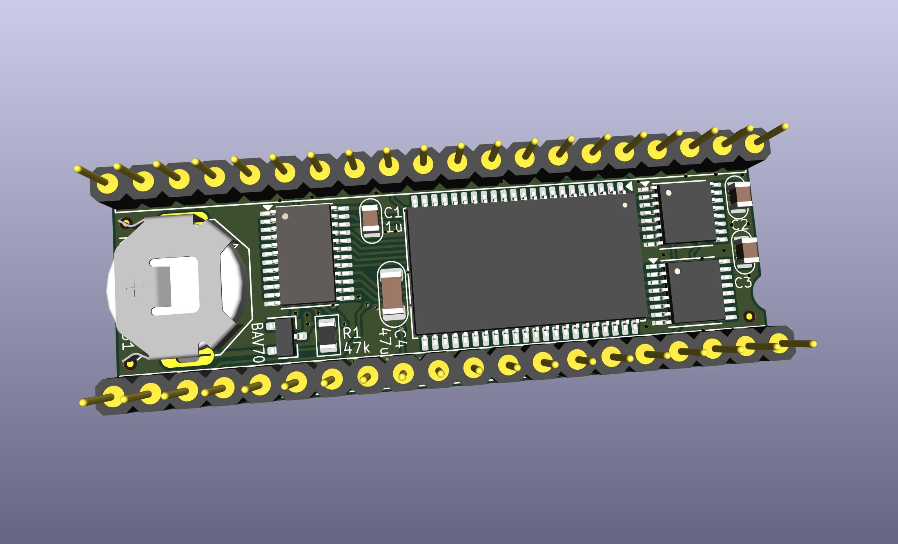  
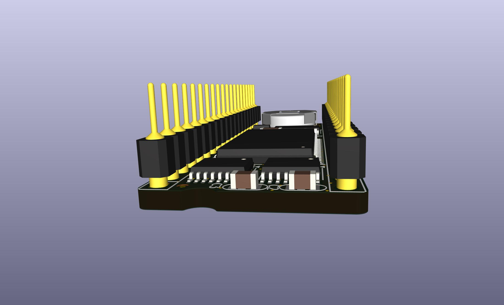  
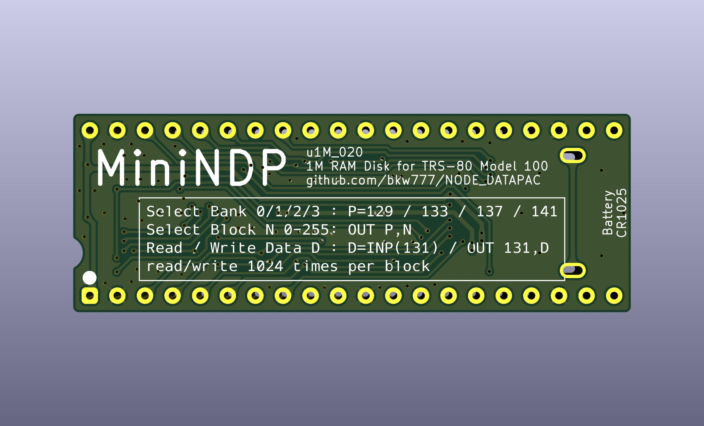  
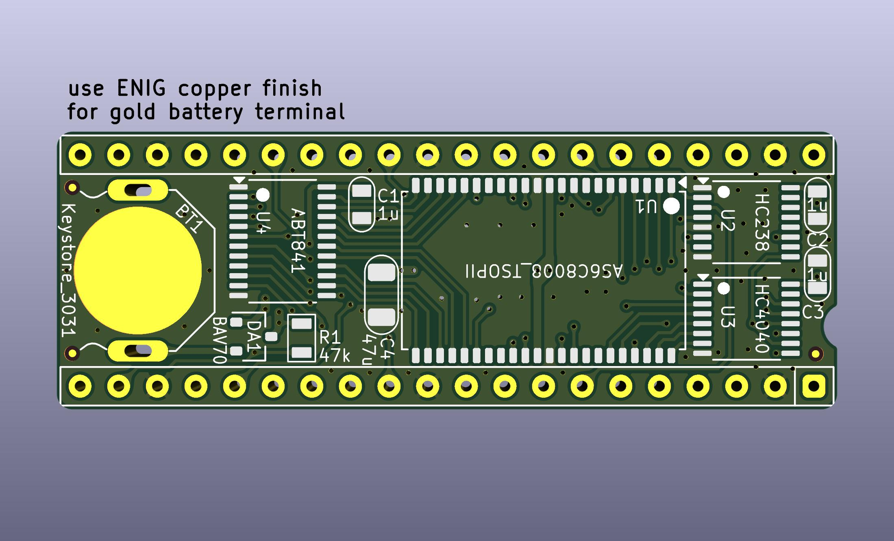  
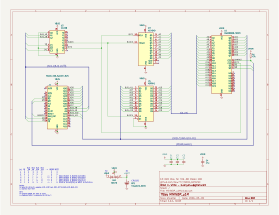  

BOM [MiniNDP_u1M.bom.csv](PCB/out/MiniNDP_u1M.bom.csv)

## [Other Versions](MiniNDP_variants.md)  
[SL1M](MiniNDP_variants.md#sl1m---slim-1-meg) - slim 1 meg, all thin chips to make a thin card  
[EZ512](MiniNDP_variants.md#ez512---easy-build-512k) - easy build 512K - all larger components  
["OG"](MiniNDP_variants.md#minindp-og) - "OG" original design, 128K-512K, thin or thick, more parts and more difficult, but all the parts are more common  
