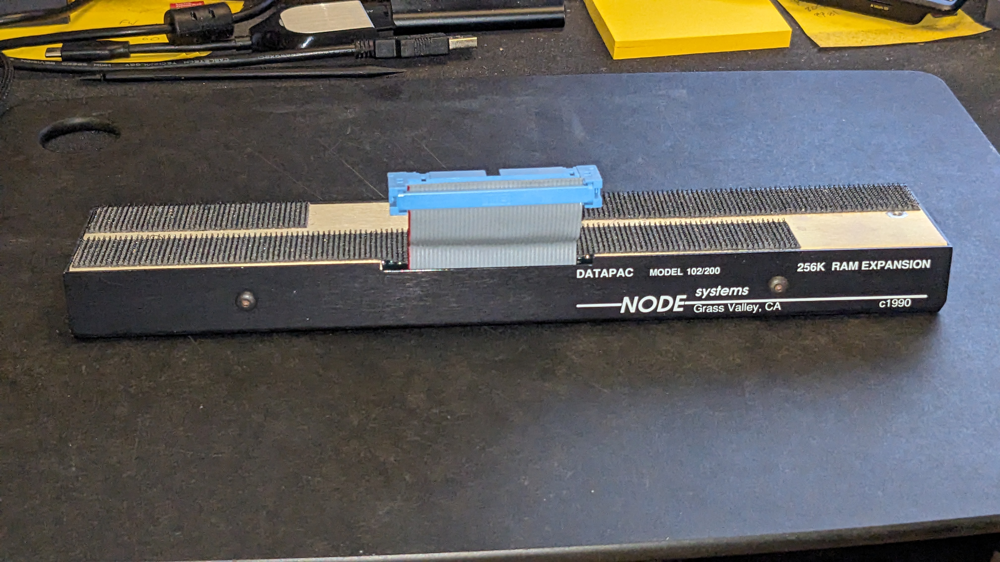
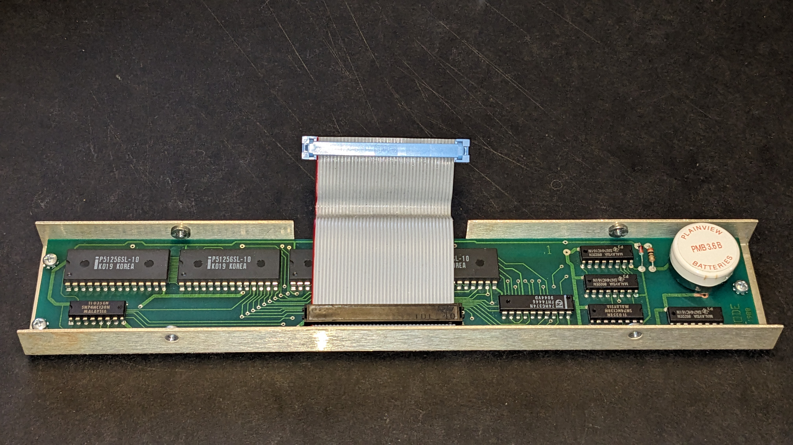
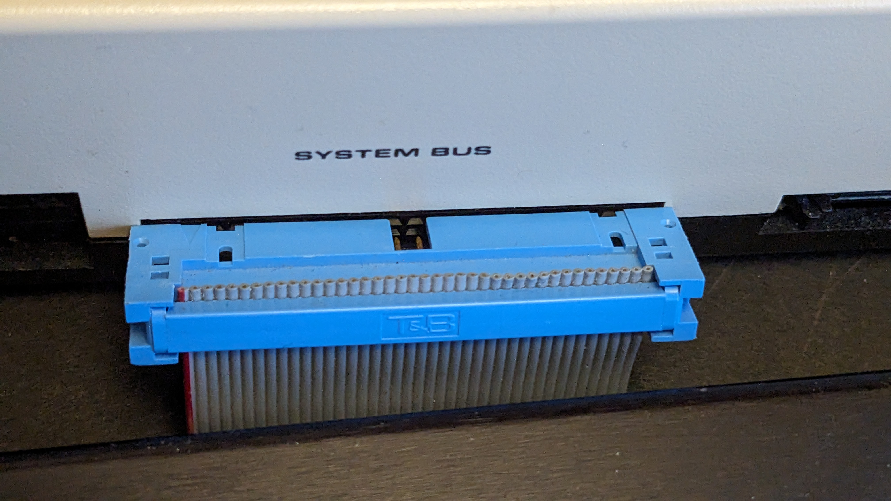
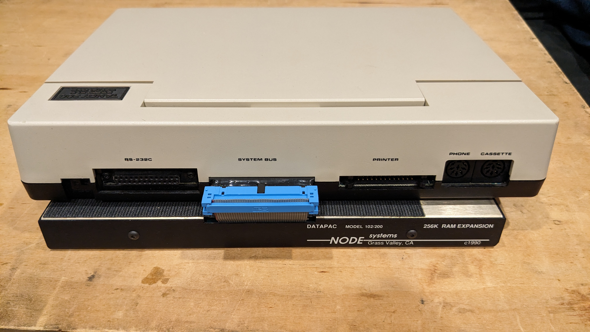

# NODE Systems DATAPAC
* [Documentation](#documentation)
* [DATAPAC Hardware](#datapac-hardware)
  * [Reproduction Schematic & PCB](#reproduction-schematic--pcb)
  * [Theory of Operation](#theory-of-operation)
  * [Battery](#battery)
  * [Upgrading 128K to 256K](#upgrading-to-256k)
  * [Model Compatibility](#model-compatibility)
* [Software](#software)
  * [BASIC](#basic)
  * [RAMDSK](#ramdsk)
    * [Installation](#installing-ramdsk)
    * [Usage](#using-ramdsk)
  * [NBOOT](#nboot)
  * [RAMPAC Inspector](#rampac-inspector)
  * [XOS-C](#xos-c)
  * [N-DKTR](#n-dktr)
  * [NODE-PDD-Link](#node-pdd-link)
  * [NDEXE](#ndexe)
  * [RAMPAC Diagnostic](#rampac-diagnostic)
* [MiniNDP](#minindp)
<!--
  * [PCB & BOM](#minindp-pcb--bom)
  * [Cover](#minindp-cover)
-->

This repo documents the NODE Systems DATAPAC, RAMPAC, and a new clone, the [MiniNDP](#minindp).

The NODE Systems DATAPAC was a popular ram disk peripheral for TRS-80 / TANDY Models 100, 102, & 200 computers.

Later versions of the same device were called RAMPAC. They functioned the same as DATAPAC and used the same software, just in a much smaller form factor.

The schematic and PCB below documents the DATAPAC from examining 2 units. If I ever aquire a RAMPAC, I'll add that.

Here is some disorganized [INFO](software/) mostly gathered from the [M100SIG archive](https://github.com/LivingM100SIG/Living_M100SIG) and [club100](http://www.club100.org).

TLDR: To use the hardware, install [RAMDSK](#ramdsk), and what you get is a ram disk of 128k to 1M depending on model and installed ram.





# Documentation
The original text file manual [RAMDSK.DO](ROM/100/RAMDSK.DO).  
The [NODE ROM](ROM) that came with the unit generates this file when formatting a device.

There are also some discussions in the [M100SIG archive](https://github.com/LivingM100SIG/Living_M100SIG) and Paul Globmans software on [club100](http://www.club100.org/library/libpg.html).  
Most of these are collected in [docs](docs).  
See also the docs for the various bits of [software](software).

Other References  
* "Database management with both the Node RAMPAC & DATAPAC."  
  Alspaugh, Ron - [Portable 100, Nov 90:8-11](https://archive.org/details/P100-Magazine/1990-11/page/8/)  
* "Node utility mini-extravaganza! Here are two special programs for Node Datapac/RAMPAC users."  
  Globman, Paul - [Portable 100, Dec 90:19-20](https://archive.org/details/P100-Magazine/1990-12/page/18/)  

# DATAPAC Hardware
## Reproduction Schematic & PCB
This is a new drawing but aims to reflect the original actual device as exactly as possible.  
It's meant to be a form of documentation or reference describing the original hardware as it was.  
For instance, the ungrounded inputs on the 161's, the inconsistent thickness of power traces, the fact that only 1 of the 2 bus VDD pins is connected, the VCC trace that almost touches one of the mounting screw heads, etc, are all exactly as in the original.  
(I added a fiber washer to that screw in my units after noticing that. The case is not connected to ground, but still...)  

For a historical reproduction version of the original PCB (minus the NODE copyright mark), see: NODE_DATAPAC_256K_historical_reproduction.kicad_pro

For a cleaned up version of the original PCB that still uses the same components and fits in the same case, see: NODE_DATAPAC_256K_bkw.kicad_pro


PCB TOP


PCB BOTTOM


The original PCB has no silkscreen. This image has silkscreen added to show where the components from the schematic go.


<!--
## Updated Replacement PCB that fits the original case

Uses all the same through-hole parts, fits in the original enclosure, improves the trace routing a little, for example moving that VCC line away from that screw head, GND traces replaced by zone fills, thicker and all the same size vcc lines, decoupling caps, silkscreen.  


-->

## Theory of Operation
The circuit has 2 functions, SELECT-BLOCK and READ/WRITE-BYTE, controlled by the internal active-low signals /BLOCK and /BYTE.

The U4 HC138 monitors four lines from the bus, `/Y0` `(A)` `A8` `A9`, and based on that asserts either `/BLOCK` or `/BYTE` or neither.  
If neither /BLOCK nor /BYTE is asserted then the bus traffic has no effect on any of the other chips.

The 3 HC161 form a 0-1023 counter, setting SRAM address bits A0-A9.  
Call this the byte-number or byte-position counter or offset.

The HC374 sets SRAM address bits A10-A17 from the bus data bits AD0-AD7, and latches that value on its outputs until triggered to update to a new value.  
Call this the block-number or block selector.

The U5 HC138 converts 3 bits of the block-number into 1 of 8 chip-select to select 1 of 8 32K SRAM chips,  
and also monitors both /BYTE and RAMRST and disables all ram while either /BYTE or RAMRST is high.

----

### SELECT-BLOCK
When /BLOCK goes low:
* SRAM A0-A9 are reset to 0  (byte-position counter is reset to 0)
* BUS AD0-AD7 are copied to SRAM A10-A17  (bus data lines AD0-AD7 select a block-number)

When /BLOCK goes high:
* SRAM A10-A17 are held latched at whatever they were set to  (block-number is locked in until next /BLOCK)

----

### READ-BYTE / WRITE-BYTE
When /BYTE goes low:
* SRAM is enabled  (bus data lines AD0-AD7 read from or write to the current address in SRAM)

When /BYTE goes high:
* SRAM is disabled
* A0-A9 are incremented by 1 (byte-position, thus the current address in SRAM, is advanced to the next byte)

----

The byte-number and block-number combine to form the current address in SRAM at any given time.  

The device provides up to 256 blocks (8-bit block-number) of 1024 bytes each (10-bit byte-number).

The host computer first does a SELECT-BLOCK to select a block number from 0-255, then does READ-BYTE or WRITE-BYTE to read or write one byte of data at byte number 0 in that block, then repeats the BYTE operation up to 1023 more times to read or write up to all 1024 bytes in the block.  

If you read or write more than 1024 times without selecting a new block, the byte-number counter just rolls over to 0 again.

You can also mix reads and writes in the same block. Each read OR write advances the byte position the same way each time, regardless if the previous operation was a read or a write. For instance in order to skip over 64 bytes without modifying them and then start writing at the 65th byte, you would read-and-ignore 64 times and then start writing.

"ramdisk" is an appropriate term because the device actually does operate like a disk even though it has no brains or firmware. The block-select latch acts like a track or sector address, and the binary counter acts like a disk or tape head reading or writing a sequential stream of bytes.

Later versions of RAMPAC were offered with 384k or 512k by adding a second bank of up to 256k, and later versions of RAMDSK.CO know how to access the 2nd bank.

In 512K units, the extra 256K is accessed by the state of bus address line A10 during a SELECT-BLOCK operation.  
SELECT-BLOCK with BUS_A10 low accesses bank0, with BUS_A10 high accesses bank1.  
All other aspects are the same, so accessing bank0 on a a 512K device is the same as accessing the only bank on a 256K device.  Old software is still compatible with bank0 on new hardware, new software is still compatible with old hardware.

[What this all means from the host computer software side of things](https://github.com/bkw777/NODE_DATAPAC?tab=readme-ov-file#low-level-direct-access-using-only-basic)

## Battery
The original battery is no longer made, and the modern cross-reference is almost 2mm taller and does not fit inside the enclosure.

NODE Systems themselves used to perform an update to older units to replace the original rechargeable NiCD cell with a non-rechargeable lithium cell which was supposed to last about 5 years.

The change is simple and easy, and the parts are common. You just remove the old battery and the 200 ohm resistor, and replace them with a CR2032 holder and a diode. That's it. Both parts fit and solder right in the same locations where the old parts came out. Point the diode stripe away from the battery, just like the other diode that is right there next to it. Any standard diode will do. Schottky is not recommended because the reverse leakage is not good for a lithium cell. Another 1N4148 like the one that's already there is perfect.  
This should give at least 4 years of memory.  
(The original NiCD battery may have only lasted as little as a few months per charge according to a review in the archives. So the coin cell mod is not merely more conveniently available with current parts, it's an improvement.)

BEFORE


AFTER


STEPS


If you wish to keep using a rechargeable battery, then one suitable option is FL3/V80H. That is 3 16x5.8mm NiMH button cells in a flat in-line pack with wire leads. It fits perfectly in the space next to the ribbon cable. It needs to be secured with hot glue or foam mounting tape, and connected with wires run to the original battery location.  


The charging circuit is utterly basic, so do not connect any other type of battery except NiCD or NiMH.  
You can use any cell form factor and any larger or smaller mAh capacity, but must be 3.6v and only NiCD or NiMH chemistry.

## Upgrading to 256K
A 128k unit may be upgraded to 256k by just adding 4 more SRAM chips piggy-backed onto the existing chips.

The PCB has 4 DIP-28 footprints for the SRAM chips.  
Each DIP-28 footprint also has an extra via close to pin 20.

A 128k unit has a low-power 62256 installed in each footprint, and nothing connected to the via near pin 20.

To get 256k, a second set of chips are soldered piggyback on top of the first four.  
All pins except pin 20 are simply soldered to the chip below.  
Pin 20 is bent out and connected to the extra via on the pcb (with a short bit of wire to reach) and not connected to the chip below.  

No other parts or changes are needed to upgrade an existing 128k unit to 256k.

Any 62256 will work, but for old parts you want the low-power version for standby battery life.  
New parts already naturally have as low or lower standby current than the low-power versions of old parts even if they don't say "low power".  
Old standard: HM62256    70uA  
Old lowpower: HM62256LP  4uA  
Old lowpower: P51256SL   2uA  
New standard: AS6C62256  1uA

## Model compatibility  
Originally only North-American Models 100, 102, & 200 were ever supported.  
Today Kyotronic KC-85 and Olivetti M-10 are also supported, and the assembly source means the international models could be added as well.  
The device is not compatible with NEC PC-8201/PC-8300.

Although the DATAPAC was primarily designed for Model 102 & 200, the crimp-on boxed male IDC pin header on the cable does not actually fit into a 200 without enlarging the opening around the bus connector on the 200. If you want to connect an original DATAPAC to a 200 without hacking up the 200's case or modifying the DATAPAC cable, you can build a small [adapter](ref/T200_adapter.jpg) by just soldering a [male](https://www.digikey.com/en/products/detail/sullins-connector-solutions/SBH11-PBPC-D20-ST-BK/1990068) & [female](https://www.digikey.com/en/products/detail/sullins-connector-solutions/SFH11-PBPC-D20-ST-BK/1990093) solder-type 2x20 boxed pin headers back to back. The solder box header does fit in the opening.
  


The DATAPAC case says "102/200", but it also works on Model 100, K85, and M10 with the right adapter cable. It's electrically compatible with everything but NEC.

For 100 & K85 the cable is just an IDC-DIP-40 aka "DIP-40 wire-to-board" connector and a standard 2x20 female IDC connector, both crimped onto a 40-pin ribbon cable about 8 inches long.  
[The Model 100 adapter part](https://github.com/bkw777/TRS-80_Disk_Video_Interface_Cable/blob/main/README.md#part-3---model-100-adapter) of this [3-part Disk/Video Interface Cable](http://tandy.wiki/Disk/Video_Interface:_Cable) is the same thing.

For Olivetti M-10 the cable is even simpler, a standard female to female IDC 40-pin ribbon cable.

[MiniNDP](#minindp) fits directly on both 102 and 200 with no adapter or cable, or M10 with a female-female ribbon cable at least 5 inches long.

[MiniNDP_u1M](#minindp-u1m---for-model-100-or-kyotronic-kc-85) fits directly in the bus socket of 100 or K85 with no adapter or cable, and the cover can even be closed over it.

# Software

 - [NODE ROM](ROM)  
 - [RAMDSK.CO](software/RAMDSK)  
 - [other](software)  

Originally these shipped with an [OPTION ROM](ROM) from NODE called RAMDSK, written by Travelling Software. <sub><sup>\[citation needed, I don't remember where I read that\]</sup></sub>  

The only copy of the original rom available today is an early version that only supports the original 256k hardware, and only for Model 100/102.

Later, Paul Globman wrote [RAMDSK.CO](software/RAMDSK), and that was eventually licensed by NODE and shipped with new units.  

Later still, RAMDSK was updated with 2 changes:  
 - automatic repair of a corrupted format stamp on start-up  
 - support for 512k in 2 banks of 256k (RAMPAC & EXTRAM)

Recently, RAMDSK has been updated yet further:  
- disassembled and annotated to produce usable assembly source  
- single source produces binaries for all machine models  
- add Kyotronic KC-85 build  
- add Olivetti M-10 build  
- support for 4 banks (MiniNDP)

Some other software culled from the [M100SIG archive](https://github.com/LivingM100SIG/Living_M100SIG) and [Club100](https://www.club100.org) are collected here in the [software](software) directory.  

## BASIC
How to access the hardware from BASIC.

### High level file operations using CALLable machine language routines
See [RAMDSK.DO](ROM/100/RAMDSK.DO) for the NODE ROM routines.  
See [RAMDSK.TIP](software/RAMDSK/RAMDSK.TIP) for the RAM100.CO/RAM200.CO routines.  
But note, the addresses in those documents are incorrect for RAMDSK v2. We don't have a copy of RAMDSK v1 for 100 but we do for 200. So you can't follow those directions exactly except on a 200 and using RAMDSK v1.  

The latest RAMDSK built from the new source includes .map and .calls files that give the current addresses to the routines in those binaries, but actually uising them has not been tested.

### Low level direct access using only BASIC
There are two low level operations that you use to access the device,  
BLOCK and BYTE, and each of those has two variations, for four total ops.

Select a BLOCK from BANK 0  
`OUT 129,n`  
Selects block# **n** (0-255) in bank 0, and resets the byte position to 0.

Select a BLOCK from BANK 1  
`OUT 133,n`  
Selects block# **n** (0-255) in bank 1, and resets the byte position to 0.

Read a BYTE  
`INP(131)`  
Reads the byte at the current byte position, and advances the byte position by one.

Write a BYTE  
`OUT 131,n`  
Writes the value **n** (0-255) to the current byte position, and advances the byte position by one.

The first read or write after selecting a block# applies to byte #0 of that block.  
The byte position advances by one after each read or write, so the next read or write will be byte #1, then byte #2, etc up to 1024.  
If you read or write more than 1024 times without selecting some other block, the byte position just rolls over to 0 again.

The position counter advances the same whether reading or writing.

Since the device can only read or write a single unsigned byte at a time, it's most efficient to use integer variables.  
Use the % suffix or DEFINT: `B%=INP(131)` or `DEFINT B : B=INP(131)`

The general sequence is always:  
1 - select a bank+block  
2 - read/write byte 0-1024 times

To seek to an arbitrary offset before reading or writing, read-and-ignore that many bytes.

For instance, in RBOOT.DO, to skip over the first 16 bytes of the block, it does `FORA=0TO15:N=INP(131):NEXT`  
N is not actually used, it's just reading 16 times and ignoring the data. This just advances the byte position counter to get from byte #0 past the 10-byte RAMDSK header and 6-byte .CO header to the start of the .CO executable data.

Examples

Select bank 0 block 0  
`OUT129,0`

read a byte, which will be byte #0 of this block  
`INP(131)`

Read and print the ascii of all the bytes in bank 0 block 2.  
(this will mess up the display from control bytes if there is a binary .CO file in this block)
```
10 OUT 129,2
20 FOR I=0 TO 1023
30 PRINT CHR$(INP(131));
40 NEXT
```

Do the same but in bank 1  
change line 10 to:  
`10 OUT 133,2`

Manually repair the first two bytes of block 0 to mark the bank as being formatted without touching any of the data.  
This means:
1. Select bank0 block0  
2. write one byte, value 64  
3. write one byte, value 4

`OUT129,0:OUT131,64:OUT131,4`

(BTW you usually don't need to do this because RAMDSK.CO will do it for you if you answer "Y" at the "Fix?" prompt.)

## RAMDSK
The disk technically doesn't care what you write to it, but the normal software for the device is either the [NODE ROM](ROM) or [RAMDSK.CO](software/RAMDSK/)  

This provides a virtual disk interface where you can copy files to and from the device.

RAMDSK provides the same functionality as the NODE ROM, and is compatible with it.  
They both write the same filesystem structure to the device, either one can read/write a device that was formatted by the other.

Differences between the NODE ROM and RAMDSK:

The NODE ROM creates a text file when it formats a blank device, RAMDSK does not.

The NODE ROM docs claim it also supports PG Designs and PCSG ram expansions, which are NOT clones or work-alikes of the DATAPAC/RAMPAC. RAMDSK only supports the DATAPAC/RAMPAC or anything that works exactly the same way such as MiniNDP.

RAMDSK supports banks (devices with more than 256K of ram), the NODE ROM only supports up to 256K.

RAMDISK includes a feature to automatically repair the format stamp in the first 2 bytes of the device, the NODE ROM does not.

### Assembly Source Reconstructed from Disassembly

[RAMDSK Source](software/RAMDSK/src)  

`make clean all` builds a 4-bank version of RAMxxx.CO, RAMxxx.DO, and RAMxxx.calls for all models. (100, 200, K85, M10)  

`make load_100` or load_200 etc: convenience target that builds and then runs `dl -v -b RAMxxx.DO` to install to the portable.

For each `RAMxxx.CO`:  
`RAMxxx.DO` is a BASIC loader containing the .CO  
`RAMxxx.calls` lists some functions that may be CALLed from BASIC or another machine language program.

### Installing RAMDSK

Archived docs mention an 8 line BASIC program called BOOT that could be manually typed in to BASIC to bootstrap a copy of RAMDSK from a RAMPAC after a cold start.  
Requires first saving a copy of RAMDSK.CO to the device, and must be the first file on the device.

That program does not seem to be archived anywhere, but I have written `RBOOT` and `NBOOT` new below.  

To get [RAMDSK](software/RAMDSK) installed for the first time, use the matching `RAMxxx.DO` BASIC loader.

To bootstrap the BASIC loader from a PC running Windows:  
Install [tsend](https://github.com/bkw777/tsend)  
Then: `C:> tsend.ps1 -file RAM100.DO`

To bootstrap the BASIC loader from a PC running Linux, MACOS, FreeBSD, any unix, Cygwin/MSYS2:  
Install [dl2](https://github.com/bkw777/dl2)  
Then: `$ dl -v -b RAM100.DO`

Then run RAMDSK to format the device and copy RAMDSK.CO to it as the first file.  
In order for RBOOT or NBOOT to work, `RAMxxx.CO` must be the first file on bank0.

Once you have RAMDSK installed, if you save a copy to the device as the very first file after a fresh format, then in the future you can re-install RAMDSK from the device itself after a cold reset without needing another computer or TPDD drive by manually typing in a 4-line BASIC program.

These are optimized to tetris-pack into the fewest possible 40-column lines, not to be the most efficient code, so the entire program actually fits on the screen so you can easily verify it's all typed-in correctly before running it.  
Please excuse the inexcusable IF and math inside the byte read loop. :)

These have specific length and offset values that are only valid for the exact RAM100.CO and RAM200.CO files shown.  
If you recompile RAMDSK with other options or modified code, the TOP & END values in these need to be changed to match.  
These are correct for both the legacy RAMDSK v2 and the latest RAMDSK, only because the latest version is artificially padded to come out to the same length as the legacy version just for this reason.

RBOOT for 100, 102, K85, & M10
```
1 CLEAR0,61558:T=61558:E=62957:OUT129,2
2 FORA=0TO15:N=INP(131):NEXT:FORA=TTOE
3 POKEA,INP(131):IFA=T+1007THENOUT129,1
4 ?".";:NEXT:SAVEM"RAMDSK",T,E,T
```

RBOOT for 200  
```
1 CLEAR0,59715:T=59715:E=61101:OUT129,2
2 FORA=0TO15:N=INP(131):NEXT:FORA=TTOE
3 POKEA,INP(131):IFA=T+1007THENOUT129,1
4 ?".";:NEXT:SAVEM"RAMDSK",T,E,T
```

Either of above may be adjusted to boot from a different bank instead of bank0.  
For bank1, 2, or 3, chamge all (2) occurances of OUT129 to OUT133, 137, or 141.  
Example, Model 200 booting from Bank1 (requres RAM200.CO saved as the first file in bank1):  
```
1 CLEAR0,59715:T=59715:E=61101:OUT133,2
2 FORA=0TO15:N=INP(131):NEXT:FORA=TTOE
3 POKEA,INP(131):IFA=T+1007THENOUT133,1
4 ?".";:NEXT:SAVEM"RAM200",T,E,T
```

You could get fancy and support both model 100 and model 200 at the same time on the same device by saving RAM100.CO to Bank0 and RAM200.CO to Bank1.


### Using RAMDSK
Usage is mostly pretty self-explanatory.  

A few things that aren't explained on-screen.  

* On legacy version RAMDSK v2 if you keep holding the Enter key down while RAMDSK starts up, then it switches from bank0 to bank1 before anything else.
  This code is omitted from the current version.  

* On startup RAMDSK looks at the first 2 bytes of the disk to tell if the disk is formatted or not.  
  If it does not see a valid format stamp (0x40 0x04), it asks if you want to format the disk.  
  You can answer Y or N here.  
  Don't panic if you get this on a device that is supposed to already be formatted and have files.  
  Just be sure to answer N! On the current version there is also an extra confirmation step so you even get 2 chances to say N.  
  After you decline to format, you will get a chance to do a non-destructive repair instead.

* [The format stamp is easily corrupted](software/RAMDSK/RAMPAC.001),  
  When this happens, you will get the format prompt above. Don't Panic.  
  If you answer N to format, then next it asks "Repair?"  
  If you answer Y to repair, it just re-writes the format stamp without touching anything else.

  <!-- (As Paul Globman said above, it was not a great engineering decision to use byte0 for this critical purpose (or any purpose) for exactly this reason, but that's what NODE did so we just have to deal with it.)  -->
  <!-- What Paul mentions about the latch being volatile is probably a good thing.  
  Better to always corrupt the same byte 0 than random bytes all over.  
  The latch losing power is like parking the heads. -->
  <!--
  You know what? now that we have source and can hack on RAMDSK, who cares about strict compatibility with the NODE ROM any more?
  TODO: maybe one of these, or something else:  
   - Use only the 2nd byte and ignore the 1st byte (but keep resetting it just to maximise compatibility with old binaries and node rom because no reason not to)  
     Maybe to make it less likely for a random data byte to match the valid format value, make it a checksum over the fcb table? That will definitely break compatibility because the legacy software is looking for exactly 0x40 0x04
   - Ignore both bytes 0 & 1 and don't even perform a format check, just assume it's formatted and display the gibberish if it's not. Format by providing a format button.  
     All of the actual load/save/kill/etc functions must still perform a test-else-abort on the spot every time just before their actual work, because the device is externally attached and can be disconnected at any time. 
     It's harmless to let the file listing display giberish. It's not harmless to let any other function read and operate on gibberish.
   - The 2nd 512 bytes of block0 are un-used, use some of them?
  -->

* Finally it displays a screen full of disk filenames.  
The files are not listed in the order they exist on the device, nor alphabetically. First all of the .BA files are listed, then the .CO files, then the .DO files.

* If there are more than one page of files on the disk, press Enter to see the next page of filenames.

* You can press LABEL to format the disk.

* All other actions done by the labelled F-keys.

F1 Bank - Switch between banks of 256k each.  
  Only functional on a device that has more than 256k.  
  The current bank number is displayed at the top of the screen.

F2 Load - Copy a file from disk to ram.

F3 Save - Copy a file from ram to disk.

F4 Name - Rename a file on disk.

F5 Kill - Delete a file on disk.

F8 Menu - Exit RAMDSK.

### [NBOOT](software/NBOOT/)
The only reason the 4-line RBOOT above can be so short is because the filename and top & end addresses are all pre-known and hard-coded.

Just for reference, to boot some other CO instead of RAMDSK,  
here is a more flexible and generic bootstrapper for any .CO file up to 2038 bytes.  
* Reads the filename and start/length/exec values from the file itself  
* Works on any .CO file that fits in 2 blocks (2048 minus 10 bytes that RAMDSK uses = 2038 bytes)  
* Works without changes on all machines, 100, 200, K85, M10
```
1 CLEAR32,59000:CLS:P=131:OUT129,2
2 FORA=0TO9:F$=F$+CHR$(INP(P)):NEXT
3 GOSUB8:T=N:GOSUB8:E=T+N-1:GOSUB8:X=N
4 F$=LEFT$(F$,6):N=T+1007:FORA=TTOE
5 ?@0,A:POKEA,INP(P):IFA=NTHENOUT129,1
6 NEXT:?@0,"Installed "F$:?"Type:"
7 ?"CLEAR 0,"T":NEW":SAVEMF$,T,E,X:END
8 N=INP(P)+INP(P)*256:RETURN
```

### NODE ROM / RAMDSK filesystem structure

This is not publicly documented that I have found, at least not explicitly.  
This comes from a combination of exploring a formatted device with [RAMPAC Inspector](software/CRI), and from [disassembling RAMDSK](software/RAMDSK/src).

There is nothing in the hardware that cares about any of this.  
This is just what the NODE ROM does and so RAMDSK also does.

At the hardware level the device provides 256 1k blocks (per bank)

The NODE ROM and RAMDSK use that space to store files this way:

block 0 is reserved for the format stamp and FCB table, only the first 512 bytes are used

Blocks 1-255 are available for files.

The format stamp is the first 2 bytes of block 0: `0x40 0x04`  
They don't change or represent anything.  
NODE ROM and RAMDISK look for this to decide if a device is formatted or not.

The FCB table is the next 255 pairs of bytes of block 0.

Each FCB corresponds to a block.  
fcb 1-255 <-> block 1-255  

Each FCB is 2 bytes: `attr next`

`attr` is a single byte file attribute,  
the same value used by the MKDIRENT routine in the system rom.  
(ex: 0x2239 in the North American Model 100 system rom)  
0x00: block is not used  
0x20: block is part of a file but is not the first block  
0x40: block does not exist or is otherwise not available  
0x80: first block of a .BA file  
0xD0: first block of a .CO file  
0xA0: first block of a .DO file

`next` is the block number of the next block in the file.  
0x00 if there are no further blocks or the current block is not part of a file.

Bytes 512-1024 of block 0 are not used.  
You could store 512 bytes of hidden secrets there :)

For the remaining blocks 1-255:

If a block is the first block in a file, then the first 10 bytes of the block contain the RAMDSK file header:  
0-5: 6 bytes filename base  
6-7: 2 bytes filename extension  
8-9: 2 bytes file length, not including the 10-byte header  
The remaining 1013 bytes are file data

If a block is part of a file but not the first block in the file, then the block is all file data starting right at byte 0 and ending wherever the file length says to end.  
The bytes after the end of the file to the end of the block are not used.

The first block of a file is located by scanning the FCB table for all FCBs that have an `attr` matching the file you want, then reading the 10-byte header of each potential matching block until finding the matching filename.

The remaining blocks are found by following the chain of `next`-block pointers until filesize runs out. The FCB of the 1st block points to the 2nd block, the FCB for the 2nd block points to the 3rd, etc.

This means a bank may contain up to 255 1k files, Or 1 255k file.

| block | contents |
| --- | --- |
|0|FCB table|
|1|filedata|
|...|...|
|255|filedata|

Block 0 / FCB table:

|byte#|1 byte|1 byte|desc|
| --- | --- | --- | --- |
|0-1|0x40|0x04|Stamp|
|2-3|attr|next|FCB 1|
|4-5|attr|next|FCB 2|
|...|...|...|...|
|509-510|attr|next|FCB 255|
|512-1024|||unused|

First block of any file:

|basename<br>6 bytes|extension<br>2 bytes|filesize<br>2 bytes|data<br>1014 bytes|
| --- | --- | --- | --- |
|RAMDSK|CO|0x7E 0x05|...|

Any other block:

|data<br>1024 bytes|
| --- |
|...|


## RAMPAC Inspector
[RAMPAC Inspector](software/CRI)

It's named CRI.BA because it's a very Crude RAMPAC Inspector.

You supply a bank number, block number, starting byte offset, and byte length, and it reads those bytes and displays them on screen.

bank: 0-1  (or 0-3 if you edit line 10 to enable 1-meg support)
block: 0-255
start: 0-1023
length: 1-1024

Press F2 while it's running to switch between ascii or hex display mode.

Press F8 while it's running or BREAK at the input prompt to quit.

The reason it exists when [RD](software/Rampac_Diagnostic/) and [N-DKTR](software/N-DKTR/) already exist is,  
* Smaller  
* No machine code - you can see everything it does or change anything it does all in BASIC  
* No machine code - stand-alone, does not require either the NODE rom or RAMDSK to work  
* Supports banks / devices with more than 256k

TODO - display/repair first 2 bytes formatted flag.  
TODO - display filenames and lengths from the headers.  

## XOS-C
[XOS-C](http://www.club100.org/library/libpg.html) is "sort of an OS" for the Model 200.  
XOS-C does not require a RAMPAC, but leverages one if available.  
[Several of the NODE utils from the M100SIG require XOS-C.](software/Requires_XOS-C/)

## N-DKTR

NODE Doctor

[N-DKTR](software/N-DKTR/)

## NODE-PDD-Link

This is likely the best way to move files between the RAMPAC and a PC, by using it in concert with a [TPDD emulator](http://tandy.wiki/TPDD_server) on the PC, though I haven't tried it myself yet.

[NODE-PDD-Link](software/NODE-PDD-Link/)

## NDEXE
[NDEXE](software/NDEXE/)

## RAMPAC Diagnostic
[Rampac Diagnostic](software/Rampac_Diagnostic/)

# MiniNDP

New design that functions the same as DATAPAC / RAMPAC.

[For Model 102 & Model 200](#minindp-ez1m---for-model-102-and-200) (Also M10 with a ribbon cable)

[For Model 100 & Kyotronic KC-85](#minindp-u1m---for-model-100-or-kyotronic-kc-85)

1 megabyte in 4 banks of 256k.

How to access all 4 banks:  
Select bank 0, block N: `OUT 129,N`  
Select bank 1, block N: `OUT 133,N`  
Select bank 2, block N: `OUT 137,N`  
Select bank 3, block N: `OUT 141,N`

Everything else works the same as normal DATAPAC/RAMPAC.

## MiniNDP EZ1M - For Model 102 and 200

Unlike the original DATAPAC, this actually fits into the bus port on the Model 200 without having to hack it's case.


[MiniNDP.bom.csv](PCB/out/MiniNDP.bom.csv)

BOM [DigiKey](https://www.digikey.com/short/m4h7bmh0)  
PCB & Cover [PCBWAY](https://www.pcbway.com/project/shareproject/MiniNDP_mini_Node_DataPac_d08018c4.html)


## MiniNDP u1M - For Model 100 or Kyotronic KC-85

  
  
  
  
  
  
  
  
  

BOM [MiniNDP_u1M.bom.csv](PCB/out/MiniNDP_u1M.bom.csv)

## [Other Versions](MiniNDP_variants.md)  
[SL1M](MiniNDP_variants.md#sl1m---slim-1-meg) - slim 1 meg, all thin chips to make a thin card  
[EZ512](MiniNDP_variants.md#ez512---easy-build-512k) - easy build 512K - all larger components  
["OG"](MiniNDP_variants.md#minindp-og) - "OG" original design, 128K-512K, thin or thick, more parts and more difficult, but all the parts are more common  
