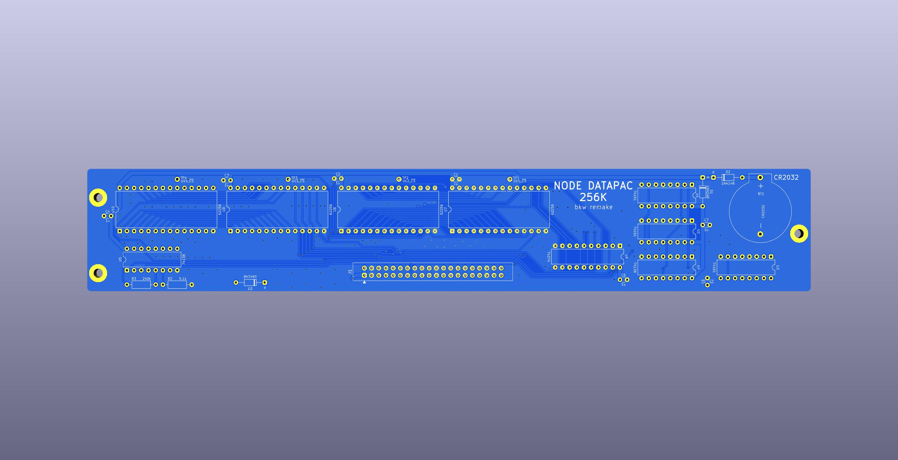

# Reproduction of Node Systems DATAPAC

The NODE Systems DATAPAC and RAMPAC were a popular ram disk peripheral for TRS-80 / TANDY Models 100, 102, & 200 computers.

RAMPAC was a later device that functioned the same as DATAPAC, even using the same software to run it, just in a new smaller form factor.

This schematic and PCB documents the DATAPAC. If I ever aquire a RAMPAC, I'll add that.

Here is some disorganized [INFO](software/) mostly gathered from the [M100SIG archive](https://github.com/LivingM100SIG/Living_M100SIG) and [club100](http://www.club100.org).

TLDR: To use the hardware, install [RAMDSK.CO](software/RAMDSK/), and what you get is a 256K ram disk.

The printing on the enclosure says 256K, and the circuit is all there to support 256K, but my 2 units only had 128K installed.  
There are footprints on the PCB for only 4 32K sram chips, for a total of 128K.  
To get 256K, a 2nd set of chips are piggybacked on top of the first 4, each with pin 20 bent out and connected to the pcb instead of to the chip below, and all other pins connected to the chip below.  
No other parts or changes are needed. I have verified this by doing it.

## Reproduction Schematic & PCB
This is a new drawing but aims to reflect the original actual device as exactly as possible.  
It's meant to be a form of documentation or reference describing the original hardware as it was.  

PCB TOP

PCB BOTTOM

The real PCB has no silkscreen. This image has silkscreen added to show where the components from the schematic go.

## Battery
The original battery is no longer made. The modern replacement is almost 2mm taller and does not fit inside the enclosure.

NODE Systems themselves used to perform an update to older units to replace the original rechargeable NiCD cell with a non-rechargeable lithium cell which was supposed to last about 5 years.

The change is simple and easy, and the parts are common. You just remove the old battery and the 200 ohm resistor, and replace them with a CR2032 holder and a diode. That's it. Both parts fit and solder right in the same locations where the old parts came out. Point the diode stripe away from the battery, just like the other diode that is right there next to it. Any kind of diode will do. Another 1N4148 like the other one that's already there is perfect.
This should give about 4 years of memory.  
(The original battery may have only lasted a number of months according to a review in the archives. So the coin cell mod is definitely an improvement as well as being available.)

BEFORE

AFTER

STEPS

If you wish to keep using a rechargeable battery, then a suitable option is FL3/V80H. That is 3 16x5.8mm NiMH button cells in a flat in-line pack with wire leads. It fits perfectly in the space next to the ribbon cable. It needs to be secured with hot glue or foam mounting tape, and connected with wires run to the original battery location.  

## Documentation
The original manual does not seem to be scanned or archived anywhere.

All we have today is a few bits of info from discussions in the [M100SIG archive](https://github.com/LivingM100SIG/Living_M100SIG) and Paul Globmans software on [club100](http://www.club100.org/library/libpg.html).  
Some of these are collected [here](software).

A few of those documents indicate that the device originally shipped with the user manual pre-loaded onto the DATAPAC as a 12K text file, along with at least one BASIC program, and the Format function in the option rom would also re-create this file.

## Software
The "driver" software for the device is [RAMDSK](software/RAMDSK/)

Originally these shipped with an option rom from NODE (Written by Travelling Software), which does not seem to be archived anywhere.  

RAMDSK is purported to provide all or almost all of the same functionality as NODEs rom, and even NODE themselves later licensed RAMDSK and included a copy with each unit. It's unclear if this was in addition to their original rom, or fully replacing it.  
Even the rom calls from the option rom have equivalents in RAMDSK, though at different addresses.  
One thing RAMDSK does not do which the original option rom did, is re-create the user manual text file as part of the Format function.

The "Bank" button in the later versions of RAMDSK is for the later versions of the hardware that could have 384K or 512K. It has no effect on a 128K or 256K unit.  

The only other significant software using this device seems to be [XOS](http://www.club100.org/library/libpg.html), which is sort of an OS for the Model 200. XOS does not require a RAMPAC or DATAPAC, but apparently makes good use of one if present. For instance, you can keep just a single copy of RAMDSK.CO in bank 3, yet be able to use it from any bank.  
I have not tried XOS yet, this is just from reading the description.

Some software culled from the M100SIG archive and Club100 are collected in [software](software)  
Much of that software actually requires the original option rom, which is not available. Some of that could possibly be converted to work with RAMDSK instead of the rom, by translating the call addresses, per the RAMDSK.TIP file.

The few documents we do have mention a BOOT program that could be manually typed in to BASIC to bootstrap a copy of RAMDSK from a RAMPAC after a cold start, but that file does not seem to be archived anywhere.

Currently the only way to get RAMDSK installed is to copy it via any of the normal ways. BASIC loader, TPDD, cassette.
The quickest way to go from scratch is the bootstrap directions in [software/RAMDSK/100/install.txt](software/RAMDSK/100/install.txt) or [software/RAMDSK/200/install.txt](software/RAMDSK/200/install.txt), which uses a bootstrapper program to feed a loader program into BASIC.

## Model compatibility
Apparently only Models 100, 102, & 200 were ever supported. (No NEC or Olivetti, etc)

There is no reason the device can't work on any of the other machines, merely the software was never ported to them.

### Model 200
The connector on the DATAPAC [does not actually fit in a Model 200](REF/does_not_fit_model_200.jpg) without cutting the opening wider around the bus connector on the 200.

The only connector that fits in a 200 without hacking on the 200s case is a [solder-type 2x20 male box header](https://www.digikey.com/en/products/detail/sullins-connector-solutions/SBH11-PBPC-D20-ST-BK/1990068),
 which could be soldered back to back with the [female version](https://www.digikey.com/en/products/detail/sullins-connector-solutions/SFH11-PBPC-D20-ST-BK/1990093),
 to make an [adapter](REF/T200_adapter.jpg) to allow [connecting to a 200](REF/T200_adapter_installed.jpg) without having to damage the 200's case.

### Model 100
This "102/200" version actually works on Model 100 also. It needs an adapter cable, but the cable is simple. It's just a "wire-to-board" IDC-DIP-40 crimp-on DIP connector and a standard 2x20 female IDC connector, both crimped on to a 40-pin ribbon cable about 8 inches long.  
[The Model 100 part](https://github.com/bkw777/TRS-80_Disk_Video_Interface_Cable/blob/main/README.md#part-3---model-100-adapter) of this [3-part cable for the Disk/Video Interface](http://tandy.wiki/Disk/Video_Interface:_Cable) is exactly the same thing.

## Theory of Operation
This only describes the hardware. I don't yet know how the software works.

The 3 74x161 form a 0-1023 counter, setting local sram address bits A0-A9. We'll call this the byte counter.

The 74x374 sets local sram address bits A10-A17 from the bus AD0-AD7, and latches that setting, ignoring the bus except when triggered to get a new address.

4 lines from the system bus, A8, A9, /Y0, and (A), combine to produce two signals which I am calling /BLOCK and /BYTE.

Each time /BLOCK goes low it sets SRAM A0-A9 to 0 and copies BUS AD0-AD7 to SRAM A10-A17,
then holds A10-A17 latched while /BLOCK is high.

Each time /BYTE goes low it enables SRAM for read or write while low,
then when /BYTE goes high it disables SRAM and increments A0-A9 by 1.

So the device operate in 1k blocks, where the host computer gives 1 of 256 possible "block-start" addresses, then reads or writes up to 1024 bytes, one at a time. Each time the host accesses a byte, the counter advances itself and the next read or write will operate on the next byte.
The device actually does operate like a disk even though it has no brains or firmware.

<!-- 
## New Replacement PCB
Uses all the same through-hole parts, fits in the original enclosure, improves the trace routing a little, for example moving that VCC line away from that screw head, gnd traces replaced by pours, thicker and all the same size vcc lines, decoupling caps, silkscreen.  
There is not much reason to build this instead of a MiniNDP. Even if you had an original DATAPAC that was corroded by the battery, it would be easier and more history-preserving to just repair the corroded traces with bodge wires since all the parts are so big and simple.

-->

# MiniNDP
Functions the same as DATAPAC. Essentially the same circuit, just with a single 256k ram chip instead of 8 32k chips, surface mount parts instead of through hole, and directly attached instead of connected by a cable.

The connector fits in a Model 200 without having to modify the 200.  

Also works on Model 100 with the same adapter cable described above.  

All the caps are optional. The original DATAPAC has no caps and works fine.  
C1 provides a few minutes of life without a battery so you can change the battery without losing data.

The diode on RAMRST is copied from a user mod found on a DATAPAC. It appears to be intended to prevent a battery drain on the host computer while the DATAPAC is left connected to the host while the host is turned off.

You can optionally make a thinner card by replacing BT1 and C1 with lower profile (and lower capacity) alternatives.  
|BATTERY|estimated life|holders that fit the footprint|height|C1 Capacitor|
|---|---|---|---|---|
|CR2032|7.5 years|Keystone 3034 TE/Linx BAT-HLD-001-SMT Adam Tech BH-67 MPD BK-912|4.1mm|[TAJC227K010RNJ](https://www.digikey.com/en/products/detail/kyocera-avx/TAJC227K010RNJ/1833766?s=N4IgTCBcDaICoEEBSBhMYDsBpADARhwCUA5JEAXQF8g) - 6032-28 220u 10v|
|CR2016|3 years|Keystone 3028|1.7mm|[TLJW157M010R0200](https://www.digikey.com/en/products/detail/kyocera-avx/TLJW157M010R0200/929982?s=N4IgTCBcDaICoBkBSB1AjAVgOwFkAMaeASnmHniALoC%2BQA) - 6032-15 150u 10v|

A 256Kx8 SRAM is ideal, but 512Kx8 are more readily available, so the circuit and pcb are designed to also accept a 512Kx8 SRAM in the same footprint with no changes needed.  

To allow the drop-in use of either a 256Kx8 or 512Kx8 part, the active-high CE2 pin on the 256Kx8 is hardwired high and not used to enable/disable the chip.  
On the 512Kx8 part that pin is an address line. So, tying the pin high makes it a no-op in both cases, and makes both parts act like a 256Kx8 that only has a single /CE pin.  
For the 256Kx8 part, note that it must specifically be AS6C2008A and not AS6C2008. Only the A version is 5v tolerant.  
For the 512Kx8 part, there is no A version. AS6C4008 is 5v tolerant.  
The DigiKey cart below has AS6C4008, and the Mouser cart has AS6C2008A.

BOM [DigiKey](https://www.digikey.com/short/fz7n5pv0), [Mouser](https://www.mouser.com/ProjectManager/ProjectDetail.aspx?AccessID=3535282dda)  
PCB [OSHPark](https://oshpark.com/shared_projects/sDavLUEu), [PCBWAY](https://www.pcbway.com/project/shareproject/MiniNDP_mini_Node_DataPac_d08018c4.html), or for anyone else there is a gerber zip in [releases](../../releases/)

For the PCB, you want ENIG copper finish so that the battery contact is gold. PCBWAY and JLCPCB are a bit expensive for ENIG. Elecrow is cheaper, and OSHPark is always ENIG.  

For an enclosure, I have an idea for a design, but haven't drawn it up yet, meanwhile, F.D. Singleton has already designed a 3d-printable [slip cover](enclosure) that looks like it works pretty well.

CR2032 height

CR2016 height (nominally a CR2012 holder, but can take a CR2016)  

Installed on a TANDY 102

Installed on a TANDY 200

F.D. Singelton's slip cover

