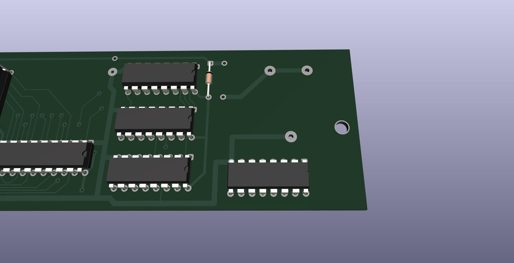

# Reproduction of Node Systems DATAPAC

The NODE Systems DATAPAC and RAMPAC were a ram disk peripheral for TRS-80 / TANDY Models 100, 102, & 200 computers.

RAMPAC was a later device that functioned the same as DATAPAC, even using the same software to run it, just in a new smaller form factor.

This schematic and PCB documents the DATAPAC. If I ever aquire a RAMPAC, I'll add that.

Here is some disorganized [INFO](software/) mostly gathered from the [M100SIG archive](https://github.com/LivingM100SIG/Living_M100SIG) and [club100](http://www.club100.org).

TLDR: To use the hardware, install [RAMDSK.CO](software/RAMDSK/), and what you get is a 128K or 256K ram disk.

The printing on the enclosure says 256K, and the circuit is all there to support 256K, but my two units only had 128K installed.  
The PCB has footprints for four 32K sram chips (62256 equivalent), for a total of 128K.  
To get 256K, a second set of chips are piggybacked on top of the first four, each with pin 20 bent out and connected to the pcb instead of to the chip below.  
No other parts or changes are needed to upgrade a 128K unit to 256K.


## Reproduction Schematic & PCB
This is a new drawing but aims to reflect the original actual device as exactly as possible.  
It's meant to be a form of documentation or reference describing the original hardware as it was.  


PCB TOP


PCB BOTTOM


The original PCB has no silkscreen. This image has silkscreen added to show where the components from the schematic go.


## Battery
The original battery is no longer made. The modern replacement is almost 2mm taller and does not fit inside the enclosure.

NODE Systems themselves used to perform an update to older units to replace the original rechargeable NiCD cell with a non-rechargeable lithium cell which was supposed to last about 5 years.

The change is simple and easy, and the parts are common. You just remove the old battery and the 200 ohm resistor, and replace them with a CR2032 holder and a diode. That's it. Both parts fit and solder right in the same locations where the old parts came out. Point the diode stripe away from the battery, just like the other diode that is right there next to it. Any kind of diode will do. Another 1N4148 like the other one that's already there is perfect.
This should give about 4 years of memory.  
(The original battery may have only lasted a number of months according to a review in the archives. So the coin cell mod is definitely an improvement as well as being available.)

BEFORE


AFTER


STEPS





If you wish to keep using a rechargeable battery, then a suitable option is FL3/V80H. That is 3 16x5.8mm NiMH button cells in a flat in-line pack with wire leads. It fits perfectly in the space next to the ribbon cable. It needs to be secured with hot glue or foam mounting tape, and connected with wires run to the original battery location.  


## Documentation
The original manual does not seem to be scanned or archived anywhere.

All we have today is a few bits of info from discussions in the [M100SIG archive](https://github.com/LivingM100SIG/Living_M100SIG) and Paul Globmans software on [club100](http://www.club100.org/library/libpg.html).  
Some of these are collected [here](software).

A few of those documents say that the device originally shipped with the user manual pre-loaded onto the DATAPAC as a 12K text file, along with at least one BASIC program, and the Format function in the option rom would also re-create this file.

## Software
### RAMDSK
The "driver" software for the device is [RAMDSK](software/RAMDSK/)

Originally these shipped with an option rom from NODE (Written by Travelling Software), which does not seem to be archived anywhere. Today all we have left is RAMDSK.

RAMDSK purports to provide all or almost all of the same functionality as NODEs option rom, and even NODE themselves later licensed RAMDSK and included a copy with each unit. It's unclear if this was in addition to their original option rom, or fully replacing it.  
Even the rom calls from the option rom have equivalents in RAMDSK, though at different addresses. (see RAMDSK.TIP) 
One thing RAMDSK does not do which the original option rom did, is re-create the user manual text file as part of the Format function.

The "Bank" button in the later version of RAMDSK is for the later versions of the hardware that could have 384K or 512K. It has no effect on a 128K or 256K unit.  

The only other significant software using this device seems to be [XOS](http://www.club100.org/library/libpg.html), which is sort of an OS for the Model 200. XOS does not require a RAMPAC or DATAPAC, but apparently makes good use of one if present. For instance, you can keep just a single copy of RAMDSK.CO in bank 3, yet be able to use it from any bank.  
I have not tried XOS yet, this is just from reading the description.

Some software culled from the M100SIG archive and Club100 are collected in [software](software).  
Much of that software actually requires the original option rom, which is not available. Some of that could possibly be converted to work with RAMDSK instead of the rom by translating the call addresses per the RAMDSK.TIP file.

The few documents we do have mention a BOOT program that could be manually typed in to BASIC to bootstrap a copy of RAMDSK from a RAMPAC after a cold start, but that program does not seem to be archived anywhere.

Currently the only way to get RAMDSK installed is to copy it via any of the normal ways to copy any other .CO file. Create a BASIC loader with co2ba or similar, TPDD, cassette.
The quickest way to go from scratch if you don't already have a TPDD emulator and TS-DOS set up is the bootstrap directions in [software/RAMDSK/RAM100/install.txt](software/RAMDSK/RAM100/install.txt) or [software/RAMDSK/RAM200/install.txt](software/RAMDSK/RAM200/install.txt), which uses a bootstrapper program on a pc to feed a loader program into BASIC.

### RBOOT
Once you have RAMDSK installed, if you use it to save a copy to the RAMPAC as the very first file after a fresh format, then you can re-install RAMDSK from the RAMPAC after a cold reset by manually typing in a short BASIC program.  
These RBOOT for 100 and 200 are meant to be as small as possible since you have to manually type them in, so they don't have any frills like a progress display or summary message.  
They don't print anything while running. When they are done, just exit BASIC and there should be a copy of RAMDSK.CO installed, and it should be immediately ready to use without needing to LOADM or CLEAR.

#### RBOOT for Model 100
[software/RAMDSK/RAM100/RBOOT.DO](software/RAMDSK/RAM100/RBOOT.DO) uses pre-computed values and only works for this exact RAMDSK binary [software/RAMDSK/RAM100/RAM100.CO](software/RAMDSK/RAM100/RAM100.CO).  
```
1 CLEAR0,61558:S=61558:E=62957
2 OUT129,2:FORJ=0TO15:K=INP(131):NEXT
3 J=S:K=S+1007:GOSUB5:OUT129,1:J=K+1
4 K=E:GOSUB5:SAVEM"RAMDSK",S,E,S:END
5 FORA=JTOK:POKEA,INP(131):NEXT:RETURN
```

#### RBOOT for Model 200
[software/RAMDSK/RAM200/RBOOT.DO](software/RAMDSK/RAM200/RBOOT.DO) uses pre-computed values and only works for this exact RAMDSK binary [software/RAMDSK/RAM200/RAM200.CO](software/RAMDSK/RAM200/RAM200.CO).  
```
1 CLEAR0,59715:S=59715:E=61101
2 OUT129,2:FORJ=0TO15:K=INP(131):NEXT
3 J=S:K=S+1007:GOSUB5:OUT129,1:J=K+1
4 K=E:GOSUB5:SAVEM"RAMDSK",S,E,S:END
5 FORA=JTOK:POKEA,INP(131):NEXT:RETURN
```

#### Generic RBOOT
Just for reference, here is a slightly larger but more flexible and generic version.  
[software/RAMDSK/RBOOT.DO](software/RAMDSK/RBOOT.DO)  
* Reads the .CO header bytes to get the necessary address values from the file itself  
* Should work on any binary that fits in the first 2 blocks (slightly uner 2k)  
* Should work on both Model 100 and 200 without changes  
* Has progress display  
* Prints a message at the end with a CLEAR command that you have to manually type to complete the install  
```
1 CLEAR0,59000 :OUT129,2 :FORA=0TO9 :N=INP(131) :NEXT
2 GOSUB6 :S=N :GOSUB6 :L=N :GOSUB6 :X=N
3 N=S+1007 :E=S+L-1 :FORA=STOE :?".";
4 POKEA,INP(131) :IF A=N THEN OUT129,1
5 NEXT :?"type CLEAR 0,"S":NEW" :SAVEM"RAMDSK",S,E,X:END
6 N=INP(131) :N=N+INP(131)*256 :RETURN
```

None of these are the actual original "BOOT" program mentioned in the archives. That original file that was shipped pre-loaded on DATAPAC & RAMPAC units is lost now unless/until someone finds a copy.  

### Using RAMDSK
The Bank button switches between 2 banks of 256K, and is only functional on RAMPAC or MiniNDP that has more than 256K installed.

[It seems to be fairly easy for the first byte to get corrupted](software/RAMPAC.001)  
I have had it happen a bunch of times already myself.  
Don't Panic(tm)  
You could do the manual BASIC one-liner from that document, but RAMDSK has a first-byte-fixer built-in.  
If you get the dreaded "Format?" prompt, just answer "N" and then it will prompt "Fix?" ,and you answer "Y" to that, and your files will be back.

### BASIC
How to access the hardware directly from BASIC.

There are two low level operations that you use to access the device,  
BLOCK and BYTE, and each of those has two variations, for four total ops.

#### Select a BLOCK from BANK 0
`OUT 129,n`  Select block# **n** (0-255) in bank 0  

#### Select a BLOCK from BANK 1
`OUT 133,n`  Select block# **n** (0-255) in bank 1

#### Read a BYTE
`INP(131)`   Read the byte at the current byte position

#### Write a BYTE
`OUT 131,n`  Write the value **n** (0-255) at the current byte position

The first read or write after selecting a block# applies to byte #0 of that block.  
The byte position advances by one after each read or write, so the next read or write will be byte #1, then byte #2, etc up to 1024.  
And actually, it's not "up to 1024", it wraps around to 0 of the same block again if you keep reading or writing more than 1024 times without selecting some other block.

There is only one byte-position counter that applies the same to reads and writes. The counter advances the same whether you read or write, so you could actually mix reads and writes. If you read 10 bytes and then write 10 bytes, you will read bytes 0-9 and the write bytes 10-19.

Since the device only operates on single byte values, it's a little more efficient to use integer variables with the % suffix, ie, use B%=INP(131) instead of B=INP(131) etc where possible.

#### examples

Select bank 0 block 0  
`OUT129,0`

read a byte, which will be byte #0 of this block  
`INP(131)`

Read and print the ascii of all the bytes in bank 0 block 1  
This will be the first block of actual file data for the first file (also with some file/block metadata like the filename and probably some kind of linked list block pointers).  

```
10 OUT 129,1
20 FOR I=0 TO 1023
30 PRINT CHR$(INP(131));
40 NEXT
```

Do the same but in bank 1  
change line 10 to:  
`10 OUT 133,1`

Manually repair the first two bytes of block 0 to mark the bank as being formatted without touching any of the data  
`OUT129,0:OUT131,64:OUT131,4`

Selects bank0 block0, writes 64 to byte #0, writes 4 to byte #1  
You usually don't need to do this manually because RAMDSK.CO can do it for you.

### RPI.BA
Here is a small "RAMPAC inspector" [RPI.BA](software/RPI) to view the raw data from anywhere on the device.  
There are already old apps for that like N-DKTR and RD, but they are large, include machine language or require the original option rom or RAMDSK.CO, don't support 512k, etc.  
For instance [RD.BA](Rampac_Diagnostic) can not even be loaded in one piece even on a freshly reset 32k machine, and does not support banks, or the model 200.  
So this does not use any machine code, everything is in BASIC, supports banks/512k, runs on both model 100 and 200, and is relatively small.

The ascii display mode (press F2 to toggle hex/ascii) displays the non-printing control characters as their respective CTRL code in inverse video.  
For example NUL appears as `@` in reverse video. So every byte still takes a single cell of the display.

## Model compatibility
Apparently only Models 100, 102, & 200 were ever supported. (No NEC or Olivetti, etc)

There is no reason the device can't work on any of the other machines, merely the software was never ported to them.

### Model 200
The connector on the DATAPAC [does not actually fit in a Model 200](REF/does_not_fit_model_200.jpg) without cutting the opening wider around the bus connector on the 200.

The only connector that fits in a 200 without hacking on the 200s case is a [solder-type 2x20 male box header](https://www.digikey.com/en/products/detail/sullins-connector-solutions/SBH11-PBPC-D20-ST-BK/1990068),
 which could be soldered back to back with the [female version](https://www.digikey.com/en/products/detail/sullins-connector-solutions/SFH11-PBPC-D20-ST-BK/1990093),
 to make an [adapter](REF/T200_adapter.jpg) to allow [connecting to a 200](REF/T200_adapter_installed.jpg) without having to damage the 200's case.

### Model 100
The case says "102/200", but it actually works on Model 100 also. It needs an adapter cable, but the cable is simple. It's just a "wire-to-board" IDC-DIP-40 crimp-on DIP connector and a standard 2x20 female IDC connector, both crimped on to a 40-pin ribbon cable about 8 inches long.  
[The Model 100 part](https://github.com/bkw777/TRS-80_Disk_Video_Interface_Cable/blob/main/README.md#part-3---model-100-adapter) of this [3-part cable for the Disk/Video Interface](http://tandy.wiki/Disk/Video_Interface:_Cable) is exactly the same thing.

## Theory of Operation
The three HC161 chips form a 0-1023 counter, setting local sram address bits A0-A9. We'll call this the byte or byte-position counter.

The HC374 sets local sram address bits A10-A17 from the bus AD0-AD7, and latches and holds that address on its outputs until triggered to update to a new address.

Four lines from the system bus: A8, A9, /Y0, and (A), combine to produce two signals which I am calling /BLOCK and /BYTE.

Each time /BLOCK goes low it sets SRAM A0-A9 to 0 and copies BUS AD0-AD7 to SRAM A10-A17,
then holds A10-A17 latched while /BLOCK is high.  
Call this a BLOCK op.

Each time /BYTE goes low it enables SRAM for read or write while low,
then when /BYTE goes high it disables SRAM and increments A0-A9 by 1.
Call this a BYTE op.

So the device provides up to 256 blocks of 1k bytes each. The host computer does a BLOCK op to select a block number from 0-255, then does a BYTE op to read or write a byte of data at byte #0 in the block, then repeats the BYTE op 1023 more times to read or write all 1024 bytes in the block.  
The device actually does operate like a disk even though it has no brains or firmware.

Later versions of RAMPAC were offered with 384k or 512k by adding a second bank of 128k or 256k, and later versions of RAMDSK.CO know how to access it.

The extra 256K is accessed by the state of BUS address line A10 during a BLOCK op.  
BLOCK with BUS_A10 low accesses bank0, BLOCK with BUS_A10 high accesses bank1.  
The state of BUS_A10 is essentially copied to the SRAM A18 address line and latched during BLOCK ops along with A10-A17, like adding a 9th bit to the HC374.  

The extra bank 512k operation is just deduced from watching what RAMDSK.CO tries to do on the system bus when you press the Bank button, then the theory tested with a breadboard circuit, and finally with MiniNDP below, which actually works with RAMDSK.  
MiniNDP probably does not implement the circuit the same way that the RAMPAC did.

<!-- 
## New Replacement PCB
Uses all the same through-hole parts, fits in the original enclosure, improves the trace routing a little, for example moving that VCC line away from that screw head, gnd traces replaced by pours, thicker and all the same size vcc lines, decoupling caps, silkscreen.  
There is not much reason to build this instead of a MiniNDP. Even if you had an original DATAPAC that was corroded by the battery, it would be easier and more history-preserving to just repair the corroded traces with bodge wires since all the parts are so big and simple.


-->

# MiniNDP

Functions the same as DATAPAC / RAMPAC. Essentially the same circuit, just with a single 512k ram chip instead of 8 32k chips, surface mount parts instead of through hole, and directly attached instead of connected by a cable.

Provides the second bank of 256k like RAMPAC, for a total of 512k.

The connector fits in a Model 200 without having to modify the 200.  

The diode on RAMRST is copied from a user mod found on a DATAPAC. It appears to be intended to prevent a battery drain on the host computer while the DATAPAC is left connected to the host while the host is turned off.

You can optionally make a thinner card by replacing BT1 and C1 with lower profile alternatives.  
|BATTERY|estimated life|holders that fit the footprint|height|C1 Capacitor|
|---|---|---|---|---|
|CR2032|7.5 years|Keystone 3034<br>TE/Linx BAT-HLD-001-SMT<br>Adam Tech BH-67<br>MPD BK-912|4.1mm|[TAJC227K010RNJ](https://www.digikey.com/en/products/detail/kyocera-avx/TAJC227K010RNJ/1833766?s=N4IgTCBcDaICoEEBSBhMYDsBpADARhwCUA5JEAXQF8g) - 6032-28 220u 10v|
|CR2016|3 years|Keystone 3028|1.7mm|[TLJW157M010R0200](https://www.digikey.com/en/products/detail/kyocera-avx/TLJW157M010R0200/929982?s=N4IgTCBcDaICoBkBSB1AjAVgOwFkAMaeASnmHniALoC%2BQA) - 6032-15 150u 10v|

BOM [DigiKey](https://www.digikey.com/short/q4mh3b52)  
PCB <!-- [OSHPark](https://oshpark.com/shared_projects/), -->[PCBWAY](https://www.pcbway.com/project/shareproject/MiniNDP_mini_Node_DataPac_d08018c4.html), or there is a gerber zip in [releases](../../releases/)

For the PCB, you want ENIG copper finish so that the battery contact is gold. PCBWAY and JLCPCB are a bit expensive for ENIG. Elecrow is cheaper, and OSHPark is always ENIG.  

There are a few options for an [enclosure](enclosure).  
There is OpenSCAD source and exported STL for a snap-on cover, with both a thick version for a card with CR2032 holder, and a thin version for a card with a CR2016 holder.  
There is also an STL for a slip cover style by F. D. Singleton.

You can get both the PCB and enclosure at the same time from Elecrow by submitting the gerber zip and the enclosure stl, and it arrives in under 2 weeks even with the cheapest economy shipping option.


CR2032 height


CR2016 height (nominally a CR2012 holder, but can take a CR2016)  


Installed on a TANDY 102


Installed on a TANDY 200


The 512k board also still supports 256k and 128k. There is no real reason to do this now but if you wanted to install a 256k (AS6C2008A) 
or 128k (AS6C1008) SRAM, omit the U8 part (the 1G79), and instead short U8 pads 4 & 5 together with solder. Those two pads are modified to also be a solder-jumper for this purpose.
