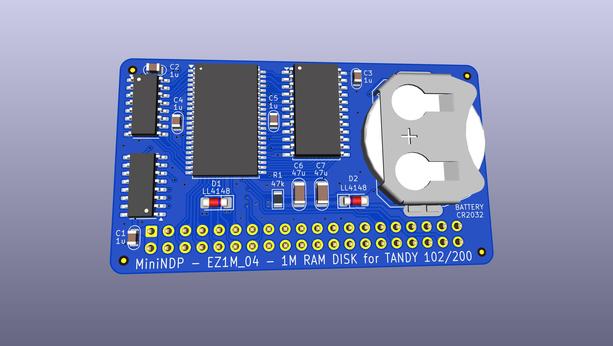
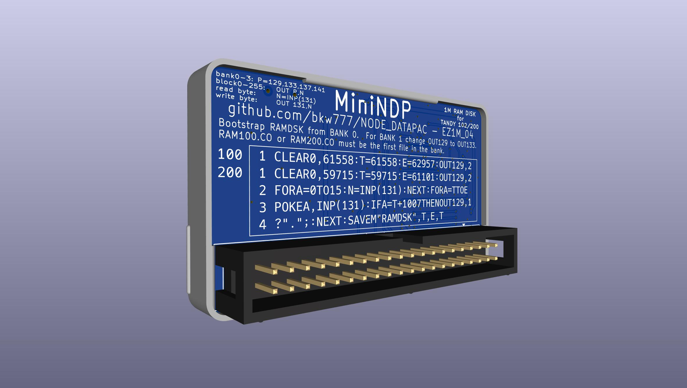
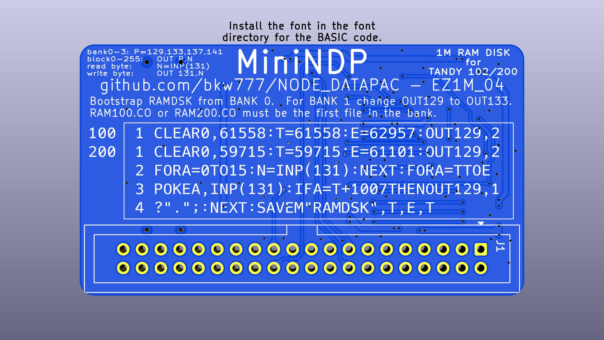
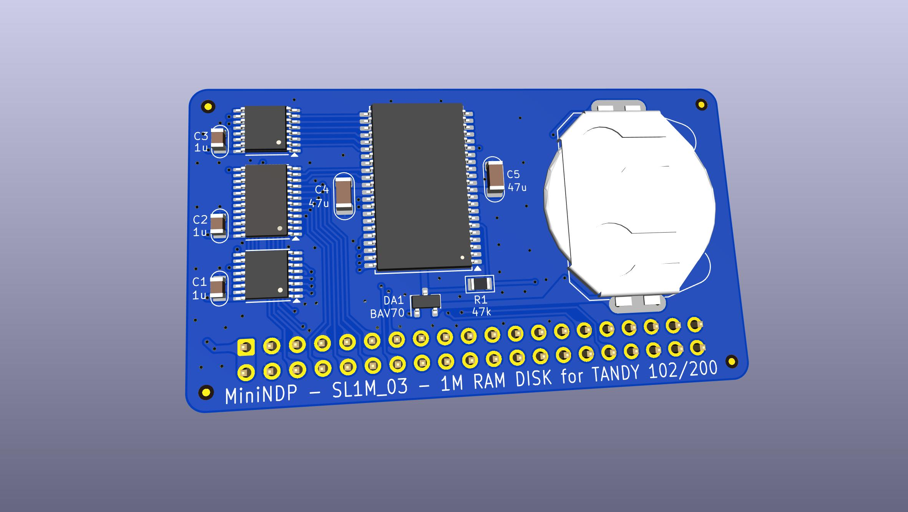
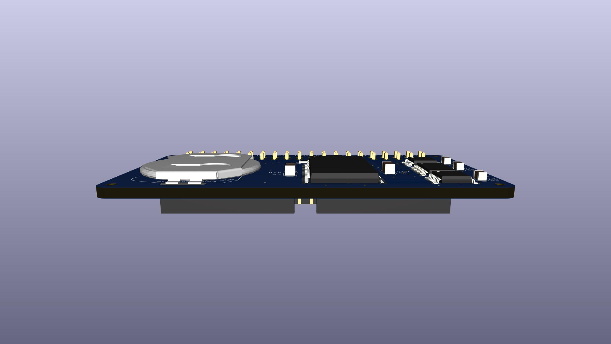
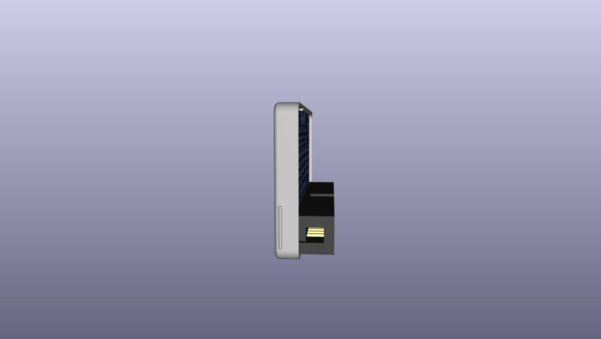
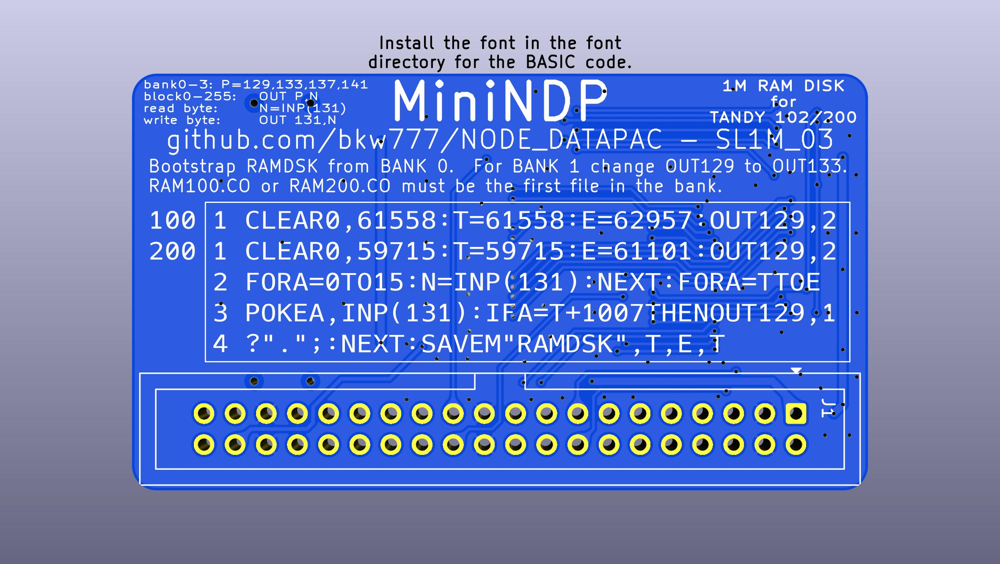
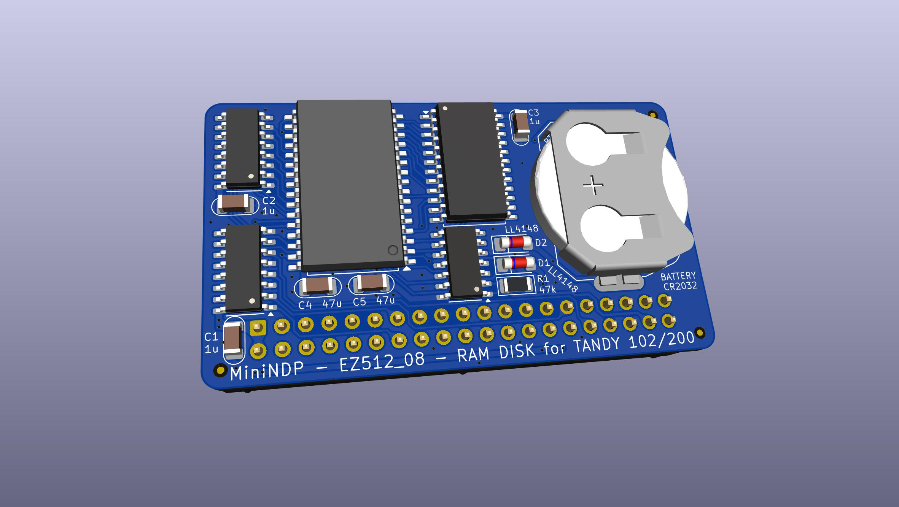
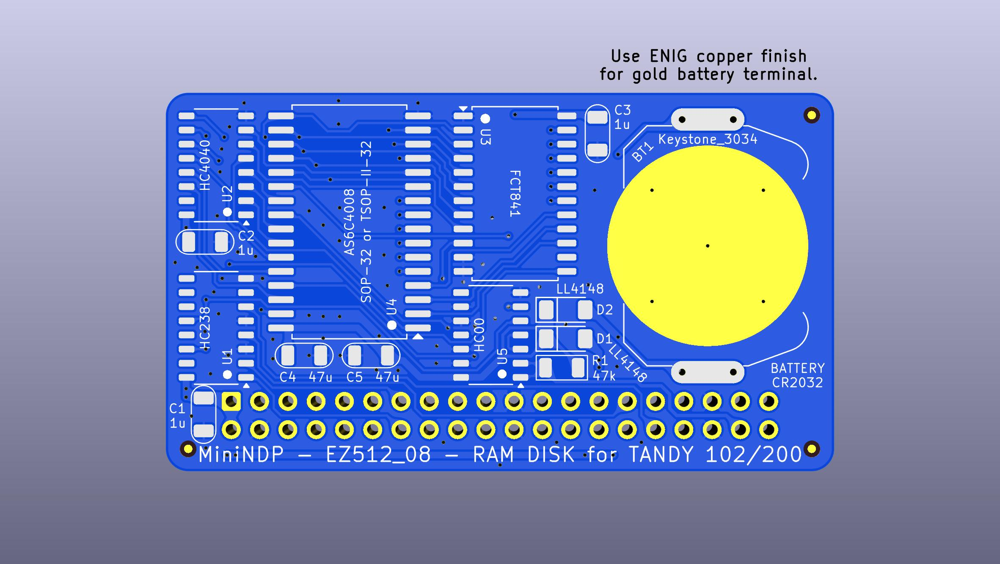

# NODE Systems DATAPAC
* [Documentation](#documentation)
* [DATAPAC Hardware](#datapac-hardware)
  * [Reproduction Schematic & PCB](#reproduction-schematic--pcb)
  * [Theory of Operation](#theory-of-operation)
  * [Battery](#battery)
  * [Upgrading 128K to 256K](#upgrading-to-256k)
  * [Model Compatibility](#model-compatibility)
* [RAMPAC Hardware](#rampac-hardware)
* [Software](#software)
  * [BASIC](#basic)
  * [RAMDSK](#ramdsk)
    * [Installation](#installing-ramdsk)
    * [Usage](#using-ramdsk)
  * [NBOOT](#nboot)
  * [RAMPAC Inspector](#rampac-inspector)
  * [XOS-C](#xos-c)
  * [N-DKTR](#n-dktr)
  * [NODE-PDD-Link](#node-pdd-link)
  * [NDEXE](#ndexe)
  * [RAMPAC Diagnostic](#rampac-diagnostic)
* [MiniNDP](#minindp)
  * [PCB & BOM](#minindp-pcb--bom)
  * [Cover](#minindp-cover)
  * [WIP/Experiments](#works-in-progress)

This repo documents the NODE Systems DATAPAC, RAMPAC, and a new clone, the [MiniNDP](#minindp).

The NODE Systems DATAPAC was a popular ram disk peripheral for TRS-80 / TANDY Models 100, 102, & 200 computers.

Later versions of the same device were called RAMPAC. They functioned the same as DATAPAC and used the same software, just in a much smaller form factor.

The schematic and PCB below documents the DATAPAC from examining 2 units. If I ever aquire a RAMPAC, I'll add that.

Here is some disorganized [INFO](software/) mostly gathered from the [M100SIG archive](https://github.com/LivingM100SIG/Living_M100SIG) and [club100](http://www.club100.org).

TLDR: To use the hardware, install [RAMDSK](#ramdsk), and what you get is a ram disk of 128k to 512k depending on model and installed ram.


# Documentation
The original text file manual [RAMDSK.DO](ROM/100/RAMDSK.DO).  
The [option rom](ROM) that came with the unit generates this file when formatting a device.

There are also some discussions in the [M100SIG archive](https://github.com/LivingM100SIG/Living_M100SIG) and Paul Globmans software on [club100](http://www.club100.org/library/libpg.html).  
Most of these are collected in [docs](docs).  
See also the docs for the various bits of [software](software).

The only version of the original rom we have is an early version that only supports the original 256k hardware, and only for Model 100/102.  
There was also a version for Model 200 (the hardware is the same, but the rom still needs to be made specifically for 200 to run on a 200).  
And there were later versions that supported up to 512k.  
The original rom is not needed to use the hardware. Paul Globmans [RAMDSK.CO](software/RAMDSK) can be used instead.

Other References  
* "Database management with both the Node RAMPAC & DATAPAC."  
  Alspaugh, Ron - [Portable 100, Nov 90:8-11](https://archive.org/details/P100-Magazine/1990-11/page/8/)  
* "Node utility mini-extravaganza! Here are two special programs for Node Datapac/RAMPAC users."  
  Globman, Paul - [Portable 100, Dec 90:19-20](https://archive.org/details/P100-Magazine/1990-12/page/18/)  

# DATAPAC Hardware
## Reproduction Schematic & PCB
This is a new drawing but aims to reflect the original actual device as exactly as possible.  
It's meant to be a form of documentation or reference describing the original hardware as it was.  
For instance, the ungrounded inputs on the 161's, the inconsistent thickness of power traces, the fact that only 1 of the 2 bus VDD pins is connected, the VCC trace that almost touches one of the screw heads, etc, are all exactly as in the original.  
(I added a fiber washer to that screw in my units after noticing that. The case is isolated, not connected to ground, but still...)


PCB TOP


PCB BOTTOM


The original PCB has no silkscreen. This image has silkscreen added to show where the components from the schematic go.


## Theory of Operation
The circuit has 2 functions, SELECT-BLOCK and READ/WRITE-BYTE, controlled by the internal active-low signals /BLOCK and /BYTE.

The U4 HC138 monitors four lines from the bus, `/Y0` `(A)` `A8` `A9`, and based on that asserts either `/BLOCK` or `/BYTE` or neither.  
If neither /BLOCK nor /BYTE is asserted then the bus traffic has no effect on any of the other chips.

The 3 HC161 form a 0-1023 counter, setting SRAM address bits A0-A9.  
Call this the byte-number or byte-position counter or offset.

The HC374 sets SRAM address bits A10-A17 from the bus data bits AD0-AD7, and latches that value on its outputs until triggered to update to a new value.  
Call this the block-number or block selector.

The U5 HC138 converts 3 bits of the block-number into 1 of 8 chip-select to select 1 of 8 32K SRAM chips,  
and also monitors both /BYTE and RAMRST and disables all ram while either /BYTE or RAMRST is high.

----

### SELECT-BLOCK
When /BLOCK goes low:
* SRAM A0-A9 are reset to 0  (byte-position counter is reset to 0)
* BUS AD0-AD7 are copied to SRAM A10-A17  (bus data lines AD0-AD7 select a block-number)

When /BLOCK goes high:
* SRAM A10-A17 are held latched at whatever they were set to  (block-number is locked in until next /BLOCK)

----

### READ-BYTE / WRITE-BYTE
When /BYTE goes low:
* SRAM is enabled  (bus data lines AD0-AD7 read from or write to the current address in SRAM)

When /BYTE goes high:
* SRAM is disabled
* A0-A9 are incremented by 1 (byte-position, thus the current address in SRAM, is advanced to the next byte)

----

The byte-number and block-number combine to form the current address in SRAM at any given time.  

The device provides up to 256 blocks (8-bit block-number) of 1024 bytes each (10-bit byte-number).

The host computer first does a SELECT-BLOCK to select a block number from 0-255, then does READ-BYTE or WRITE-BYTE to read or write one byte of data at byte number 0 in that block, then repeats the BYTE operation up to 1023 more times to read or write up to all 1024 bytes in the block.  

It's not really limited to 1024 reads/writes. If you read or write more than 1024 times total without selecting a new block, the byte-number counter just rolls over to 0 again.

You can also mix reads and writes in the same block. Each read OR write advances the byte-number the same way each time, regardless if the previous operation was a read or a write. For instance in order to skip over 64 bytes without modifying them and then start writing at the 65th byte, you would read-and-ignore 64 times and then start writing.

It's called a ramdisk because the device actually does operate like a disk even though it has no brains or firmware. The block-select latch acts like a track or sector address, and the binary counter acts like a disk or tape head reading or writing a sequential stream of bytes.

Later versions of RAMPAC were offered with 384k or 512k by adding a second bank of up to 256k, and later versions of RAMDSK.CO know how to access the 2nd bank.

The extra 256K is accessed by the state of bus address line A10 during a SELECT-BLOCK operation.  
SELECT-BLOCK with BUS_A10 low accesses bank0, with BUS_A10 high accesses bank1.  
All other aspects are the same, so accessing bank0 on a a 512K device is the same as accessing the only bank on a 256K device.  Old software is still compatible with bank0 on new hardware, new software is still compatible with old hardware.

[What this all means from the host computer software side of things](https://github.com/bkw777/NODE_DATAPAC?tab=readme-ov-file#low-level-direct-access-using-only-basic)

## Battery
The original battery is no longer made, and the modern cross-reference is almost 2mm taller and does not fit inside the enclosure.

NODE Systems themselves used to perform an update to older units to replace the original rechargeable NiCD cell with a non-rechargeable lithium cell which was supposed to last about 5 years.

The change is simple and easy, and the parts are common. You just remove the old battery and the 200 ohm resistor, and replace them with a CR2032 holder and a diode. That's it. Both parts fit and solder right in the same locations where the old parts came out. Point the diode stripe away from the battery, just like the other diode that is right there next to it. Any standard diode will do. Schottky is not recommended because the reverse leakage is not good for a lithium cell. Another 1N4148 like the one that's already there is perfect.  
This should give at least 4 years of memory.  
(The original NiCD battery may have only lasted as little as a few months per charge according to a review in the archives. So the coin cell mod is not merely more conveniently available with current parts, it's an improvement.)

BEFORE


AFTER


STEPS


If you wish to keep using a rechargeable battery, then a suitable option is FL3/V80H. That is 3 16x5.8mm NiMH button cells in a flat in-line pack with wire leads. It fits perfectly in the space next to the ribbon cable. It needs to be secured with hot glue or foam mounting tape, and connected with wires run to the original battery location.  


The charging circuit is utterly basic, so do not connect any other type of battery except NiCD or NiMH.  
You can use any cell form factor and any larger or smaller mAh capacity, but must be 3.6v and only NiCD or NiMH chemistry.

## Upgrading to 256K
A 128k unit may be upgraded to 256k by just adding 4 more SRAM chips piggy-backed onto the existing chips.

The PCB has 4 DIP-28 footprints for the SRAM chips.  
Each DIP-28 footprint also has an extra via close to pin 20.

A 128k unit has a low-power 62256 installed in each footprint, and nothing connected to the via near pin 20.

To get 256k, a second set of chips are soldered piggyback on top of the first four.  
All pins except pin 20 are simply soldered to the chip below.  
Pin 20 is bent out and connected to the extra via on the pcb (with a short bit of wire to reach) and not connected to the chip below.  

No other parts or changes are needed to upgrade an existing 128k unit to 256k.

Any 62256 will work, but for old parts you want the low-power version for standby battery life.  
New parts already naturally have as low or lower standby current than the low-power versions of old parts even if they don't say "low power".  
Old standard: HM62256    70uA  
Old lowpower: HM62256LP  4uA  
Old lowpower: P51256SL   2uA  
New standard: AS6C62256  1uA

## Model compatibility
Only Models 100, 102, & 200 were ever supported.

The device is probably hardware compatible with the Olivetti M-10 and Kyotronic KC-85, though RAMDSK was (probably) never ported to them.

The device is not compatible with the NEC PC-8201/PC-8300 at all.

### Model 200
The connector on the DATAPAC [does not actually fit in a Model 200](ref/does_not_fit_model_200.jpg) without cutting the opening wider around the bus connector on the 200.

The only connector that fits in a 200 without hacking on the 200s case is a [solder-type 2x20 male box header](https://www.digikey.com/en/products/detail/sullins-connector-solutions/SBH11-PBPC-D20-ST-BK/1990068),
 which could be soldered back to back with the [female version](https://www.digikey.com/en/products/detail/sullins-connector-solutions/SFH11-PBPC-D20-ST-BK/1990093),
 to make an [adapter](ref/T200_adapter.jpg) to allow [connecting to a 200](ref/T200_adapter_installed.jpg) without having to damage the 200's case.

### Model 100
The case says "102/200", but it actually works on Model 100 also. It needs an adapter cable, but the cable is simple. It's just a "wire-to-board" IDC-DIP-40 crimp-on DIP connector and a standard 2x20 female IDC connector, both crimped on to a 40-pin ribbon cable about 8 inches long.  
[The Model 100 part](https://github.com/bkw777/TRS-80_Disk_Video_Interface_Cable/blob/main/README.md#part-3---model-100-adapter) of this [3-part cable for the Disk/Video Interface](http://tandy.wiki/Disk/Video_Interface:_Cable) is exactly the same thing.

# RAMPAC Hardware
About all we can say currently is that we know it was sold in 128k, 256k, 384k, and 512k capacities, and was "about 2 inches square".

We know how it's banks worked, because we can look at RAMDSK and see what it tries to do, and verified by the fact that 512k MiniNDP actually works.  

MiniNDP schematic is essentially just a clone of the DATAPAC schematic with the coin cell mod applied and the multiple ram chips replaced by a single big one. RAMPAC schematic might have been different.

# [Software](software)

Originally these shipped with an [option rom](ROM) from NODE (written by Travelling Software) called RAMDSK.  
Later, each unit also came with a [.CO also called RAMDSK](software/RAMDSK) written by Paul Globman.

The only version of the original rom we have is an early version that only supports the original 256k hardware, and only for Model 100/102.  
There was also a version for Model 200, and there were later versions that supported up to 512k.  
The original rom is not needed to use the hardware. Instead you can use Paul Globmans RAMDSK.  
We have versions of that for both 100 and 200, and we have the later versions that support up to 512k.

Some software culled from the M100SIG archive and Club100 are collected here in the [software](software) directory.  

## BASIC
How to access the hardware from BASIC.

### High level file operations using CALLable machine language routines
See [RAMDSK.DO](ROM/100/RAMDSK.DO) for the NODE ROM routines.  
See [RAMDSK.TIP](software/RAMDSK/RAMDSK.TIP) for the RAM100.CO/RAM200.CO routines.

### Low level direct access using only BASIC
There are two low level operations that you use to access the device,  
BLOCK and BYTE, and each of those has two variations, for four total ops.

Select a BLOCK from BANK 0  
`OUT 129,n`  
Selects block# **n** (0-255) in bank 0, and resets the byte position to 0.

Select a BLOCK from BANK 1  
`OUT 133,n`  
Selects block# **n** (0-255) in bank 1, and resets the byte position to 0.

Read a BYTE  
`INP(131)`  
Reads the byte at the current byte position, and advances the byte position by one.

Write a BYTE  
`OUT 131,n`  
Writes the value **n** (0-255) to the current byte position, and advances the byte position by one.

The first read or write after selecting a block# applies to byte #0 of that block.  
The byte position advances by one after each read or write, so the next read or write will be byte #1, then byte #2, etc up to 1024.  
And actually, it's not "up to 1024", it wraps around to 0 of the same block again if you keep reading or writing more than 1024 times without selecting some other block.

Since the device can only read or write a single byte at a time, it's most efficient to use integer variables with the % suffix, ie, use B%=INP(131) instead of B=INP(131) etc where possible.

The general sequence is always:  
1 - select a bank+block  
2 - read/write byte 0-1024 times

If you need to read or write some arbitrary set of bytes from the middle of a block, you must still read (or write) all the bytes from 0 up to the desired offset.  
For instance, in RBOOT.DO, to skip over the first 16 bytes of the block it does `FORA=0TO15:N=INP(131):NEXT`  
N is not actually used, it's just reading 16 times and ignoring the data. This just advances the byte position counter to get from byte #0 up to the start of the bytes that it actually wants.

Examples

Select bank 0 block 0  
`OUT129,0`

read a byte, which will be byte #0 of this block  
`INP(131)`

Read and print the ascii of all the bytes in bank 0 block 2.  
(this will mess up the display from control bytes if there is a binary .CO file in this block)
```
10 OUT 129,2
20 FOR I=0 TO 1023
30 PRINT CHR$(INP(131));
40 NEXT
```

Do the same but in bank 1  
change line 10 to:  
`10 OUT 133,2`

Manually repair the first two bytes of block 0 to mark the bank as being formatted without touching any of the data.  
This means:
1. Select bank0 block0  
2. write one byte, value 64  
3. write one byte, value 4

`OUT129,0:OUT131,64:OUT131,4`

(BTW you usually don't need to do that manually because RAMDSK.CO will do it for you if you just answer "Y" at the "Fix?" prompt.)

## RAMDSK
The "driver" software for the device is [RAMDSK](software/RAMDSK/)

RAMDSK claims to provide the same functionality as NODEs option rom, and even NODE themselves later licensed RAMDSK and included a copy with each unit.  
Even the rom calls from the option rom have equivalents in RAMDSK, though at different addresses. (see [RAMDSK.TIP](software/RAMDSK/RAMDSK.TIP))  
One thing RAMDSK does not do which the original option rom did, is re-create the user manual text file as part of the Format operation.

### Installing RAMDSK
Archived docs mention an 8 line BASIC program called BOOT that could be manually typed in to BASIC to bootstrap a copy of RAMDSK from a RAMPAC after a cold start.

That program does not seem to be archived anywhere, but I have written `RBOOT` and `NBOOT` below which are new.  
This only works after a copy of RAMDSK has been copied to the RAMPAC.

To get RAMDSK installed the first time, copy RAM100.CO or RAM200.CO to the 100 or 200, then run it to format the device and copy RAM100.CO/RAM200.CO to it as the first file written to it.

The most convenient way is to use a TPDD [client](http://tandy.wiki/TPDD_client) & [server](http://tandy.wiki/TPDD_server) to copy the file, then [adjust HIMEM](https://bitchin100.com/wiki/index.php?title=Loading_a_typical_CO_file) to run it.  

If you don't already have a REX Classic or REX# or an actual TS-DOS rom, I have made these BASIC loaders:  
[software/RAMDSK/RAM100/RAM100.DO](software/RAMDSK/RAM100/RAM100.DO) for Model 100/102  
[software/RAMDSK/RAM200/RAM200.DO](software/RAMDSK/RAM200/RAM200.DO) for Model 200  

To bootstrap the BASIC loader from a PC running Windows:  
Install [tsend](https://github.com/bkw777/tsend)  
Then: `C:> tsend.ps1 -file RAM100.DO`

To bootstrap the BASIC loader from a PC running Linux, MACOS, FreeBSD, any unix, Cygwin/MSYS2:  
Install [dl2](https://github.com/bkw777/dl2)  
Then: `$ dl -v -b RAM100.DO`  

Another option for mac/linux, [pdd.sh](https://github.com/bkw777/pdd.sh) also has a bootstrap function and does not require you to compile anything.

Once you have RAMDSK installed, if you save a copy to the RAMPAC as the very first file after a fresh format, then in the future you can re-install RAMDSK from the RAMPAC itself after a cold reset without needing another computer or TPDD drive by manually typing in a short BASIC program.

These are optimized to tetris-pack into the fewest possible 40-column lines, not to be the most efficient code, so the entire program actually fits on the screen so you can easily verify it's all correct before trying to run it.  
Please excuse the inexcusable IF and math inside the byte read loop. :)

These have specific byte size and offset values that are only valid for the exact RAM100.CO and RAM200.CO files shown.

RBOOT for Model 100  
[software/RAMDSK/RAM100/RBOOT.100](software/RAMDSK/RAM100/RBOOT.100)  
for [software/RAMDSK/RAM100/RAM100.CO](software/RAMDSK/RAM100/RAM100.CO)
```
1 CLEAR0,61558:T=61558:E=62957:OUT129,2
2 FORA=0TO15:N=INP(131):NEXT:FORA=TTOE
3 POKEA,INP(131):IFA=T+1007THENOUT129,1
4 ?".";:NEXT:SAVEM"RAM100",T,E,T
```

RBOOT for Model 200  
[software/RAMDSK/RAM200/RBOOT.200](software/RAMDSK/RAM200/RBOOT.200)  
for [software/RAMDSK/RAM200/RAM200.CO](software/RAMDSK/RAM200/RAM200.CO)
```
1 CLEAR0,59715:T=59715:E=61101:OUT129,2
2 FORA=0TO15:N=INP(131):NEXT:FORA=TTOE
3 POKEA,INP(131):IFA=T+1007THENOUT129,1
4 ?".";:NEXT:SAVEM"RAM200",T,E,T
```

RBOOT for Model 200, booting from Bank1  
If you want to get fancy, you could support both model 100 and model 200 at the same time on the same RAMPAC by putting a copy of RAM100.CO in Bank0 and a copy of RAM200.CO in Bank1, and modify RBOOT.200 to read from bank1 instead of bank0 by just changing `OUT129` to `OUT133`.
```
1 CLEAR0,59715:T=59715:E=61101:OUT133,2
2 FORA=0TO15:N=INP(131):NEXT:FORA=TTOE
3 POKEA,INP(131):IFA=T+1007THENOUT133,1
4 ?".";:NEXT:SAVEM"RAM200",T,E,T
```

### Using RAMDSK
(RAMDSK.CO not the Node ROM)  
Usage is mostly pretty self-explanatory.

The F1-Bank button switches between 2 banks of 256k, and is only functional on a RAMPAC that has more than 256k.

[It is fairly common for the first byte to get corrupted](software/RAMDSK/RAMPAC.001) ...Don't Panic(tm)  
You could do the manual BASIC one-liner `OUT129,0:OUT131,64:OUT131,4`, but RAMDSK also has a first-byte-fixer built-in.  
If you get the "Format RAM-Disk?" prompt on power-on, just answer "N".  
Then it will ask "Fix?", answer "Y".

### [NBOOT](software/NBOOT/)
Just for reference, to boot some other CO instead of RAMDSK,  
here  is a more flexible and generic bootstrapper for any .CO file up to 2038 bytes.  
* Reads the filename and start/length/exec values from the file itself  
* Works on any .CO file that fits in 2 blocks  
* Works without changes on both Model 100 and 200
```
1 CLEAR32,59000:CLS:P=131:OUT129,2
2 FORA=0TO9:F$=F$+CHR$(INP(P)):NEXT
3 GOSUB8:T=N:GOSUB8:E=T+N-1:GOSUB8:X=N
4 F$=LEFT$(F$,6):N=T+1007:FORA=TTOE
5 ?@0,A:POKEA,INP(P):IFA=NTHENOUT129,1
6 NEXT:?@0,"Installed "F$:?"Type:"
7 ?"CLEAR 0,"T":NEW":SAVEMF$,T,E,X:END
8 N=INP(P)+INP(P)*256:RETURN
```

### RAMDSK data format

This is not publicly documented that I have found, at least not explicitly.  
Some things might be be figured out by reading the BASIC source to [N-DKTR](software/N-DKTR/) and [RD](software/Rampac_Diagnostic/), since they include functions to do things like inspect or repair files, except they use the callable machine language routines from the NODE rom or RAMDSK to do some of those functions, so maybe not that much can be gleaned from just the BASIC code.

In the past, Paul Globman reverse engineered the format written by the NODE option rom, but he used that to write the commercial product RAMDSK, not to publish the info.

I have figured out a very few basic things using [RAMPAC Inspector](software/CRI).

The first 2 bytes of block 0 in each bank holds a special value `0x64 0x04` which indicates that the device is formatted.  
The design of the circuit means that the first byte is routinely corrupted during power-on/power-off/plug/un-plug events, which is why the steps to manually re-write those bytes are documented and why RAMDSK has a function to repair them built-in.

Other than the first 2 bytes, block 0 is still a mystery.  
Block 0 only contains some kind of space allocation table, no file data.  
It's not a directory, there are no filenames stored in block 0.  
It's probably some form of linked list that defines chains of blocks.  

Files appear to be stored in reverse block number order.  
On a blank device, a file that requires 2 blocks uses blocks 1 & 2, and starts at block 2 and ends at block 1.  
I don't know what happens when files get deleted and new files have to be fragmented.

Filenames and lengths are readable from the first 10 bytes of any block that begins a file.

The first 10 bytes of the first block used by a file contains the file name without the dot, and the file length.

6 bytes - file name  
2 bytes - file extension  
2 bytes - file length (LSB first, 7E05 = 0x057E = 1406 for RAM100.CO)

These 10 bytes are metadata created and used by RAMDSK, not part of the file.

The length field does not include these 10 bytes.

The file data starts immediately after this and continues for $length bytes.

A block is 1024 bytes, and the first block has 10 bytes used by RAMDSK, so files that are longer than 1014 bytes use more than one block.

The remaining blocks in the file have no metadata headers, the payload data resumes right from byte 0 in the remaining blocks.

We don't know which blocks contain file data though without knowing how to interpret block 0.  
Even a block that looks like the beginning of a file with a filename at the beginning could actually just be data within some other file that happens to have that particular data.

You can use CRI.BA to just read the first 10 bytes of any block and look for filenames.

Run CRI.BA and enter: 0,1,0,16 to read the first 16 bytes of block 1 in bank 0,  
(0,1,0,10 = bank 0, block 1, start at offset 0, length 10 bytes.  
 Block 1 is the 2nd block, the first possible block with data, block 0 has only the allocation table.)

then repeat for block 2: 0,2,0,10    block 3: 0,3,0,10   etc...  

Use F2 to switch between ascii and hex display.  
In ascii mode you can see the file names if any, and in hex mode it's easier to get the file length.  

To read the file length:  
In hex display mode each hex pair is one byte.  
Count past the first 8 hex pairs to get past the filename,  
The next pair is the LSB of the file length  
The next pair is the MSB of the file length  
Length = MSB * 256 + LSB


In the particular case of .CO files, the first 6 bytes of a CO file is the CO header, which has the start address, length, and exe address.  
This isn't metatdata from RAMDSK, it's part of the CO file format.  
The length in the CO header is 6 bytes less than the length in the RAMDSK header because the CO header length field doesn't include the CO header itself.

2 bytes - top address, lsb first  
2 bytes - length, lsb first  
2 bytes - exe address, lsb first


## RAMPAC Inspector
[RAMPAC Inspector](software/CRI)

It's named CRI.BA because it's a very Crude RAMPAC Inspector.

You supply a bank number, block number, starting byte offset, and byte length, and it reads those bytes and displays them on screen.

bank: 0-1  (or 0-3 if you edit line 10 to enable 1-meg support)
block: 0-255
start: 0-1023
length: 1-1024

Press F2 while it's running to switch between ascii or hex display mode.

Press F8 while it's running or BREAK at the input prompt to quit.

The reason it exists when [RD](software/Rampac_Diagnostic/) and [N-DKTR](software/N-DKTR/) already exist is,  
* Smaller  
* No machine code - you can see everything it does or change anything it does all in BASIC  
* No machine code - stand-alone, does not require either the NODE rom or RAMDSK to work  
* Supports banks / devices with more than 256k

TODO - display/repair first 2 bytes formatted flag.  
TODO - display filenames and lengths from the headers.  

## XOS-C
[XOS-C](http://www.club100.org/library/libpg.html) is "sort of an OS" for the Model 200.  
XOS-C does not require a RAMPAC, but leverages one if available.  
[Several of the NODE utils from the M100SIG require XOS-C.](software/Requires_XOS-C/)

## N-DKTR

NODE Doctor

[N-DKTR](software/N-DKTR/)

## NODE-PDD-Link

This is likely the best way to move files between the RAMPAC and a PC, by using it in concert with a [TPDD emulator](http://tandy.wiki/TPDD_server) on the PC, though I haven't tried it myself yet.

[NODE-PDD-Link](software/NODE-PDD-Link/)

## NDEXE
[NDEXE](software/NDEXE/)

## RAMPAC Diagnostic
[Rampac Diagnostic](software/Rampac_Diagnostic/)

<!-- 
## New Replacement PCB
Uses all the same through-hole parts, fits in the original enclosure, improves the trace routing a little, for example moving that VCC line away from that screw head, GND traces replaced by zone fills, thicker and all the same size vcc lines, decoupling caps, silkscreen.  
There is not much reason to build this instead of a MiniNDP. Even if you had an original DATAPAC that was corroded by the battery, it would be easier and more history-preserving to just repair the corroded traces with bodge wires since all the parts are so big and simple.


-->

# MiniNDP






[MiniNDP.bom.csv](PCB/out/MiniNDP.bom.csv)

Functions the same as DATAPAC / RAMPAC.

Actually fits in a Model 200 without having to enlarge the opening in the 200's case.

Has 1 megabyte in 4 banks of 256k. 512k usable by RAMDSK plus another 512k only usable by software you'd have to write yourself.

See the [magazine articles](#documentation) above for example code that could be adjusted to use the upper 512k as raw database space.

How to access all 4 banks:  
Select bank 0, block N: `OUT 129,N`  
Select bank 1, block N: `OUT 133,N`  
Select bank 2, block N: `OUT 137,N`  
Select bank 3, block N: `OUT 141,N`

Everything else works the same as normal DATAPAC/RAMPAC.

Installed on a TANDY 102  


Installed on a TANDY 200  


If you want to open the PCB file in KiCAD, first install this [font](font) so that the BASIC code on the PCB silkscreen renders correctly.

## MiniNDP pcb, bom, & cover
BOM [DigiKey](https://www.digikey.com/short/m4h7bmh0)  
PCB & Cover [PCBWAY](https://www.pcbway.com/project/shareproject/MiniNDP_mini_Node_DataPac_d08018c4.html)

Gerber zip and cover stl also in [releases](../../releases/)  
gerber zip also includes centroid & bom.

Remember to select the ENIG or "Immersion Gold" copper finish option if you want the battery terminal gold plated.  

The PCB & Cover link above goes to PCBWAY only because they have the closest thing to a just-buy-it page where the gerbers and cover stl are already uploaded.  
But I actually use Elecrow because they are much cheaper for ENIG. Just upload the gerber zip and cover stl.

The cover can be printed in pretty much any material by pretty much any printing process.  
Ordinary FDM with ordinary PLA works well but is just a little ugly. SLS or MJF nylon are the best.  
I wouldn't recommend resin as it will probably be too fragile and also likes to warp after curing.

<!--
Max battery vs thinnest card  
|BATTERY|life|holder|height|tantalum|grace(1)|
|---|---|---|---|---|---|
|CR2032|7-13 years|[Keystone 3034](https://www.digikey.com/en/products/detail/keystone-electronics/3034/4499289)<br>TE/Linx BAT-HLD-001-SMT<br>Adam Tech BH-67<br>MPD BK-912|4.1mm|[TAJC227K010RNJ](https://www.digikey.com/en/products/detail/kyocera-avx/TAJC227K010RNJ/1833766?s=N4IgTCBcDaICoEEBSBhMYDsBpADARhwCUA5JEAXQF8g) - 6032-28 220u 10v|1 minute|
|CR2016|3-6 years|[TE BAT-HLD-002-SMT](https://www.digikey.com/en/products/detail/te-connectivity-linx/BAT-HLD-002-SMT/3044011)(2)|2.8mm|[TLJW157M010R0200](https://www.digikey.com/en/products/detail/kyocera-avx/TLJW157M010R0200/929982?s=N4IgTCBcDaICoBkBSB1AjAVgOwFkAMaeASnmHniALoC%2BQA) - 6032-15 150u 10v|40 seconds|
|CR2012|1.5-3 years|[Keystone 3028](https://www.digikey.com/en/products/detail/keystone-electronics/3028/4499284) (picture is wrong, part is correct)|1.7mm|[TLJW157M010R0200](https://www.digikey.com/en/products/detail/kyocera-avx/TLJW157M010R0200/929982?s=N4IgTCBcDaICoBkBSB1AjAVgOwFkAMaeASnmHniALoC%2BQA) - 6032-15 150u 10v|40 seconds|

(1) Grace is the battery-change grace period provided by C1.  
With no battery installed, how long it takes for C1 to discharge from 2.0v (coin cell about to die) down to 1.5v (sram data retention).

(2) This CR2016 holder is taller than needed for a CR2016, so much so that you may as well just use a full CR2032 holder and get double the years.  
But you can actually stuff a CR2016 into the CR2012 holder. It's just a stiff fit.  
You can adjust the CR2012 holder to fit perfect so there will be less strain on the solder joints by either bending the tabs down slightly before soldering,  
or by soldering with the holder clamped over a piece of PCB in the holder as a filler block in place of a battery. PCB is 1.6mm just like CR2016.

CR2032 height


CR2016 height (nominally a CR2012 holder, but can take a CR2016)  

-->

## MiniNDP other versions
There are a few other versions of the card just to allow for different parts availability and different soldering difficulty.  
They all work the same from a software point of view, and all are tested.

### SL1M - slim 1 meg
* Same as EZ1M (the default version above), just with TSOP & TSSOP components.  
* Allows to make a thin card.

Use the thinner CR2016 version of the cover with this.  
The battery holder is technically for CR2012, but you can stuff a CR2016 in it.

  
  
  
  
  
  
[MiniNDP_SL1M.bom.csv](PCB/out/MiniNDP_SL1M.bom.csv)

### EZ512 - easy-build 512K
* All larger parts for easier hand-soldering.  
* 1M SOIC/SOJ sram is getting uncommon and expensive.  
* RAMDSK can only use 512K anyway.  

It requires an additional chip vs the 1M because the 512K sram doesn't have a CE2 pin.

  
  
  
  
  
[MiniNDP_EZ512.bom.csv](PCB/out/MiniNDP_EZ512.bom.csv)

### MiniNDP "OG"
* Circuit is more like the original NODE version.  
* Components are more common, more likely to be available.  
* Supports 512K, 256K, or 128K.  
* Supports CR2032, CR2016, or CR2012, so you can choose if you want more battery life or a thinner card.  
* Supports a big tantalum cap for more battery-change grace period.

  
  
  
  
[MiniNDP_OG.bom.csv](PCB/out/MiniNDP_OG.bom.csv)
