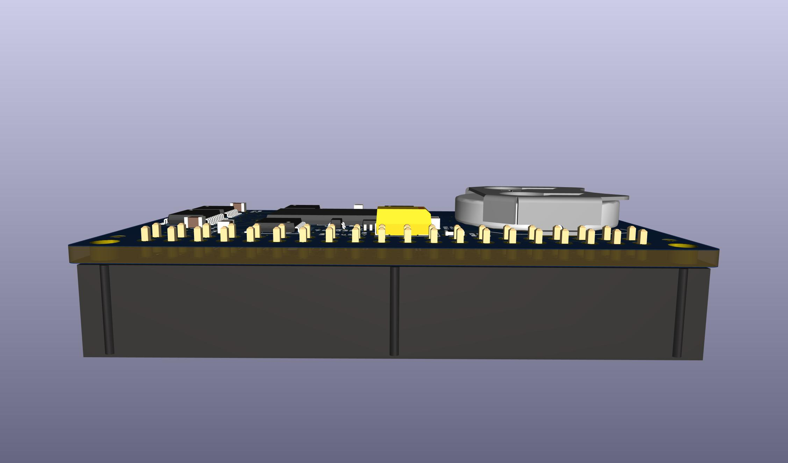

# Reproduction of Node Systems DATAPAC

The NODE Systems DATAPAC and RAMPAC were a popular ram disk peripheral for TRS-80 / TANDY Models 100, 102, & 200 computers.

RAMPAC was a later device that functioned the same as DATAPAC, even using the same software to run it, just in a new smaller form factor.

This schematic and PCB documents the DATAPAC. If I ever aquire a RAMPAC, I'll add that.

Here is some disorganized [INFO](software/) mostly gathered from the [M100SIG archive](https://github.com/LivingM100SIG/Living_M100SIG) and [club100](http://www.club100.org).

TLDR: To use the hardware, install [RAMDSK.CO](software/RAMDSK/), and what you get is a 128K or 256K ram disk.

The enclosure printing says 256K, and the circuit is all there to support 256K, but my 2 units only had 128K installed.  
There are footprints on the PCB for 4 x 32K sram chips, for a total of 128K.  
To get 256K, a 2nd set of 4 chips are piggybacked on top of the first 4, with only pin 20 bent out and connected to the pcb instead of to the chip below.  
No other parts or changes are needed.

## Reproduction Schematic & PCB
This is a new drawing but aims to reflect the original actual device as exactly as possible.  
It's meant to be a form of documentation or reference describing the original hardware as it was.  

PCB TOP

PCB BOTTOM

The real PCB has no silkscreen. This image has silkscreen added to show where the components from the schematic go.

<!-- 
## New Schematic & PCB
This aims to be a functional replacement and will change over time to use newer parts.  
Currently still uses all the same main chips as the original. Changes so far are that many of the traces are rerouted, coin cell battery, decoupling caps, ground pours, silkscreen.  
Pending TODO items: Change the BUS connection to use a removable cable, and flip the pinout so that the computer end of the cable can use a connector that actually fits in a 200.

-->

## Battery
The original battery is no longer made. The modern replacement is almost 2mm taller and does not fit inside the enclosure.

NODE Systems themselves used to perform an update to older units to replace the original rechargeable NiCD cell with a non-rechargeable lithium cell which was supposed to last about 5 years.

The change is simple and easy, and the parts are common. You just remove the old battery and the 200 ohm resistor, and replace them with a CR2032 holder and a diode. That's it. Both parts fit and solder right in the same locations where the old parts came out. Point the diode stripe away from the battery, just like the other diode that is right there next to it. Any kind of diode will do. Another 1N4148 like the other one that's already there is perfect.
This should give about 4 years of memory.  
(The original battery may have only lasted a number of months according to a review in the archives. So the coin cell mod is definitely an improvement as well as being available.)

BEFORE

AFTER

STEPS

If you wish to keep using a rechargeable battery, then a suitable option is FL3/V80H. That is 3 16x5.8mm NiMH button cells in a flat in-line pack with wire leads. It fits perfectly in the space next to the ribbon cable. It needs to be secured with hot glue or foam mounting tape, and connected with wires run to the original battery location.  

## Documentation
The original manual does not seem to be scanned or archived anywhere.

All we have today is a few bits of info from discussions in the [M100SIG archive](https://github.com/LivingM100SIG/Living_M100SIG) and Paul Globmans software on [club100](http://www.club100.org/library/libpg.html).  
Some of these are collected [here](software).

A few of those documents indicate that the device shipped with the user manual pre-loaded onto the DATAPAC as an 11.7K text file, along with at least one BASIC program, and the Format function in the option rom would also re-create this file.

## Software
The "driver" software for the device is [RAMDSK](software/RAMDSK/)

Originally these shipped with an option rom from NODE, which does not seem to be archived anywhere.  

RAMDSK is purported to provide all or almost all of the same functionality as NODEs rom, and even NODE themselves later licensed RAMDSK and included a copy with each unit. It's unclear if this was in addition to their original rom, or fully replacing it.  
Even the rom calls from the option rom have equivalents in RAMDSK, though at different addresses.  
(One thing RAMDSK does not do which the original option rom did, is re-create the user manual text file as part of the Format function.)  

The only other significant software using this device seems to be [XOS-C](http://www.club100.org/library/libpg.html), which is sort of an OS for the Model 200. XOS does not require a RAMPAC or DATAPAC, but apparently makes good use of one if present. For instance, you can keep just a single copy of RAMDSK.CO in bank 3, yet be able to use it from any bank.  
I have not tried XOS-C yet, this is just from reading the description.

Some software culled from the M100SIG archive and Club100 are collected in [software](software)  

## Model compatibility
Apparently only Models 100, 102, & 200 were ever supported. (No NEC or Olivetti, etc)

### Model 200
The connector on the DATAPAC does not actually fit in a Model 200 without cutting the opening wider around the bus connector on the 200.  

The only connector that fits in a 200 without hacking on the 200s case is a solder-type IDC box header like [this](https://www.digikey.com/en/products/detail/sullins-connector-solutions/SBH11-PBPC-D20-ST-BK/1990068),
 which could be soldered back to back with the female version like [this](https://www.digikey.com/en/products/detail/sullins-connector-solutions/SFH11-PBPC-D20-ST-BK/1990093),
 to make an adapter to allow connecting to a 200 without having to damage the 200's case.

### Model 100
This "102/200" version actually works on Model 100 also. It needs an adapter cable, but the cable is simple. It's just a "wire-to-board" IDC-DIP-40 crimp-on DIP connector and a standard 2x20 female IDC connector, both crimped on to a 40-pin ribbon cable about 8 inches long.  
The Model 100 part of this [3-part cable for the Disk/Video Interface](http://tandy.wiki/Disk/Video_Interface:_Cable) is exactly the same thing.

## Theory of Operation
I am still piecing this together. This is only my hazy guess at how it works so far:

U1-U3 form a 0-1023 counter, setting local sram address bits A0-A9. We'll call this the byte counter.

U6 sets local sram address bits A10-A17 from the bus AD0-AD7, and latches that setting, ignoring the bus except when triggered to get a new address.

BUS_A8, BUS_A9, Y0, and /A from the bus combine to produce two signals which I am calling /BLOCK and /BYTE.

Each time /BYTE is pulsed:
* The byte counter is advanced by 1 (A0-A9 are changed to the next address).

* All sram are disabled during the transition.

Each time /BLOCK is pulsed low and then back up, it does 2 things:
* U6 updates A10-A17 from bus AD0-AD7.  
  5 of those bits are used directly as A10-A14 going to all SRAM chips,  
  3 bits A15-A17 are used indirectly to select 1 of the 8 chips.  
  The end result is the same as if all 8 address lines went to a single larger chip.

* The byte counter is reset to 0.

So the device appears to operate in 1k blocks, where the host computer gives 1 of 256 possible "block-start" addresses, then reads or writes up to 1024 bytes, one at a time. Each time the host accesses a byte, the counter advances itself and the next read/write will get the next byte.  
The device is actually acting a bit like a disk even though it has no brains or firmware.

I do not yet know how the software side of the process works.

# MiniNDP
Not yet tested.  

Works the same as DATAPAC (hopefully), just with a single 256k (or 512k) SRAM and all SMT parts, and directly attached instead of connected by a cable.  

Height is only 34mm. The top edge stops about 8.5mm below the top surface of a Model 200, and stands about 6.5mm above the top surface of a Model 102.  

The connector fits in a Model 200 without having to modify the 200.  

Works on Model 100 with the same adapter cable described above.  

All the caps are optional. The original DATAPAC seems to work fine without any. However:  
* C1 provides about 15 seconds of battery-change time, even assuming the battery has already almost died and is down to 2.3v when removed.  
* C6 would add to the battery-change time too, but the purpose of C6 is to keep VBUS alive and keep all the chips stable on disconnect, and let the RAM_RST/SLEEP pullup disable the SRAM. I don't know if this is a good or bad idea, or merely harmless but pointless. The original DATAPAC includes a very strong pulldown (5.1k) against VBUS on an active-high enable pin on the 3-8 decoder that disables all 8 sram chips fast if VBUS is disconnected. The new circuit doesn't have that. There is an active-high enable pin on the 256k sram that could be wired up the same way, but that pin is just an un-used address line on the 512k chip, and there is no equivalent active-high enable pin on the 512k chip. So the circuit is desgned to just let RAM_RST/SLEEP take care of disabling the sram on disconnect. This also saves one full milliamp of continuous current drain on the host's batteries while connected to the host.  

D2 is copied from a user mod found on a DATAPAC. It appears to prevent a battery drain on the host computer while the DATAPAC is left connected to the host while the host is turned off. R1 does the job of pulling RAM_RST/SLEEP high whenever needed, so it's not required to rely on the host to drive it high. The pullup is actually even weaker on the original unit, 240k, and the original modded unit works fine, so even the weak pullup is still fast enough to disable sram even during the rapid on/off during data transfers when the sram need to be disabled briefly between each byte address change. If the original unit works with 240k ohm, then 200k will only be faster and safer. However, to more strictly replicate the original DATAPAC circuit if you wanted, you could omit D2 and short D2 pads 2 & 3 with a solder blob.  

BT1 is shown using a CR2032 holder. This is thin, but still the tallest/thickest thing on the board.  
If you wanted the card to be even thinner & more even, you could substitute the CR2032 holder with a CR2016 holder or even a CR2012 holder.  
A CR2032 gives 7.5 years of memory. (200mAh to reach 2.4v / 3uA)  
A CR2016 gives 3 years of memory. (80mAh to reach 2.4v / 3uA)  
A CR2012 gives 2 years of memory. (50mAh to reach 2.4v / 3uA)  
Part numbers for different size holders that fit the same solder footprint:  
For CR2032: Keystone 3034, TE/Linx BAT-HLD-001-SMT, Adam Tech BH-67, MPD BK-912  (4.1mm tall)  
For CR2016: TE/Linx BAT-HLD-002-SMT  (2.8mm tall)  
For CR2012: Keystone 3028 (1.7mm tall)

The SRAM is shown using a 256Kx8 part. This is the ideal part since it's a 256K device and no ram is wasted, but 256Kx8 5v parallel sram are uncommon today. It is an uncommon in-between size, where both 128k and 512k are more commonly manufactured. AS6C2008A are still made new, and can be ordered in individual quantities from Mouser, but for instance DigiKey only sells them in bulk. That is a single manufacturer and a single retailer, not counting ebay.  
But AS6C4008 is more available. Both DigiKey and Mouser sell them new in individual quantities. There are also a few other manufacturers still making similar parts, though not available in individual quantities. 512Kx8 are basically more available than 256Kx8.  
To allow the drop-in use of either a 256K or 512K part, the active-high CE2 pin on the 256K part is not used to enable or disable the chip, only the active-low /CE1. CE2 is tied to VMEM, making it no-op on the 256K part.  
The 512K part has no active-high CE2 pin. That pin is instead an extra address line, which is also effectively no-op by being tied to VMEM.  
So either 256Kx8 (AS6C2008A) or 512Kx8 (AS6C4008) may be dropped in place and work the same.  
For the 256K part, note that it must specifically be AS6C2008A and not AS6C2008. Only the A version is 5v tolerant.  
For the 512K part, there is no A version. AS6C4008 is 5v tolerant.  

